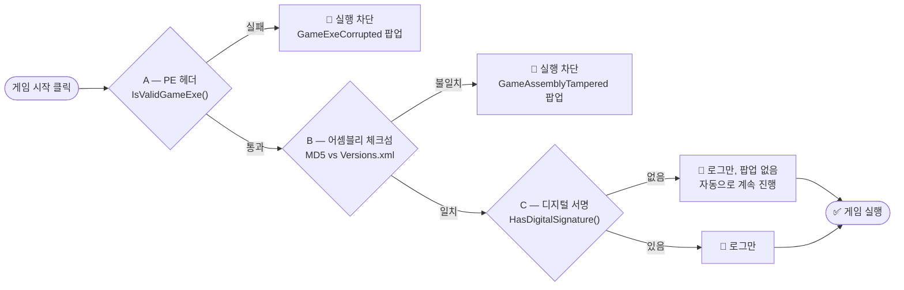

[](../README.md)
[](README.ko.md)
[](README.de.md)
[](README.es.md)
[](README.fr.md)
[](README.pl.md)
[](README.ru.md)
[](README.it.md)
[](README.jp.md)
[](README.pt.md)
[](README.vi.md)
[](README.zh-CN.md)
[](README.zh-TW.md)

# ModAPI(v1) v2.0.9623 - 20260920

> 원작: FluffyFish / Philipp Mohrenstecher (독일 엥겔스키르헨)
> 업그레이드: zzangae (대한민국)

---

## 개요

ModAPI는 **5개 공식 지원 게임**의 모드를 관리하는 데스크톱 애플리케이션입니다. 이 업그레이드 에디션에는 멀티게임 지원, 완전히 재설계된 설정 탭, Steam 경로 설정, 영구 UI 설정, 동적 폰트 크기 시스템, 게임 시작 유효성 검사, Debug/Release 빌드 분리, 그리고 인게임 테스트로 검증된 수많은 충돌 수정이 포함되어 있습니다.

---

## 지원 게임

| 게임 | 엔진 | 버전 | Steam ID | 실행파일 |
|---|---|---|---|---|
| The Forest | Unity 5 | v1.12 (VR) | 242760 | `TheForest.exe` |
| Subnautica | Unity | 2025 패치 | 264710 | `Subnautica.exe` |
| RAFT | Unity | v1.1.02 (베타) | 648800 | `Raft.exe` |
| Escape The Pacific | Unity 6 | v0.67.0.0 | 655290 | `EscapeThePacific.exe` |
| Green Hell | Unity 2019 | v2.9.5 | 763790 | `GH.exe` |

<details>
<summary><b>The Forest</b></summary>

| 항목 | 값 |
|---|---|
| 엔진 | Unity 5 (Unity 4에서 업그레이드) |
| 최신 버전 | v1.12 (VR) |
| 마지막 업데이트 | 2019년 9월 11일 — VR 지원 패치; 이후 주요 콘텐츠 업데이트 없음 |
| 실행파일 | `TheForest.exe` |
| 데이터 폴더 | `TheForest_Data/Managed/` |
| Mods 폴더 | `mods/TheForest/` |
| 프로젝트 폴더 | `projects/TheForest/` |
| Steam 앱 ID | `242760` |
| IL2CPP | ❌ Mono — 완전 지원 |

The Forest는 Unity 4에서 Unity 5로 업그레이드되어 비주얼과 물리 효과가 크게 향상되었습니다. 2019년 9월 VR 패치가 마지막 주요 업데이트였으며, 이후 안정적인 완성 상태를 유지하고 있어 모딩에 이상적입니다.
</details>

<details>
<summary><b>Subnautica</b></summary>

| 항목 | 값 |
|---|---|
| 엔진 | Unity (2022년 Below Zero와 통합 코드베이스) |
| 최신 버전 | 2025 패치 (v18810395) |
| 마지막 업데이트 | 2025년 8월 12일 — 모바일 출시와 함께 버그 수정 및 성능 개선 |
| 실행파일 | `Subnautica.exe` |
| 데이터 폴더 | `Subnautica_Data/Managed/` |
| Mods 폴더 | `mods/Subnautica/` |
| 프로젝트 폴더 | `projects/Subnautica/` |
| Steam 앱 ID | `264710` |
| IL2CPP | ❌ Mono — 지원 |

원래 Unity 5 기반으로 출시된 Subnautica는 2022년 말 'Living Large' 업데이트(v2.0)를 통해 Below Zero와 엔진 코드베이스를 통합하여 최적화 및 안정성이 향상되었습니다. 참고: 차기작 *Subnautica 2*는 Unreal Engine 5를 사용합니다.

> **v2.0.9610에서 XML 재작성**: `XGamingRuntime.dll`, `XblPCSandbox.dll`, `FMODUnity.dll`, `Newtonsoft.Json.dll`, `Unity.InputSystem.dll`, `Unity.Collections.dll`, `Unity.Burst.dll`이 `copyAssembly`에 추가됨.
</details>

<details>
<summary><b>RAFT</b></summary>

| 항목 | 값 |
|---|---|
| 엔진 | Unity |
| 최신 버전 | v1.1.02 (베타) / v1.09 (안정) |
| 마지막 업데이트 | 2026년 3월 — 베타 브랜치에서 음성 채팅 및 멀티플레이어 버그 수정 |
| 실행파일 | `Raft.exe` |
| 데이터 폴더 | `Raft_Data/Managed/` |
| Mods 폴더 | `mods/Raft/` |
| 프로젝트 폴더 | `projects/Raft/` |
| Steam 앱 ID | `648800` |
| IL2CPP | ❌ Mono — 지원 |
| Versions.xml | `1.1.01` (체크섬 포함) |

v1.0 *The Final Chapter*로 공식 스토리가 완결된 이후에도 네트워크 코드 개선 및 안정성을 위한 패치가 지속되고 있습니다. 2026년 3월 베타 브랜치 업데이트에서 음성 채팅 및 멀티플레이어 문제가 수정되었습니다.
</details>

<details>
<summary><b>Escape The Pacific</b></summary>

| 항목 | 값 |
|---|---|
| 엔진 | Unity 6 (2025년 말 Unity 2021/2022에서 마이그레이션) |
| 최신 버전 | v0.67.0.0 |
| 마지막 업데이트 | 2025년 6월 26일 — 섬 배분 재설계 및 엔진 업데이트; 2026년까지 핫픽스 진행 중 |
| 실행파일 | `EscapeThePacific.exe` |
| 데이터 폴더 | `EscapeThePacific_Data/Managed/` |
| Mods 폴더 | `mods/EscapeThePacific/` |
| 프로젝트 폴더 | `projects/EscapeThePacific/` |
| IL2CPP | ❌ Mono — 지원 |

2025년 말 주요 시스템 재설계 및 Unity 6 마이그레이션을 완료하여 더 역동적인 환경이 구현되었습니다. 게임은 현재 얼리 액세스 개발이 진행 중입니다.

> **v2.0.9610에서 XML 재작성**: `extends="GenericUnityGame"` 제거; `includeAssembly`를 `Assembly-CSharp.dll`만으로 설정 — `Assembly-CSharp-firstpass.dll` 상속 오류 방지.
</details>

<details>
<summary><b>Green Hell</b></summary>

| 항목 | 값 |
|---|---|
| 엔진 | Unity 2019 |
| 최신 버전 | v2.9.5 |
| 마지막 업데이트 | 2026년 2월 4일 — Steam Deck 최적화 및 텍스트 가독성 개선 |
| 실행파일 | `GH.exe` |
| 데이터 폴더 | `GH_Data/Managed/` |
| Mods 폴더 | `mods/GH/` |
| 프로젝트 폴더 | `projects/GH/` |
| Steam 앱 ID | `763790` |
| IL2CPP | ❌ Mono — 지원 |
| Versions.xml | `2.9.5` (체크섬 포함) |

게임 수명 주기 동안 Unity 2017 → 2018 → 2019로 개발되었습니다. 2026년 2월 핫픽스는 Steam Deck 호환성 및 UI 가독성에 집중했습니다.

> **v2.0.9610에서 XML 재작성**: `AmplifyBloom.dll`, `AmplifyColor.dll`, `AmplifyMotion.dll`, `com.rlabrecque.steamworks.net.dll`, `Unity.ProBuilder.dll`, `Unity.Postprocessing.Runtime.dll` 추가; 존재하지 않는 `DOTweenPro.dll` 제거.
</details>

---

<details>
<summary><b>아키텍처</b></summary>

### 런타임 분리

| 컴포넌트 | 대상 | 런타임 | 이유 |
|---|---|---|---|
| `ModAPI.exe` | .NET Framework 4.8 | Windows .NET 4.8 | 데스크톱 애플리케이션, 최신 API 완전 지원 |
| `ModAPI_Shared.dll` | .NET Framework 4.8 | Windows .NET 4.8 | 공유 라이브러리 |
| `BaseModLib.dll` | .NET Framework 3.5 | Game Mono 2.0 | **영구 고정** — PE 헤더가 `v2.0.50727`을 읽어야 함 |
| Mod DLL (사용자) | .NET Framework 4.8 | Game Mono 2.0 (패치됨) | 4.8로 빌드, Apply 시 PE 헤더 패치 |

### 개발자 도구

프로젝트 관리용 독립 WPF 유틸리티. 최종 사용자에게 배포되지 않습니다.

| 도구 | 프로젝트 | 목적 |
|---|---|---|
| `MODAPI_VersionTool.exe` | `VersionTool\MODAPI_VersionTool.csproj` | `AssemblyInfo.cs` 및 `App.xaml.cs` 버전 동시 업데이트 |
| `MODAPI_LangTool.exe` | `LangTool\MODAPI_LangTool.csproj` | 언어 파일 관리 — 추가, 편집, 비활성화, 내장 전환 |

**VersionTool — 버전 관리**

클릭 한 번으로 버전 번호를 업데이트하는 독립 WPF 도구입니다.

- 현재 버전 자동 표시 (`App.xaml.cs`에서 읽음)
- 새 버전 입력 후 **Apply Version** 클릭 시 두 파일 동시 업데이트
- 형식 검증: `X.X.XXXX` 형식만 허용

| 파일 | 경로 | 변경 내용 |
|---|---|---|
| `AssemblyInfo.cs` | `ModAPI\Properties\` | `AssemblyVersion`, `AssemblyFileVersion` |
| `App.xaml.cs` | `ModAPI\` | `public static string Version` |

**LangTool — 언어 시스템**

```
resources/langs/langs.json          ← 언어 레지스트리 (builtin / active 플래그)
resources/langs/Language.XX.xaml    ← 언어별 번역 키
resources/langs/Language.XX.png     ← 국기 이미지 (36×24, flagcdn.com/h24/ 제공)
```

내장 전환 흐름 (Update 버튼):
```
builtin: false → true (langs.json)
  → CreateDefaultLangsJson() 재작성 (LangTool\MainWindow.xaml.cs)
  → Language.XX.xaml 등록 (ModAPI\ModAPI.csproj)
  → 다음 빌드: 언어 완전 내장, 오프라인 사용 가능
```

### Debug / Release 빌드 분리

모든 파일 유효성 검사 및 어셈블리 처리는 `#if DEBUG` / `#else`를 통한 빌드 구성에 따라 분기됩니다.

| 위치 | Debug 빌드 | Release 빌드 |
|---|---|---|
| `CheckSteam()` | `File.Exists()`만 — 더미 파일 통과 | `FileValidator.IsValidSteamExe()` — PE 헤더 + 최소 1 MB |
| `CheckGamePath()` | `File.Exists()`만 — 더미 파일 통과 | `FileValidator.IsValidAssemblyDll()` — PE 헤더 + CLR 메타데이터 + 최소 8 KB |
| `ModLib.Create()` — IncludeAssemblies | `File.Copy()` — Cecil 파싱 생략 | 전체 Mono.Cecil 파싱 + IL 수정 + `module.Write()` |
| `ModLib.Create()` — 파일 없음 | 경고 로그, 건너뛰고 계속 | 오류 로그, 팝업과 함께 중단 |

**Debug 테스트**는 `create_dummy_Debug_games.ps1`을 사용하여 `bin\Debug\dummy_games\`, `bin\Debug\dummy_steam\`, `bin\Debug\gamefiles\original\` 아래에 0바이트 자리 표시자 파일을 생성합니다. 이 파일들은 `File.Exists()` 검사를 통과하며 실제 게임 설치 없이 전체 UI 워크플로우 테스트가 가능합니다.

**Release 빌드**는 `FileValidator` (PE 헤더 + .NET CLR 메타데이터 검증)를 적용하여 0바이트 파일, 텍스트 파일 및 임의 바이너리를 거부합니다. 유효한 Windows 실행파일과 .NET 어셈블리만 통과합니다.

### FileValidator — PE 헤더 검증

`ModAPI_Shared\Utils\FileValidator.cs` — Release 빌드에서만 적용됩니다.

| 메서드 | 검사 항목 | 최소 크기 |
|---|---|---|
| `IsValidSteamExe(path)` | MZ 서명 + PE\0\0 서명 | 1 MB |
| `IsValidGameExe(path)` | MZ 서명 + PE\0\0 서명 | 512 KB |
| `IsValidAssemblyDll(path)` | MZ + PE\0\0 + CLR 메타데이터 헤더 (데이터 디렉토리 #14) | 8 KB |

```
검사되는 PE 헤더 레이아웃:
[0x00] 4D 5A          ← "MZ" DOS 서명
[0x3C] XX XX XX XX   ← PE 헤더 오프셋 (리틀 엔디언)
[offset] 50 45 00 00 ← "PE\0\0" 서명
[Optional Header → DataDirectory[14]] RVA+Size != 0 ← .NET CLR 헤더 존재
```

### 어셈블리 리매핑 파이프라인

```
[Mod 개발자가 .NET 4.8로 빌드]
  → Mod DLL: PE 헤더 v4.0.30319, mscorlib 4.0.0.0

[ModAPI Apply — ModProject.cs]
  → AssemblyVersionMap.RemapAllReferences(modModule)
      mscorlib 4.0.0.0 → 2.0.0.0 등
  → modModule.RuntimeVersion = "v2.0.50727"
      PE 헤더: v4.0.30319 → v2.0.50727

[Game Mono 2.0]
  → PE 헤더 승인 ✅  →  참조 해결 ✅
```

### 어셈블리 리졸버 폴백

```
1. gamefiles/original/{GameId}/{AssemblyPath}   ← 백업 폴더
2. {ActualGameInstallPath}/{AssemblyPath}        ← 게임 설치 폴더 (폴백)
```

### C# 7.3 기능 지원

| 기능 | 상태 | 비고 |
|---|---|---|
| 패턴 매칭 (`is`, `switch`) | ✅ | 인게임 검증됨 |
| 문자열 보간 (`$""`) | ✅ | 인게임 검증됨 |
| `out` 변수 인라인 | ✅ | 인게임 검증됨 |
| `async` / `await` | ✅ | AsyncBridge + System.Threading 폴리필 경유 |
| 튜플 (`ValueTuple`) | ❌ 하드 한계 | Mono 2.0 `mscorlib` ABI — 해결 방법 없음 |
</details>

<details>
<summary><b>테마 시스템 [상세 참조](v2.0.9613_themes_ko.md)</b></summary>

v2.0.9613부터 테마 선택 UI가 설정 탭에서 전용 **테마 탭**으로 이동되었습니다. 새 테마 추가 시 `App.xaml.cs` 딕셔너리에 한 줄만 추가하면 됩니다.

| 인덱스 | ID | 파일 | 팔레트 |
|---|---|---|---|
| 0 | `classic` | `Dictionary.xaml`만 | 원본 ModAPI 텍스처 배경 |
| 1 | `light` | `FluentStylesLight.xaml` | 밝은 톤 + 파란 강조색 |
| 2 | `dark` | `FluentStyles.xaml` | 어두운 톤 + 파란 강조색 (기본값) |
| 3 | `diablo` | `FluentStylesDiablo.xaml` | 빨강 + 검정 |
| 4 | `nebula` | `FluentStylesNebula.xaml` | 어두운 우주 |
| 5 | `sunset` | `FluentStylesSunset.xaml` | 밝은 일몰 |
| 6 | `ocean` | `FluentStylesOcean.xaml` | 어두운 바다 |
| 7 | `nordic` | `FluentStylesNordic.xaml` | 밝은 노르딕 |
| 8 | `citrus` | `FluentStylesCitrus.xaml` | 밝은 시트러스 |
| 9 | `bloom` | `FluentStylesBloom.xaml` | 밝은 꽃 |

테마 변경 시 앱이 자동으로 재시작됩니다. (`theme.cfg`에 저장)

| 테마 | 테마 |
| :---: | :---: |
|**01. Classic 테마**|**02. Light 테마**|
|  |  |
|**03. Dark 테마**|**04. Diablo 테마**|
|  |  |
|**05. Nebula 테마**|**06. Sunset 테마**|
|  |  |
|**07. Ocean 테마**|**08. Nordic 테마**|
|  |  |
|**09. Citrus 테마**|**10. Bloom 테마**|
|  |  |

### 배경 텍스처

테마 탭의 **배경 텍스처** 카드에서 이미지를 선택하면 앱 전체 배경으로 적용됩니다. 지원 형식: `.png` / `.jpg` / `.jpeg`, 최대 50MB, 4K 해상도 이하. 이미지는 JPEG Q75로 압축되고 16바이트 매직 헤더와 함께 `resources\textures\ui_bg\bg.dat` (숨김 속성)로 저장됩니다. SHA-256 해시로 무결성 검증; 변조 감지 시 자동 초기화 + 경고 팝업 표시.

배경이 활성화되면 UI 투명도는 두 레이어로 처리됩니다: 레이어 1 (MergedDictionaries 오버레이)은 `{DynamicResource}` 패널용, 레이어 2 (WalkStyleBackgrounds)는 `{StaticResource}` 기반 패널에 반투명 적용.

### 폰트 크기 시스템

| 리소스 키 | 기본값 | 설명 |
|---|---|---|
| `AppBaseFontSize` | 13 | 일반 텍스트 |
| `AppBaseHeaderFontSize` | 16 | 헤더, 패널 제목 |
| `AppBaseSmallFontSize` | 12 | 보조 레이블 |
| `AppBaseTinyFontSize` | 10 | 힌트 텍스트 |
| `AppBaseLargeFontSize` | 20 | 대형 표시 텍스트 |

### 영구 UI 설정 — `ui.cfg`

| 키 | 기본값 | 설명 |
|-----|---------|-------------|
| `ModListWidth` | `150` | Mods 탭 목록 너비 (px) |
| `ProjectListWidth` | `150` | Development 탭 프로젝트 목록 너비 (px) |
| `AppFontSize` | `13` | 전역 UI 폰트 크기 (px) |
| `AlwaysOnTop` | `false` | 창 항상 위에 표시 |
| `TexturePath` | *(없음)* | 배경 텍스처 원본 파일명 (표시용) |
| `TextureHash` | *(없음)* | 배경 텍스처 SHA-256 해시 |
| `TextureActive` | `false` | 배경 텍스처 활성화 상태 |
| `GamePathReset_{GameId}` | *(없음)* | 게임 경로 초기화 플래그 |
| `SteamPathReset` | *(없음)* | Steam 경로 초기화 플래그 |
</details>

<details>
<summary><b>프로젝트 구조</b></summary>

```
ModAPI/
├── App.xaml / App.xaml.cs              # ThemeRegistry, ThemeIds, ApplyTheme()
├── ui.cfg                               # 영구 UI 설정
├── theme.cfg                            # 현재 테마
├── Windows/
│   ├── MainWindow.xaml / .cs            # 메인 UI — 6개 탭, 테마, 설정, Steam 경로,
│   │                                    #   0바이트 다운로드 보호, 슬라이더 디바운스, 조용한 설정 읽기
│   └── SubWindows/
│       ├── SpecifyGamePath.xaml / .cs   # 게임 경로 팝업 (동적 GameNameLabel)
│       ├── FirstSetup.xaml / .cs        # 최초 실행 설정 + 기본값 초기화
│       └── (14개 추가 SubWindows)
├── Themes/
│   ├── Dictionary.xaml                  # Classic 테마
│   ├── FluentStyles.xaml                # Dark 테마
│   ├── FluentStylesLight.xaml           # Light 테마
│   ├── FluentStylesDiablo.xaml          # Diablo 테마
│   ├── FluentStylesNebula.xaml          # Nebula 테마
│   ├── FluentStylesSunset.xaml          # Sunset 테마
│   ├── FluentStylesOcean.xaml           # Ocean 테마
│   ├── FluentStylesNordic.xaml          # Nordic 테마
│   ├── FluentStylesCitrus.xaml          # Citrus 테마
│   └── FluentStylesBloom.xaml           # Bloom 테마
├── Data/
│   ├── Mod.cs                           # Mod 파일 로드, LF/CRLF 헤더 파싱, 진단 로그
│   ├── ModLib.cs                        # BaseModLib 생성 + 리매핑 (#if DEBUG 분리)
│   ├── Models/
│   │   └── ModProject.cs                # 프로젝트 생성/빌드/적용 + null 보호
│   ├── ViewModels/
│   │   ├── ModsViewModel.cs             # FilteredMods, SelectedModItem, SelectedGameFilter,
│   │   │                                #   손상된 mod 재시도 방지
│   │   ├── ModViewModel.cs              # 폴더 경로에서 GameId 추출
│   │   ├── ModProjectsViewModel.cs      # DispatcherTimer용 Dispose()
│   │   └── SettingsViewModel.cs         # UseSteam/AutoUpdate/UpdateVersions 기본값 true
│   └── AssemblyVersionMap.cs            # Mono 2.0 어셈블리 버전 매핑 (20개 어셈블리)
├── Utils/
│   ├── CustomAssemblyResolver.cs        # 이름 기반 리졸버 (캐싱 포함)
│   └── MonoHelper.cs                    # Mono.Cecil IL 헬퍼 유틸리티
├── resources/
│   ├── langs/                           # 13개 언어 파일 + langs.json (v2.0.9620에서 LangTool.* 키 추가)
│   └── textures/ui_bg/
│       └── bg.dat                       # 압축 및 보안 처리된 배경 이미지 (런타임 생성)
└── configs/
    ├── games/
    │   ├── TheForest.xml
    │   ├── Subnautica.xml               # v2.0.9610 전체 재작성
    │   ├── Raft.xml
    │   ├── EscapeThePacific.xml         # v2.0.9610 전체 재작성
    │   ├── GH.xml                       # v2.0.9610 전체 재작성
    │   ├── SonsOfTheForest.xml          # IL2CPP — 미지원
    │   └── {GameId}/Versions.xml        # Raft, GH, Subnautica, EscapeThePacific
    └── UserConfiguration.xml

ModAPI_Shared/
├── Configurations/
│   └── Configuration.cs                 # silent 매개변수가 있는 GetPath/GetString/GetInt
├── Data/
│   ├── Game.cs                          # ApplyMods 백업 자동 생성, 조건부 리졸버,
│   │                                    #   게임 폴더 폴백, 경량 생성자 + ModLib 초기화 수정
│   └── ModLib.cs                        # #if DEBUG 분리, IncludeAssemblies/CopyAssemblies용 게임 폴더 폴백
└── Utils/
    └── FileValidator.cs                 # PE 헤더 + CLR 메타데이터 검증 (Release 전용, 최소 8 KB)

BaseModLib/
├── BaseModLib.csproj                    # .NET 3.5 + LangVersion 7.3
└── libs/polyfills/
    ├── AsyncBridge.dll
    └── System.Threading.dll

VersionTool/
├── MODAPI_VersionTool.csproj            # 독립 WPF 버전 업데이트 도구
├── App.config
├── App.xaml / App.xaml.cs
├── MainWindow.xaml / .cs               # 버전 입력, Apply 버튼, 현재 버전 표시
└── Properties/
    ├── AssemblyInfo.cs
    ├── Resources.Designer.cs / .resx
    └── Settings.Designer.cs / .settings

LangTool/
├── MODAPI_LangTool.csproj               # 독립 WPF 언어 관리 도구
├── App.xaml / App.xaml.cs              # 언어 로드/전환, langtool.cfg
├── MainWindow.xaml / .cs               # 메인 UI — 언어 목록, 편집 패널, 경로 선택기
├── AddLanguageDialog.xaml / .cs        # ISO 3166-1 국가 선택기 ComboBox
├── ModApiDialog.xaml / .cs             # ModAPI 스타일 커스텀 다이얼로그 (정보/경고/확인/질문)
├── Models/
│   ├── LanguageEntry.cs                # 언어 항목 모델 (isoCode, langCode, builtin, active)
│   ├── LangsJson.cs                    # langs.json 루트 모델
│   └── IsoCountry.cs                   # ComboBox용 ISO 국가 모델
└── Helpers/
    ├── LangsJsonHelper.cs              # langs.json 읽기/쓰기
    ├── FlagDownloader.cs               # flagcdn.com h24 국기 다운로드
    ├── XamlGenerator.cs                # Language.XX.xaml 생성/저장/파싱
    ├── MissingKeyDetector.cs           # 영어 기준 누락 키 감지
    ├── IsoCountryList.cs               # ISO 3166-1 전체 국가 목록 (196개국, 오프라인)
    └── BuiltinCodeWriter.cs            # CreateDefaultLangsJson() 재작성 + ModAPI.csproj 등록

bin\Debug\                               # Debug 테스트 전용
├── create_dummy_Debug_games.ps1         # 더미 게임/Steam 구조 생성
├── dummy_games\{GameId}\               # 더미 게임 설치 경로
├── dummy_steam\Steam.exe               # 더미 Steam 실행파일
└── gamefiles\original\{GameId}\        # ModLib용 더미 백업 경로
```

---

</details>

<details>
<summary><b>설치 및 설정</b></summary>

### 1단계 — 사전 요구사항

| 항목 | 필수 여부 |
|---|---|
| Windows 10 / 11 | ✅ |
| .NET Framework 4.8 | ✅ (Windows 11에 사전 설치됨; Windows 10은 [다운로드](https://dotnet.microsoft.com/download/dotnet-framework/net48)) |
| Steam | 필수 — 설정 탭에서 구성해야 함 |
| 지원 게임 최소 1개 | 필수 — 설정 탭에서 구성해야 함 |

### 2단계 — ModAPI 설치

1. GitHub에서 최신 릴리즈 다운로드
2. 임의 폴더에 압축 해제 (예: `C:\ModAPI\`)
3. `ModAPI.exe` 실행
4. 최초 실행 시 **Welcome** 화면이 표시됨 — 환경 설정 후 **Continue** 클릭

### 3단계 — Steam 경로 설정 (설정 탭)

1. **설정** 탭으로 이동
2. **Steam 설치 경로** 항목 찾기
3. **찾아보기** 클릭 → `Steam.exe` 선택
4. **저장** 클릭

### 4단계 — 게임 경로 설정 (설정 탭)

1. 게임 카드 헤더를 클릭하여 펼치기
2. **찾아보기** 클릭 → 게임 루트 폴더 선택 (`.exe`가 있는 위치)
3. **저장** 클릭

| 게임 | 실행파일 | 경로 예시 |
|---|---|---|
| The Forest | `TheForest.exe` | `C:\Steam\steamapps\common\The Forest\` |
| Subnautica | `Subnautica.exe` | `C:\Steam\steamapps\common\Subnautica\` |
| RAFT | `Raft.exe` | `C:\Steam\steamapps\common\Raft\` |
| Escape The Pacific | `EscapeThePacific.exe` | `C:\Steam\steamapps\common\Escape The Pacific\` |
| Green Hell | `GH.exe` | `C:\Steam\steamapps\common\Green Hell\` |

### 5단계 — 모드 다운로드 (Downloads 탭)

1. **Downloads** 탭으로 이동
2. 게임 필터에서 게임 선택
3. 모드를 찾아보거나 검색 후 **Download** 클릭

> **오프라인**: `modapi.survivetheforest.net`에서 `.mod` 파일을 수동으로 다운로드하여 해당 폴더에 배치:

| 게임 | 폴더 |
|---|---|
| The Forest | `mods/TheForest/` |
| Subnautica | `mods/Subnautica/` |
| RAFT | `mods/Raft/` |
| Escape The Pacific | `mods/EscapeThePacific/` |
| Green Hell | `mods/GH/` |

### 6단계 — 모드 적용 및 게임 시작 (Mods 탭)

1. **Mods** 탭으로 이동
2. **게임 필터**에서 게임 선택 (0열)
3. **모드 목록**에서 활성화할 모드 체크 (1열)
4. **Start Game** 클릭

게임 시작 전 다음 검사가 자동으로 실행됩니다:

| # | 검사 항목 | 실패 팝업 |
|---|---|---|
| 1 | Steam 경로 설정 및 유효성 확인 | SteamNotFound |
| 2 | `mods/` 폴더의 게임이 설정 탭 게임과 일치 | GameModsMismatch |
| 3 | 최소 1개의 모드 선택됨 | NoModSelected |
| 4 | 여러 게임의 모드가 혼합 선택되지 않음 | MixedGameMods |
| 5 | 게임 경로 설정 및 실행파일 존재 확인 | GamePathNotSet / GameNotInstalled |

---

</details>

<details>
<summary><b>탭 개요</b></summary>

### Welcome 탭
최초 실행 설정 화면 (탭 인덱스 0). AutoUpdate, Steam 연결, VersionsData 테이블 환경 설정. 이후 실행 시 커뮤니티 링크와 릴리즈 노트를 제공합니다.

### Mods 탭
주요 모드 관리 워크플로우 — 3열 레이아웃:

| 열 | 내용 |
|---|---|
| 0열 | 게임 필터 — 5개 지원 게임에 대한 라디오 버튼 |
| 1열 | 모드 목록 — 버전 선택기 및 활성화 체크박스가 있는 설치된 모드 |
| 2열 | 정보 — 선택한 모드의 세부 정보, 설명, 버전 히스토리 |

### Downloads 탭
`modapi.survivetheforest.net`에서 모드를 탐색하고 다운로드합니다.

- **게임 필터**: TheForest / DedicatedServer / VR / Subnautica / RAFT / EscapeThePacific / GH
- **카테고리 필터**: 12개 카테고리 (버그 수정, 밸런싱, 치트, …)
- **검색**: 모드명, 설명, 제작자로 검색
- **오프라인 모드**: 5개 지원 게임 모두에 대한 폴더 안내 표시

### Development 탭
모드 개발 워크플로우 — 게임 필터 패널 (0열)에서 5개 지원 게임 모두를 포함합니다.

- 게임별 모드 프로젝트 생성, 빌드 및 적용
- 언어 리소스 관리
- 3단계 유효성 검사가 있는 ModLib 생성 (Steam → 프로젝트 → 게임 경로)
- 경량 `Game` 생성자를 통한 안전한 게임 전환 (`Verify()` 호출 없음)

### Themes 탭
테마 선택 및 배경 텍스처 관리.

- **테마 선택**: 10개 테마 (Classic, Light, Dark, Diablo, Nebula, Sunset, Ocean, Nordic, Citrus, Bloom)
- **배경 텍스처**: 앱 전체 배경으로 이미지 선택 (JPEG 압축 + 보안 처리)
- 배경 텍스처 활성 시 테마 선택 잠김

### Settings 탭
중앙 집중식 설정 — 4행:

| 행 | 내용 |
|---|---|
| 0 | 언어 / 폰트 크기 / 최대 너비 / 모드 목록 너비 / 프로젝트 목록 너비 |
| 1 | VersionsData 유지 / 자동 업데이트 / Steam 연결 / 항상 위에 표시 |
| 2 | Steam 설치 경로 (텍스트박스 + 찾아보기 + 저장 + 초기화) |
| 3 | 게임 설치 경로 — 게임별 확장 가능 카드 (텍스트박스 + 찾아보기 + 저장 + 초기화) |

---

</details>

<details>
<summary><b>Lang Tool</b></summary>

### MODAPI_LangTool (언어 관리 도구)

ModAPI 언어 파일을 관리하는 독립 WPF 도구입니다. `LangTool\MODAPI_LangTool.csproj`로 솔루션에 추가됩니다.

**위치**: `LangTool\MODAPI_LangTool.csproj`

**핵심 기능**

| 기능 | 설명 |
|---|---|
| 언어 목록 | `langs.json`의 모든 언어를 상태 아이콘과 함께 표시 (🔒 내장 / 🚫 비활성 / ✅ 활성) |
| 언어 추가 | ISO 3166-1 ComboBox에서 국가 선택 → `flagcdn.com/h24/{iso}.png`에서 국기 자동 다운로드 → 영어 템플릿으로 `Language.XX.xaml` 자동 생성 |
| 언어 편집 | `isoCode` / `langCode` 잠금; 활성 상태일 때 `langName` 및 번역 키 편집 가능 |
| 비활성화 / 활성화 | `langs.json`의 `active` 플래그 토글 — 파일 보존, ModAPI 목록에서 숨김 |
| 업데이트 (내장 전환) | `builtin: false` → `true` 전환 — 되돌릴 수 없음, 2단계 확인 — 소스에서 `CreateDefaultLangsJson()` 자동 재작성 및 `ModAPI.csproj`에 `Language.XX.xaml` 등록 |
| 누락 키 감지 | 영어 기준과 비교 — 누락/빈 키 수 및 번역 진행률 표시 |
| 내장 보호 | `builtin: true` 언어는 읽기 전용 — 편집, 비활성화, 업데이트 불가 |
| 비활성 보호 | `active: false` 언어는 재활성화 전까지 읽기 전용 |
| 언어 UI | LangTool 자체가 모든 13개 ModAPI 언어를 지원 — 우측 상단 국기 포함 언어 선택기 |
| 경로 저장 | 선택한 ModAPI 루트 경로를 `langtool.cfg`에 저장 — 다음 실행 시 자동 로드 |
| 커스텀 다이얼로그 | 모든 팝업에 시스템 MessageBox 대신 ModAPI 스타일 다크 테마 `ModApiDialog` 사용 |

**langs.json 구조**

```json
{
  "languages": [
    { "isoCode": "us", "langCode": "EN",    "langName": "English",   "builtin": true,  "active": true },
    { "isoCode": "kr", "langCode": "KR",    "langName": "한국어",     "builtin": true,  "active": true },
    { "isoCode": "gb", "langCode": "EN-GB", "langName": "English (UK)", "builtin": false, "active": true }
  ]
}
```

**국기 이미지 규칙**

```
ISO 코드 (소문자) → flagcdn.com/h24/{iso}.png → Language.{LANGCODE}.png
                                                  resources/langs/
```

**업데이트 버튼 동작**

비내장 활성 언어에서 Update 버튼 클릭 시:

1. `langs.json` — `builtin: false` → `true`
2. `LangTool\MainWindow.xaml.cs` — 현재 `builtin: true` 언어 전체로 `CreateDefaultLangsJson()` 재작성
3. `ModAPI\ModAPI.csproj` — `<Resource Include="resources\langs\Language.XX.xaml" />` 등록
4. 다음 빌드 — 언어 완전 내장, 오프라인 사용 가능

**추가된 언어 키** (`Lang.LangTool.*`)

LangTool UI 문자열, 다이얼로그 메시지, 상태 텍스트를 포함하는 53개의 신규 키가 13개 언어 파일 전체에 추가됨.

---

</details>

<details>
<summary><b>Version Tool</b></summary>

### MODAPI_VersionTool (버전 업데이트 도구)

클릭 한 번으로 버전 번호를 업데이트하는 독립 WPF 도구입니다.

**위치**: `VersionTool\MODAPI_VersionTool.csproj`


**기능**
- 현재 버전 자동 표시 (`App.xaml.cs`에서 읽음)
- 새 버전 입력 후 **Apply Version** 클릭 시 두 파일 동시 업데이트
- 형식 검증: `X.X.XXXX` 형식만 허용

**수정 파일**

| 파일 | 경로 | 변경 내용 |
|---|---|---|
| `AssemblyInfo.cs` | `ModAPI\Properties\` | `AssemblyVersion`, `AssemblyFileVersion` |
| `App.xaml.cs` | `ModAPI\` | `public static string Version` |

**사용 방법**
1. `MODAPI_VersionTool.exe` 실행
2. 새 버전 입력 (예: `2.0.9619`)
3. **Apply Version** 클릭
4. Visual Studio에서 ModAPI 솔루션 리빌드

**StatusBar 버전 표시**

- `VersionLabel.Text`가 하드코딩된 설명자 대신 `App.Version`을 참조
- VersionTool로 버전 갱신 후 리빌드하면 StatusBar에 즉시 반영됨

---

</details>

<details>
<summary><b>Log</b></summary>

### 로깅 시스템 — 2파일 분리 (`ModAPI.log` / `ModAPI.detailed.log`)

개발자 전용 진단 로그가 이전에는 `#if DEBUG`로 제한되어 있어, 사용자 문제를 해결할 때 가장 필요한 Release 빌드에서 보이지 않는 문제가 있었습니다. 이를 2파일 시스템으로 대체합니다:

| 파일 | 내용 |
|---|---|
| `ModAPI.log` | 사용자용 핵심 로그 — 기존과 동일한 형태, 이전보다 더 많아지지 않음 |
| `ModAPI.detailed.log` | 모든 로그 호출을 Release/Debug 관계없이 항상 기록 — 사용자 문의 시 진단용 |

**`Debug.cs`** — `Log()`에 `detailedOnly` 매개변수가 있습니다. `true`일 때 메시지는 `ModAPI.detailed.log`에만 기록됩니다; 기존의 모든 `#if DEBUG` 블록이 완전히 제거되는 대신 이 플래그로 전환되어, Release에서도 항상 detailed 파일에 기록됩니다. 결과적으로 4단계 심각도 체계가 만들어집니다:

| 단계 | 의미 |
|---|---|
| Verbose (`detailedOnly: true`) | 반복적/기계적 추적 — 타입별, 파일별, 메서드별 |
| Notice | 사람이 읽는 흐름 — 진행 상황 및 성공 메시지 |
| Warning | 잠재적 문제, 아직 실패는 아님 |
| Error | 확실한 실패 |

**`ModAPI.log`를 채우던 로그 노이즈 발생 지점 및 `detailedOnly: true`로 전환된 항목:**

| 파일 | `ModAPI.log`에 넘쳤던 내용 |
|---|---|
| `ModsViewModel.cs` | 1초마다 반복되는 `FindMods()` 스캔/스킵/큐 메시지 |
| `Game.cs` | `UpdateVersions()` TLS/URL 추적 라인, Cecil 타입 매핑 항목 |
| `ModLib.cs` | Cecil의 타입/메서드별 어셈블리 처리 (`Validating`, `Processing`, `Changed ... accessibility`) — Green Hell mod 빌드 한 번에 수만 줄이 찍혀 `ModAPI.log` 용량의 대부분을 차지하던 주범 |
| `Mod.cs` | mod 로드마다 전체 mod 헤더 XML 덤프 (`configuration.ToString()`) |

**체크섬 불일치 로그 — 항목별에서 요약으로:** `Header.Verify()`가 이전에는 호환되지 않는 `InjectInto`/`AddMethod`/`AddField`/`AddClass` 항목마다 `Mismatched checksum at "..."` 한 줄씩 출력하여, 오래된 mod 하나에서 수십 줄이 나올 수 있었습니다. 이제 `ModAPI.log`에 단일 Warning 수준 요약만 기록됩니다 (예: `Mod "MarsarahMod" has 14 checksum mismatch(es). This usually means the mod is incompatible with the current game version. See ModAPI.detailed.log for the full list.`). 항목별 전체 내역은 `ModAPI.detailed.log`에서 계속 확인 가능합니다.

---

</details>

<details open>
<summary><b>v2.0.9623 변경사항</b></summary>

## v2.0.9623 변경사항

### 업데이트 확인 및 적용 — 런처 방식, 수동 트리거, 강제 차단 없음

첫 실행 팝업(`FirstSetup` 창)에는 원래 **최신버전 유지**, **업데이트 검색**, **스팀 연결** 3개 옵션이 있었는데, 개발이 한동안 보류돼 있었습니다. 재개하기 전 실제 코드 상태를 조사해보니 스팀 연결과 최신버전 유지는 이미 완전히 동작 중이었고, 업데이트 검색(ModAPI 신버전이 있는지 확인하는 기능)만 미완성이었습니다 — 다운로드/설치 파이프라인 자체는 있었지만, 그걸 호출하는 코드가 어디에도 없었습니다.

**이번에 구현한 내용:**

- **`Game.CheckForNewVersion(out releaseNotes)`** (`ModAPI_Shared\Data\Game.cs`) — GitHub Releases API(`/repos/{owner}/ModAPI/releases/latest`)를 호출해서 최신 태그와 릴리스 노트(`body` 필드, 별도 라이브러리 추가 없이 최소한의 JSON 문자열 이스케이프 해제 로직으로 파싱)를 함께 반환합니다. `UpdateRepoOwner`는 일반 사용자에겐 항상 `FluffyFishGames`(운영 저장소)를 가리키고, `--dev` 플래그로 실행했을 때만 유지보수자의 개발 저장소로 전환됩니다 — 설정 탭 "개발자 로그" 체크박스로는 절대 전환되지 않습니다. 그 체크박스는 크래시 로그 상세도만을 위한 것이고, 사용자가 로그만 켰을 뿐인데 미검증 테스트 채널로 조용히 옮겨지면 안 되기 때문입니다.
- **설정 탭**: 동작하지 않던 "업데이트 검색" 체크박스를 없애고, **업데이트** 버튼 하나로 대체했습니다(백그라운드 토글이 아니라 런처 방식). 버튼을 누르면 신버전을 확인하고, 있으면 "지금/나중에" 같은 중간 선택 없이 바로 다운로드→압축해제→적용 흐름으로 진입합니다.
- **첫 실행 팝업**: 죽은 "자동-업데이트" 옵션과 그 설정 저장 코드를 제거했습니다. 이제 스팀 연결과 최신버전 유지 2개만 물어봅니다.
- **`OperationPending` 창**에 기본적으로 접혀있는 릴리스 노트 표시 영역과 `Confirmed` 이벤트를 추가했습니다. 다운로드/압축해제가 100%에 도달하면 릴리스 노트가 보이면서 "완료" 버튼이 활성화되고, 이 버튼을 눌러야 실제로 `Updater.exe`를 실행하고 ModAPI가 종료됩니다(이전에는 압축해제가 끝나는 즉시 자동으로 이 과정이 실행돼서 무엇이 바뀌었는지 확인할 기회가 없었습니다). `Updater.exe` 자체(원작자 코드, 수정 없음)는 ModAPI 종료를 기다렸다가 파일을 덮어쓰고 자동으로 재시작합니다.
- ModAPI는 구버전이라고 해서 실행을 막지 않습니다. 신버전 확인은 오직 사용자가 "업데이트" 버튼을 눌렀을 때만 실행되고 앱 시작 시점엔 절대 끼어들지 않습니다 — 일반적인 게임 런처의 강제 업데이트 게이트와는 다릅니다.

### UI 버그 수정 — 릴리스 노트 영역 줄바꿈 안 되던 문제

`OperationPending` 진행률 창에 새로 추가한 릴리스 노트 영역이 처음엔 가로 스크롤이 필요한 한 줄로만 출력됐는데, 원인이 두 가지 겹쳐 있었습니다:

1. `TextBox`의 `HorizontalScrollBarVisibility` 기본값은 `Hidden`이지 `Disabled`가 아닙니다 — 명시적으로 `Disabled`로 주지 않으면 WPF는 `TextWrapping="Wrap"`을 무시하고 줄을 계속 늘려버립니다.
2. 모든 팝업 창이 쓰는 `SubWindow` 스타일이 `SizeToContent="WidthAndHeight"`(`FluentStyles.xaml`)라서, `*` 컬럼으로 늘어나는 영역은 줄바꿈 기준이 될 고정 폭이 없습니다 — 폭을 직접 지정해줘야 합니다.

`ProgressBar.ActualWidth`에 바인딩한 고정 폭을 줘서(진행률 바 오른쪽 끝과 정렬되도록) 해결했고, `TextBox` 대신 읽기 전용 `TextBlock`+`ScrollViewer` 조합으로 바꿨습니다(`TextBox`의 `PART_ContentHost` 줄바꿈 무시 문제를 아예 피함). 배경도 기본적으로 창 투명도를 그대로 물려받고 있어서 `FluentCardBrush`로 불투명하게 지정했습니다. 창을 억지로 키우려고 넣었던 수동 `Height +=` 코드는 `SizeToContent`와 충돌만 일으켜서 제거했습니다 — 영역이 보이는 순간 창이 알아서 정확히 커집니다.

### 실기 검증 (End-to-End 수동 테스트)

폐기 가능한 더미 릴리스 데이터로 확인→다운로드→압축해제→완료 확인→재시작까지 전체 흐름을 실제로 돌려봤고, 원작자의 `Updater.exe`(수정 없음)까지 포함해서 전부 정상 동작함을 확인했습니다. 테스트하면서 알게 된 유용한 사실 하나: `App.xaml.cs`는 ModAPI **자체 시작 시점**에 이미 남아있는 `_update` 폴더를 자기가 먼저 정리(적용)해버립니다 — 그래서 ModAPI를 켜기 *전에* 가짜 `_update` 폴더를 미리 만들어두는 방식으로 테스트하면, `Updater.exe`가 보기도 전에 조용히 소비돼버립니다. `_update` 폴더는 반드시 **ModAPI가 이미 켜진 상태에서** 만들어야 실제 다운로드가 채우는 상황과 동일하게 재현됩니다. 앞으로 이런 문제를 원본 재시작 로직은 안 건드리고도 쉽게 진단할 수 있도록, `Updater.cs`에 선택적 진단 로그(`Updater.diag.log`, try/catch로 감싸 일반 로직과 분리)를 추가해뒀습니다.

### 개발 노트 — `--dev`로 실행하기

`App.DevMode`(`ModAPI\App.xaml.cs`)는 `--dev` 커맨드라인 인자로 실행했을 때만 `true`가 됩니다 — 설정 탭 "개발자 로그" 체크박스와는 별개이며, 그 체크박스는 로그 상세도에만 영향을 줘야 하고 그 외의 어떤 것도(예: 어떤 서버/저장소를 바라볼지) 좌우해서는 안 됩니다.

로컬에서 `--dev`로 실행하려면:
- **Visual Studio(F5 디버깅)**: `ModAPI` 프로젝트 → 속성 → Debug 탭 → "명령줄 인수"에 `--dev` 입력.
- **빌드된 exe**: 터미널에서 `ModAPI.exe --dev`로 실행하거나, 바로가기의 대상(Target) 필드 끝에 `--dev`를 추가.

### "버전 테이블 유지" 체크박스 — 아무것도 못 할 때는 비활성화

`Game.Verify()`는 게임 경로가 유효할 때(`CheckGamePath()` 통과)만 실제로 버전 테이블을 다운로드하는 `VersionsData.Refresh()`까지 도달하고, 그렇지 않으면 그 전에 조기 종료됩니다. 즉 게임 경로가 설정 안 된 상태에서 "버전 테이블 유지"를 켜봐야 조용히 아무 일도 안 일어났습니다 — 실제로 게임 경로 없이 켜고 테스트해보니 `[UpdateVersions]` 로그가 한 줄도 안 남는 걸로 확인됐습니다.

`SettingsViewModel.CanUpdateVersionsTable`(`App.Game != null && App.Game.CheckGamePath()`)을 추가해서 체크박스의 `IsEnabled`에 바인딩했습니다. 게임 경로를 저장/초기화하거나 개발 탭에서 게임을 전환할 때마다 다시 계산됩니다. 비활성화 상태에서 마우스를 올리면 왜 안 되는지, 활성화 상태에서는 켜면 뭘 하는지 설명하는 툴팁이 각각 뜹니다. 한국어 라벨도 "최신버전 유지"에서 "버전 테이블 유지"로 바꿨습니다 — 다른 모든 언어는 이미 "테이블"이라는 단어가 들어가 있었는데 한국어만 빠져 있어서 새로 만든 "업데이트" 버튼과 헷갈릴 수 있었습니다.

### 전역 버그 수정 — 기본(classic) 테마에 툴팁 스타일 자체가 없었음

이번 세션에서 추가한 툴팁이 앱 테마가 아니라 시스템 기본 흰색 툴팁으로 나왔습니다. 알고 보니 이 앱에서 툴팁을 쓴 게 이번이 처음이라 지금까지 아무도 발견 못 했던 문제였습니다 — `FluentStyles*.xaml`(classic이 아닌 다른 테마들)에는 각각 테마에 맞는 `ToolTip` 스타일이 있는데, 기본값인 classic 테마는 `Dictionary.xaml`만 단독으로 쓰고 이 파일엔 `ToolTip` 스타일이 아예 없었습니다. `Dictionary.xaml`에 동일한 스타일을 추가했습니다(배경은 불투명하게 — 이 테마의 다른 반투명 카드 색은 배경 이미지 위에 겹쳐지는 용도라 화면 아무 곳에나 뜨는 툴팁엔 안 맞음). 이 수정은 이 팝업 하나가 아니라 기본 테마를 쓰는 앱 전체의 툴팁에 적용됩니다.

### 첫 실행 팝업 재설계

첫 실행 팝업은 이제 스팀 연결 / 버전 테이블 유지를 아예 묻지 않습니다 — 둘 다 이미 설정 탭에 있어서 여기서 또 물어보는 건 중복이었습니다. 그 자리에 스크롤 가능한 "이번 버전에서 달라진 점" 요약을 넣었습니다. 안내문과 버튼도 함께 정리했습니다:

- 스팀 연결 / 버전 테이블 유지 체크박스와 설명 문구를 없애고, 그 자리에 고정폭 스크롤 박스로 릴리스 하이라이트를 보여줍니다.
- 환영 탭 자체의 "환영합니다!" 제목을 같은 이름의 버튼으로 바꿨습니다 — 누르면 언제든 첫 실행 팝업을 다시 열어서 이번 버전에 뭐가 바뀌었는지 다시 볼 수 있습니다. 이렇게 재오픈했을 때는 버튼이 "계속" 대신 "닫기"로 바뀌고, 최초 설정 처리(`SetupDone` 저장, `FirstSetupDone()` 호출)를 다시 실행하지 않으며, 닫아도 앱이 종료되지 않습니다(`FirstSetup` 생성자의 `isReopen: true`가 이 전부를 제어).
- **테마 교차 테스트 중 발견한 창 크기 버그**: 이 팝업의 `SubWindow` 스타일은 `AllowsTransparency="True"` + `WindowStyle="None"` + `SizeToContent="WidthAndHeight"` 조합을 쓰는데, 이 조합에서는 WPF가 자동 크기 조절 시점에 `MaxWidth`를 안정적으로 지키지 못합니다. classic 테마에서는 우연히 괜찮아 보였지만, Diablo 같은 다른 테마에서는 창이 훨씬 넓게 렌더링되면서 글자가 줄바꿈 안 되고 잘렸습니다. 이 창에 한해 `SizeToContent="Height"`로 로컬 오버라이드해서 고쳤습니다(이 팝업의 카드들은 애초에 고정폭 디자인이라 가로 자동조절이 필요 없었음) — 테마별로 따로 패치할 필요 없이 모든 테마에 동일하게 적용됩니다.
- **가독성 수정, classic 테마 한정**: classic 테마가 공유하는 `NormalLabel` 스타일(흰 글자+검은 그림자, 사진 배경 이미지 위에서 읽히도록 설계됨)이 이 팝업의 단색 `PanelCenter` 카드 배경과는 안 어울립니다. 앱 전체가 쓰는 공유 스타일을 건드리거나 다른 모든 테마에서 어색해 보일 색을 하드코딩하는 대신, `App.GetCurrentTheme() == "classic"`일 때만 통과하는 `FirstSetup.ApplyClassicThemeTextFix()`를 추가해서 이 팝업 한정으로, classic 테마 한정으로만 어둡고 그림자 없는 스타일을 적용합니다. 다른 테마는 전혀 손대지 않고 원래의(이미 올바른) `NormalLabel`/`PanelCenter` 색을 그대로 씁니다.

### 게임 무결성 검사 — C단계는 더 이상 매번 묻지 않음

Green Hell처럼 애초에 실행파일에 디지털 서명이 없는 인디 게임에서, "게임 시작"을 누를 때마다 서명 없음 경고 팝업이 떠서 매번 "계속"을 눌러야 했습니다 — 실제로 뭔가 잘못된 게 아닌데도요. 서명이 없다는 것 자체는 변조의 증거가 아니라서, 이건 진짜 안전장치라기보다는 순전한 불편함이었습니다.



- **A(PE 헤더)**, **B(어셈블리 체크섬)**는 그대로입니다 — 실제 손상/변조가 확인되면 여전히 경고 팝업(`NoProjectWarning`, 앱의 다른 팝업들과 마찬가지로 공유 `SubWindow` 스타일을 써서 현재 테마에 자동으로 맞춰짐)을 띄우고 실행을 차단합니다.
- **C(디지털 서명)**는 이제 어느 방향이든 팝업이나 확인 요청 없이, `Notice` 레벨 로그 한 줄(`[Integrity] Game executable has no digital signature (not necessarily tampered — many games ship unsigned)`)만 남기고 게임을 실행시킵니다. 이전에 이 단계에서 띄우던 `GameIntegrityWarning` 팝업 클래스는 이제 어디서도 호출하지 않습니다(임의로 삭제하지 않고 그대로 남겨둠).
- 이 다이어그램은 나중에 이 검사의 구조를 놓고 다시 논의할 때 기준점이 되도록 넣었습니다 — 예를 들어 C단계를 더 가벼운 형태로("다시 묻지 않음" 1회성 팝업 등) 부활시킬지 논의가 나올 경우, 이번엔 그 방식 대신 완전 제거 쪽으로 사용자 직접 지시에 따라 결정했다는 것도 함께 기록해둡니다.

### 스팀 연결 — 경로 자동 탐지, 그리고 수동 편집 버그 수정

원작자의 "스팀 연결" 기능이 실제로 무엇을 했는지(경로 선택 이상으로) 조사해보니, `Steam.exe -applaunch {AppId}`로 게임을 실행해서 스팀 오버레이를 지원하고, `steam://validate/{AppId}`로 손상된 파일을 복구하는 기능까지 이미 구현돼 있었습니다 — 이번엔 둘 다 그대로 두고 손대지 않았습니다.

- "스팀 연결"을 켜는 순간 `MainWindow.UseSteamCheckBox_Checked`가 레지스트리(`HKEY_CURRENT_USER\Software\Valve\Steam`)에서 스팀 경로를 바로 읽어서 자동으로 채워 넣습니다 — C드라이브가 아닌 다른 드라이브에 설치돼 있어도 동일하게 동작합니다.
- 스팀 연결이 켜져 있는 동안엔 경로가 자동 관리되므로 수동 편집 영역(입력란, 찾아보기, 저장, 초기화)이 비활성화되어야 합니다. **발견 및 수정한 버그**: 이 컨트롤들을 담은 컨테이너 Grid(`SteamAndGamePathsPanel`)에 코드 비하인드에서 `DataContext`가 한 번도 설정된 적이 없었습니다 — `Settings`와 `SettingsCheckboxes`는 설정돼 있었는데 이것만 빠져 있었습니다. 그래서 `{Binding CanEditSteamPathManually}`가 조용히 실패해서 기본값인 `IsEnabled="true"`로 남아 있었습니다. 겉보기엔 비활성화된 것처럼 안 보이는데 초기화 버튼은 실제로 눌렸던 이유입니다. `SteamAndGamePathsPanel.DataContext = SettingsVm;`을 다른 둘과 나란히 추가해서 고쳤습니다.
- 별개로, 앱 전체적으로 비활성화된 컨트롤이 classic 테마에서는 시각적으로 전혀 티가 안 났습니다 — `NormalButton`의 `ControlTemplate`엔 `IsEnabled="False"` 트리거가 아예 없었습니다(Fluent 테마들엔 이미 있었음). 비활성화 시 40% 투명도로 흐려지는 트리거를 추가해서, classic 테마 전체에 적용되도록 했습니다.

### 테마 시스템 통합 — 클래식 ↔ Fluent 파리티

"둘이 실질적으로 다른 게 없다면 굳이 classic을 따로 둘 이유가 있나"라는 질문에서 시작해서, `Dictionary.xaml`(classic)과 9개 `FluentStyles*.xaml` 파일 사이의 명시적/암묵적 스타일을 전부 대조했습니다.

- 실제로 쓰이는데 빠져 있던 것들을 발견했습니다: `Slider`(설정 탭 모드 목록/프로젝트 목록 너비 슬라이더)와 `ComponentsInputs:MultilingualTextField`(모드 이름/설명 입력란의 언어 아이콘+텍스트 콤보)가 classic에만 있고 Fluent엔 대응하는 게 없었습니다 — Fluent 테마에서는 이 두 컨트롤이 조용히 classic의 Scale9 이미지 스킨으로 되돌아가면서 플랫한 Fluent 룩을 깨고 있었습니다. `DynamicResource` 기반의 플랫 대체 스타일을 만들어서 새 공용 파일 **`ModAPI\Themes\FluentStylesShared.xaml`** 하나에 담고, `ResourceDictionary.MergedDictionaries`로 9개 `FluentStyles*.xaml` 전부에 병합했습니다 — 이제 색상 하나 바꿀 때 아홉 곳이 아니라 한 곳만 고치면 됩니다.
- 반대 방향의 빈틈도 있었습니다: `GridSplitter`(`MainWindow.xaml`의 모드 목록/버전 목록 구분선)는 9개 Fluent 테마엔 스타일이 있는데 classic엔 없어서, classic에서는 그냥 OS 기본 회색 구분선으로 렌더링되고 있었습니다. `Dictionary.xaml`에 대응하는 플랫 스타일을 추가했습니다.
- 조사 도중 진짜 죽은 코드도 여럿 발견했습니다 — 정의는 돼 있지만 실제 UI 어디에서도 참조되지 않는 스타일들: `PasswordBox`(`LoginWindow.xaml`에서만 쓰이는데, `LoginWindow` 자체를 앱 어디서도 생성하지 않음 — 로그인 시스템은 이미 v2.0.9400에서 제거됨), `Components:ModProjectButton`, 소셜 로그인 버튼 스타일 4종(`FacebookButton`/`TwitterButton`/`YoutubeButton`/`TwitchButton`), 그리고 `TimeSlider`/`TimeHorizontalSlider`/`TimeSliderThumbStyle` 묶음(출시되지 못한 낮/밤 주기 슬라이더로 추정). "원작자의 작업물은 삭제하지 않는다"는 이 프로젝트의 원칙에 따라 아무것도 지우지 않았습니다 — 각 블록을 XML 주석으로 감싸고 왜 미참조 상태인지 메모를 남겨서, 히스토리에서 사라지는 대신 파일 안에 기록으로 남도록 했습니다.
- 빌드에 전혀 연결되지 않은 잔재 파일 2개도 발견했습니다: `ModAPI\Windows\Dictionary.xaml`(리팩터링 도중 만들어진 막다른 중복본으로, `App.xaml`이나 `.csproj` 어디에도 참조되지 않음)과 `ModAPI\Themes\FluentStylesClassic.xaml`(테마 시스템 초창기 프로토타입 — 각 테마가 전용 파일을 갖기 전, `light`를 제외한 모든 테마가 공유하던 임시 fallback 스킨이었다가 그 로직이 대체되며 참조를 잃음). 둘 다 git 이력으로 원작자 코드와 무관함이 확인돼서, 위의 죽은 스타일들과 달리 주석 처리 없이 완전히 삭제했고, `.csproj`에서 `FluentStylesClassic.xaml`을 가리키던 이제는 의미 없는 `<Page>` 항목도 같이 제거했습니다.
- classic 자체의 `Slider`도 예전 Scale9 이미지 막대 대신, Fluent 공용 스타일과 동일한 플랫 디자인(같은 `Border`+`Track` 구조, classic의 금색/갈색 팔레트에 맞춰 손잡이 `#B8963E`, 트랙 반투명 `#40FFFFFF`로 재배색)으로 바꿨습니다 — 예전 구현(`SliderThumbStyle`, `SliderButtonStyle`, `HorizontalSlider`, `VerticalSlider`, 예전 implicit `Slider` 스타일)도 마찬가지로 삭제 대신 주석 처리했습니다.

### 설정 탭 나머지 체크박스에도 ON/OFF 툴팁 추가

"버전 테이블 유지"에 적용했던 "마우스를 올리면 뭘 하는지 보여주는" 패턴을 설정 탭의 나머지 4개 체크박스 — **스팀 연결**, **개발자 로그**, **로그 초기화**, **항상 위에** — 에도 똑같이 적용했습니다. 각각 지금 켜져 있는지/꺼져 있는지에 따라 다른 툴팁이 뜨고, 켜면/끄면 실제로 무슨 일이 일어나는지 설명합니다(예: 스팀 연결의 켜짐 상태 툴팁은 위에서 설명한 경로 자동 탐지와 오버레이 지원을 언급합니다). 새 언어 키 8개 × 13개 언어.

### 환영 팝업 — 릴리스 노트와 동기화된 상세 본문

"이번 버전에서 달라진 점" 패널은 이번 세션에서 여러 번 다듬어졌습니다: 짧은 불릿 요약 → `Docs/RELEASE_NOTES_2.0.9623.md`와 맞춘 섹션별 상세 본문(순수 텍스트 `■`/`▸`/`•` 마커 사용 — `TextBlock`은 마크다운을 렌더링 못 함)으로, 13개 언어 전체에 번역해 넣었습니다. 그 과정에서 관련된 레이아웃 버그 2개도 함께 발견하고 고쳤습니다:

- 스크롤 가능한 텍스트에 원래 고정 `Width="450"`이 박혀 있어서 스크롤바 앞에 여백이 남았고(classic 테마에서는 줄바꿈도 조금 일찍 일어났습니다). 고정 폭을 없애고 `ScrollViewer`에 `Padding="14"`를 주는 방식으로 바꿔서 고쳤습니다 — `OperationPending`의 상세 영역에서 이미 검증된 방식과 동일합니다.
- 그다음 이 텍스트를 담는 박스(`WhatsNewBorder`)에 폭을 줘야 했는데, 고정 픽셀 값은 결국 실패하는 접근이었습니다: `SubWindow` 템플릿 자체의 콘텐츠 여백이 테마마다 다릅니다(classic 32px vs Fluent 72px — Fluent 템플릿은 바깥쪽 `Border` 여백과 `ContentPresenter` 여백을 둘 다 가지고 있음). classic의 넉넉한 레이아웃에 딱 맞게 고른 폭은 Fluent 테마에서는 **스크롤바를 화면 밖으로 밀어내 버립니다.** 고정 폭과 `HorizontalAlignment="Left"`를 아예 없애서 고쳤습니다 — 이제 박스는 기본값인 `Stretch`로 동작해서, 어떤 테마든 실제로 남는 공간에 정확히 맞춰집니다.
- 이 팝업 문구는 GitHub 릴리스 페이지에서 실시간으로 가져오지 않습니다 — 그러려면 영어 원문을 비영어권 사용자에게 그대로 보여주거나, 번역 파이프라인(릴리스마다 언어별 JSON 파일을 같이 배포하거나, 기계 번역 API를 붙이거나)을 새로 구축해야 하는데 둘 다 이 프로젝트엔 아직 없습니다. 대신 짧게 손으로 번역한 요약을 유지하고, 릴리스 노트가 갱신될 때마다 그 자리에서 다시 작성합니다(추가가 아니라 항상 전체 교체).

### 신규/업데이트된 언어 키 (13개 언어)

| 키 | 한국어 값 |
|---|---|
| `Lang.Options.Buttons.Update` | 업데이트 |
| `Lang.Windows.OperationPending.Tasks.Update.Done` | 업데이트 준비 완료 — 아래 변경 내역을 확인 후 완료를 눌러주세요. |
| `Lang.Windows.NoUpdateAvailable.Title` | 최신 버전입니다 |
| `Lang.Windows.NoUpdateAvailable.Text` | 현재 최신 버전의 ModAPI를 사용하고 있습니다. |
| `Lang.Windows.NoUpdateAvailable.Buttons.OK` | 확인 |
| `Lang.Options.Labels.UpdateVersionsTableDisabledHint` | 게임 경로를 먼저 설정해야 사용할 수 있습니다. |
| `Lang.Options.Labels.UpdateVersionsTableEnabledHint` | 게임이 패치되면 ModAPI가 새 버전인지 확인해야 하는데, 켜두면 이 정보를 자동으로 최신 상태로 유지합니다. |
| `Lang.Options.Labels.UseSteamEnabledHint` / `UseSteamDisabledHint` | 스팀 경로 자동 탐지(또는 수동 입력)가 뭘 하는지 설명 |
| `Lang.Options.Labels.DevLogEnabledHint` / `DevLogDisabledHint` | 추가 로그 파일(`ModAPI.dev.log`)과 기본 로그의 차이 설명 |
| `Lang.Options.Labels.ClearLogsOnStartEnabledHint` / `ClearLogsOnStartDisabledHint` | 실행할 때마다 이전 로그를 지울지 이어쓸지 설명 |
| `Lang.Options.Labels.AlwaysOnTopEnabledHint` / `AlwaysOnTopDisabledHint` | 창을 항상 위에 둘지, 다른 창에 가려지게 둘지 설명 |
| `Lang.Windows.FirstSetup.WhatsNewTitle` | 이번 버전에서 달라진 점 |
| `Lang.Windows.FirstSetup.WhatsNewText` | 섹션별 상세 요약(■/▸/• 마커) — 릴리스마다 전체 교체, 앱 내 현재 문구 참고 |
| `Lang.Windows.FirstSetup.Buttons.Close` | 닫기 |
| `Lang.Mods.Welcome.Buttons.OpenWelcomePopup` | 환영합니다 |

**삭제됨** (동작하지 않던 "자동-업데이트" 기능 제거): `Lang.Options.Labels.AutoUpdate`(위 `Lang.Options.Buttons.Update`로 대체), `Lang.Windows.FirstSetup.AutoUpdate`, `Lang.Windows.FirstSetup.AutoUpdateText`.

**삭제됨** (첫 실행 팝업 재설계): `Lang.Windows.FirstSetup.Steam`, `Lang.Windows.FirstSetup.SteamText`, `Lang.Windows.FirstSetup.UpdateVersions`, `Lang.Windows.FirstSetup.UpdateVersionsText`, `Lang.Mods.Welcome.Title0`(`Lang.Mods.Welcome.Buttons.OpenWelcomePopup`으로 대체).

---

</details>

<details>
<summary><b>v2.0.9622 변경사항</b></summary>

## v2.0.9622 변경사항

### 버그 수정 — 체크섬 계산 방식 통일

`StartGame()`의 무결성 검사(검증 B)는 `FileValidator.ComputeAssemblyChecksum()`으로 체크섬을 별도로 다시 계산하고 있었는데, 이 메서드는 항상 고정된 두 파일(`Assembly-CSharp` + `Assembly-CSharp-firstpass`)만 해시합니다. The Forest처럼 4개 파일(firstpass + 본체 + UnityScript-firstpass + UnityScript)을 잇는 게임에서는 이 방식이 구조적으로 맞지 않아서, 게임 파일이 전혀 손상되지 않았는데도 체크섬 불일치로 오탐하는 문제가 있었습니다.

- `Game.CheckSumGame`(이미 `Verify()` 시점에 `GenerateCheckSums()`가 각 게임의 실제 `VersionsData.CheckFiles` 목록을 기준으로 정확히 계산해둔 값 — Green Hell은 2개, The Forest는 4개 등)을 `public`으로 노출하고, `StartGame()`에서 다른 고정 파일 목록으로 재계산하는 대신 이 값을 그대로 재사용하도록 변경했습니다.
- 게임마다 실제로 필요한 파일 개수가 몇 개든, 체크섬 계산이 이제 `GenerateCheckSums()` 한 곳으로 통일되었습니다.

### 수정된 파일

| 파일 | 경로 | 변경 내용 |
|---|---|---|
| `Game.cs` | `ModAPI_Shared\Data\` | `CheckSumGame`을 `protected`에서 `public`으로 변경 |
| `MainWindow.xaml.cs` | `ModAPI\Windows\` | `StartGame()` 무결성 검사가 `FileValidator.ComputeAssemblyChecksum()`으로 재계산하는 대신 `targetGame.CheckSumGame`을 재사용 |

---

</details>

<details>
<summary><b>v2.0.9621 변경사항</b></summary>

## v2.0.9621 변경사항

### 신규 기능

#### Steam 라이브러리 전체 자동탐색

`FindGamePath()`가 고정된 `SearchPaths`로 게임을 못 찾으면, 이제 **시스템에 등록된 모든 Steam 라이브러리**(`libraryfolders.vdf`에서 한 번만 파싱, 세션 동안 캐시)를 대상으로 추가 검색합니다. 현재 활성화된 게임뿐 아니라 5개 게임 전체에 적용됩니다.

- `Game.GetSteamLibraryFolders()` 신규 — `libraryfolders.vdf` 파싱, 세션 단위 정적 캐시
- **스팀 연결** 체크박스로 게이팅: 꺼짐(신규 설치 기본값) → 5개 게임 전부 자동탐색 자체를 생략, 사용자가 직접 설정하기 전까지 빈 상태 유지. 켜짐 → 5개 게임 전부 동일한 방식으로 일관되게 탐색

#### 다른 게임용 mod 자동 감지

`.mod` 파일이 엉뚱한 게임 폴더에 들어있는 경우(예: Green Hell용 mod가 `mods\TheForest\`에 복사된 경우), 이제 Apply 작업이 조용히 망가지는 대신 자동으로 걸러냅니다.

- `Game.CheckModGameCompatibility()`(`ApplyMods()` 내부에서 사용) — 실제 IL 주입 전에, mod가 선언한 모든 `AddMethod`/`AddField`/`InjectInto` 타입이 대상 게임의 진짜 어셈블리에 실제로 존재하는지 확인합니다. 불일치하는 mod는 그 Apply에서 자동 제외되고, 나머지는 정상 적용됩니다.
- `Game.CheckModGameCompatibilityLight()` + `Game.GetCachedTypeNames()` — mod가 로드되는 시점에 같은 검사를 경량으로 수행합니다(어셈블리를 메모리로 통째로 읽어 타입 이름만 뽑고 파일은 즉시 손을 뗌). 불일치하는 mod는 Apply를 누르기도 전에 Mods 탭에서 **⚠ 경고 배지**와 툴팁으로 표시됩니다.
- mod가 제외됐거나 결과적으로 아무것도 적용되지 않았다면, Start Game이 팝업을 여러 개 겹쳐서 띄우는 대신 **하나로 합쳐서** 안내합니다. 적용된 mod가 0개면 게임을 실행하지 않습니다(`Game.LastAppliedModCount`).

#### 설정 탭 — 개발자 로그 / 로그 초기화

**스팀 연결** 다음, **항상 위에** 앞에 새 체크박스 2개가 추가됐습니다:

| 키 | 설명 |
|---|---|
| `Lang.Options.Labels.DevLog` | `ModAPI.dev.log`(`ModAPI.detailed.log`에서 이름 변경) 활성화 — `--dev`로 실행한 것과 동일한 상태 |
| `Lang.Options.Labels.ClearLogsOnStart` | 시작할 때마다 `logs\` 폴더를 비움 |

`Debug.ClearLogs()`는 파일을 지우기 전에 열려있는 로그 스트림을 먼저 닫아서 "파일 사용 중" 오류를 방지합니다.

#### 전역 예외 로깅

`App.xaml.cs`가 이제 `DispatcherUnhandledException`(UI 스레드)과 `AppDomain.UnhandledException`(백그라운드 스레드)을 전부 후킹합니다. 이전에는 로그에 아무 흔적 없이 앱이 죽던 예외들도, 이제 종료 직전에 종류·메시지·전체 스택 트레이스가 기록됩니다.

---

### 크리티컬 버그 수정

| # | 파일 | 문제 | 수정 |
|---|---|---|---|
| 1 | `Configuration.cs` | `GetPath()`가 명시적으로 초기화된(빈 문자열) 경로를 `""` 대신 `RootPath`로 잘못 해석 — `Path.GetFullPath(RootPath + 구분자 + "")`가 `RootPath`로 정규화되기 때문 | 저장된 값이 빈 문자열이면 경로 결합 전에 바로 `""`을 반환 |
| 2 | `MainWindow.xaml.cs` | "All 필터"와 "특정 필터"의 Start Game 검증 순서가 서로 달라서, 더 근본적인 문제(스팀/게임경로 미설정)보다 모드선택·게임선택 팝업이 먼저 뜨는 경우가 있었음 | 두 경로 모두 스팀 → 게임경로 → 모드선택 → 게임선택 순서로 통일 |
| 3 | `MainWindow.xaml.cs` | Start Game의 mod 수집이 현재 필터를 무시함 — 화면에 안 보이는 다른 게임의 체크된 mod까지 집계되어 엉뚱한 팝업이 뜸 | mod 수집이 현재 필터를 반영하도록 수정, "All"일 때만 전체 집계 |
| 4 | `ModsViewModel.cs` | `Mod.Mods`가 `{ModId}-{Version}`으로만 키가 잡혀서, 서로 다른 게임 폴더에 있는 동일한 파일명이 충돌 — 두 번째 것은 `Load()` 자체가 호출되지 않음 | 키에 GameId 포함: `{GameId}-{ModId}-{Version}` |
| 5 | `ModsViewModel.cs` | 4번 수정 이후에도 `UpdateMods()`가 여전히 ModId만으로 화면 항목을 묶어서, 서로 다른 게임의 동명 mod가 한 항목으로 합쳐지며 같은 버전을 두 번 추가하려다 `ArgumentException: An item with the same key has already been added`로 크래시 | 화면 항목 매칭 시 GameId도 함께 비교 |
| 6 | `Game.cs` | Green Hell의 `Versions.xml` `<files>` 목록에 같은 파일 2개가 대소문자만 다르게(`_Data`/`_data`) 중복 등재되어 있는데, `CheckFiles`가 대소문자 구분 `HashSet<string>`이라 둘 다 해시되어 체크섬이 두 배가 되고 무결성 불일치로 오탐 | `CheckFiles`를 `StringComparer.OrdinalIgnoreCase`로 변경 |
| 7 | `Game.cs` / `ModLib.cs` | `ModLib.Create()`의 "오래된 파일 제거" 단계에 `BaseModLib.dll` 잠금에 대한 재시도 보호가 없었고, `Game.CreateModLibrary()`에는 예외 처리 자체가 없어서 잠금 상태에서 백그라운드 스레드 예외로 앱 전체가 죽음 | 삭제 단계에 10회×500ms 재시도 루프 추가, `CreateModLibrary()`를 try/catch로 감쌈 |
| 8 | `MainWindow.xaml.cs` | `ApplyMods()`가 적용된 mod 0개로 끝나도(전부 제외된 경우 등) 실제 성공과 동일한 신호를 보내서, 아무것도 적용 안 된 채로 게임이 그냥 실행됨 | `Game.LastAppliedModCount`로 "적용 없음"과 "N개 적용"을 구분, 0이면 실행 건너뜀 |
| 9 | `MainWindow.xaml.cs` | 폰트 크기 변경 시, 시작 시 저장된 큰 폰트 값을 불러올 때, Settings 탭으로 전환할 때(`Tabs_SelectionChanged`가 비어있었음) 전부 창 높이 재계산이 안 일어나서 큰 폰트에서 맨 아래 게임 경로 카드가 잘림 | 세 지점 모두에 높이 재계산 추가 |
| 10 | `MainWindow.xaml.cs` | `UpdateWindowHeight()`에 상한선이 없어서, 게임 경로 카드 5개를 한꺼번에 펼치면 창이 화면 전체 크기(또는 그 이상)로 커질 수 있었음 | `SystemParameters.WorkArea.Height`로 높이 상한 적용 |
| 11 | `MainWindow.xaml.cs` | `mods\`/`projects\` 폴더가 게임 설치 여부와 무관하게 매 시작마다 5개 게임 전부에 대해 무조건 생성됨 | 경로가 검증되고 실행파일이 존재하는 게임에 대해서만 생성 |
| 12 | `Game.cs` | 저장 대상 폴더가 없으면 `UpdateVersions()`가 `Versions.xml` 저장에 실패할 수 있었음(지금까지는 5개 폴더가 전부 미리 커밋되어 있어서 드러나지 않았음) | 저장 직전에 `Directory.CreateDirectory()`로 폴더 생성 |

---

### 설정 탭 — 최초 실행 기본값 변경

`AutoUpdate`, `UseSteam`(스팀 연결), `UpdateVersionsTable`(최신버전 유지)의 신규 설치 시 기본값이 **꺼짐**으로 바뀌었습니다(기존엔 켜짐이 기본값). 이 3가지는 아직 서버 쪽 구현이 완전하지 않아서, `DevLog`/`ClearLogsOnStart`와 동일하게 opt-in 방식으로 맞췄습니다.

### UI

- Settings 탭 체크박스 행(`SettingsCheckboxes`): `StackPanel` → `WrapPanel`로 변경 — 큰 폰트 크기에서 잘리는 대신 다음 줄로 넘어갑니다.

### 신규 언어 키 (13개 언어)

| 키 | 한국어 값 |
|---|---|
| `Lang.Options.Labels.DevLog` | 개발자 로그 |
| `Lang.Options.Labels.ClearLogsOnStart` | 로그 초기화 |
| `Lang.Windows.IncompatibleModsExcluded.Title` | 모드 제외됨 |
| `Lang.Windows.IncompatibleModsExcluded.Text` | 다음 모드는 다른 게임용으로 보여 제외되었습니다: {0} |
| `Lang.Windows.IncompatibleModsExcluded.OK` | 확인 |
| `Lang.Windows.NoModsApplied.Title` | 적용된 모드 없음 |
| `Lang.Windows.NoModsApplied.Text` | 적용 가능한 모드가 없어 게임을 실행하지 않았습니다. |
| `Lang.Windows.NoModsApplied.OK` | 확인 |

### 수정된 파일

| 파일 | 경로 | 변경 내용 |
|---|---|---|
| `MainWindow.xaml.cs` | `ModAPI\Windows\` | Start Game 검증 순서 통일, 필터 인식 mod 수집, 통합 결과 팝업, UseSteam 게이팅 4개 게임 Steam 라이브러리 자동탐색, 창 높이 수정(폰트/탭전환/상한) |
| `MainWindow.xaml` | `ModAPI\Windows\` | Settings 탭 DevLog/ClearLogsOnStart 체크박스, `WrapPanel` |
| `Game.cs` | `ModAPI_Shared\Data\` | Steam 라이브러리 검색, 대소문자 구분 없는 `CheckFiles`, mod 호환성 검사(정밀+경량), `LastAppliedModCount`/`LastExcludedModsSummary`, `CreateModLibrary()` 예외 처리, UseSteam 게이팅 자동탐색 |
| `ModLib.cs` | `ModAPI_Shared\Data\` | 오래된 파일 삭제 재시도 루프 |
| `Mod.cs` | `ModAPI_Shared\Data\` | `GameMismatchReason` 필드 |
| `Configuration.cs` | `ModAPI_Shared\Configurations\` | `GetPath()` 빈 문자열 버그 수정 |
| `Debug.cs` | `ModAPI_Shared\` | `ModAPI.dev.log` 이름 변경, `DevMode` 필드, `ClearLogs()` |
| `App.xaml.cs` | `ModAPI\` | 전역 예외 핸들러, `Debug.DevMode` 연동 |
| `ModsViewModel.cs` | `ModAPI\Data\ViewModels\` | 게임별 `Mod.Mods` 키, 게임별 화면 그룹핑, 불일치 배지, 로그 스팸 억제 |
| `ModViewModel.cs` | `ModAPI\Data\ViewModels\` | `HasGameMismatch`/`GameMismatchTooltip` |
| `SettingsViewModel.cs` | `ModAPI\Data\ViewModels\` | `DevLog`/`ClearLogsOnStart`, 기존 체크박스 3개 opt-in 기본값 |
| `FirstSetup.xaml` | `ModAPI\Windows\SubWindows\` | 체크박스 3개 기본값을 꺼짐으로 변경 |
| `ModsExcludedWarning.xaml` / `.cs` | `ModAPI\Windows\SubWindows\` | 신규 |
| 13개 `Language.XX.xaml` | `ModAPI\resources\langs\` | 신규 키 8개 |

---

</details>

<details>
<summary><b>v2.0.9620 변경사항</b></summary>

## v2.0.9620 변경사항

### MODAPI_LangTool 추가

ModAPI 언어 파일을 관리하는 독립 WPF 도구가 추가되었습니다 (`LangTool\MODAPI_LangTool.csproj`) — 전체 내용은 위의 **Lang Tool** 섹션을 참고하세요.

---

### 버그 수정

| # | 파일 | 문제 | 수정 내용 |
|---|---|---|---|
| 1 | `App.xaml.cs` | 비영어 Windows에서 .NET 예외 메시지에 프랑스어가 혼입됨 | `App()` 생성자 시작 시 `CultureInfo.InvariantCulture` 고정 |
| 2 | `Game.cs` | `UpdateVersions()`에서 SSL/TLS 오류 — SSL/TLS 보안 채널 생성 불가 | `ServicePointManager.SecurityProtocol`을 통해 TLS 1.2 명시적 설정 |
| 3 | `MainWindow.xaml.cs` | 경로가 설정되어 있음에도 Green Hell `GamePathNotSet` 팝업 표시 | `App.Game.GamePath` 비어있음 → `Configuration`에서 저장된 경로 읽기 |
| 4 | `ModsViewModel.cs` | `mods\TheForest\`에 수동으로 배치한 mod 파일이 목록에 표시되지 않음 | 파일명 패턴 유효성 검사 진단 로그 추가 |
| 5 | `MainWindow.xaml.cs` | `MixedGameMods` 팝업이 여러 게임의 mod 선택을 차단 | 차단 팝업 제거 — `SelectGameDialog`로 대체 |

---

### 신규 기능

#### 게임 시작 — 게임 선택 팝업 (`SelectGameDialog`)

서로 다른 게임의 mod가 선택되거나 **All** 필터가 활성화된 경우, 실행을 차단하는 대신 게임 선택 팝업이 표시됩니다.

**발동 조건:**
- `All` 필터 선택 + Start Game 클릭
- 2개 이상의 다른 게임의 mod가 동시에 활성화됨

**동작:**
- 경로가 설정되고 실행파일이 존재하는 게임만 표시
- 선택한 게임의 mod만 적용됨 — 다른 게임의 mod는 완전히 무시됨
- 팝업 종료 후 선택한 게임으로 라디오 버튼 동기화 (`SyncModGameFilterRadioButton`)

**신규 파일**: `ModAPI\Windows\SubWindows\SelectGameDialog.xaml / .cs`

#### 게임 무결성 검증 (Release 빌드 전용, `#if !DEBUG`)

게임 시작 전 매번 3단계 무결성 검사가 실행됩니다:

| 레이어 | 방법 | 실패 시 |
|---|---|---|
| A — PE 헤더 | `FileValidator.IsValidGameExe()` | 차단 + `GameExeCorrupted` 팝업 |
| B — 어셈블리 체크섬 | MD5 → `Versions.xml` 비교 | 차단 + `GameAssemblyTampered` 팝업 |
| C — 디지털 서명 | `HasDigitalSignature()` | 경고 + 사용자 선택 (`GameIntegrityWarning`) |

**신규 파일**: `ModAPI\Windows\SubWindows\GameIntegrityWarning.xaml / .cs`

**`FileValidator.cs`에 추가된 신규 메서드**:
- `ComputeAssemblyChecksum(managedFolder)` — Assembly-CSharp.dll의 MD5 해시 (firstpass가 있으면 포함)
- `HasDigitalSignature(path)` — Authenticode 서명 확인

---

### 진단 로그 추가

#### `ModAPI_Shared\Data\Game.cs` — `UpdateVersions()` (12개 항목, Release + Debug)

| # | 단계 | 유형 | 내용 |
|---|---|---|---|
| 1 | TLS 설정 | Notice | 변경 전/후 프로토콜 |
| 2 | 다운로드 시작 | Notice | 서버 목록 |
| 3 | URL 시도 | Notice | 시도 중인 각 URL |
| 4 | 다운로드 성공 | Notice | URL, 응답 길이, 사용된 프로토콜 |
| 5 | WebException | Error | URL, HTTP 상태, 프로토콜, 세부 내용 |
| 6 | 기타 예외 | Error | URL, 예외 유형, 세부 내용 |
| 7 | 다운로드 완료 | Notice | 성공 수 / 전체 서버 수 |
| 8 | 파싱 성공 | Notice | 변경 전/후 파일 및 버전 수 |
| 9 | 파싱 실패 | Error | 예외 유형 및 세부 내용 |
| 10 | 저장 성공 | Notice | 저장 경로, 전체 버전/파일 수 |
| 11 | 저장 실패 | Error | 경로, 예외 유형, 세부 내용 |
| 12 | 응답 없음 | Error | 시도한 서버, 프로토콜 |

#### `ModAPI\Data\ViewModels\ModsViewModel.cs` — `FindMods()` (7개 항목, `#if DEBUG`만)

| # | 상황 | 유형 | 내용 |
|---|---|---|---|
| 1 | 스캔 시작 | Notice | Mods 폴더 경로, 발견된 총 파일 수 |
| 2 | 이미 로드됨 | Notice | 파일명 |
| 3 | .mod 파일 아님 | Notice | 파일명 |
| 4 | 패턴 매칭 성공 | Notice | 큐에 추가된 파일명 |
| 5 | 패턴 매칭 실패 | Warning | 파일명 + 이유 + 예상 형식 |
| 6 | 스캔 완료 | Notice | 큐 추가 수 / 전체 파일 수 |
| 7 | 예외 | Error | 예외 세부 내용 |

#### `ModAPI\Windows\MainWindow.xaml.cs` — `StartGame()` (10개 항목, Release + Debug)

| # | 상황 | 유형 | 내용 |
|---|---|---|---|
| 1 | 팝업 조건 | Notice | 현재 필터, 선택된 게임 ID, needGameSelect |
| 2 | 후보 게임 | Notice | 팝업 후보 ID 목록 |
| 3 | 경로 미설정 | Notice | 게임 건너뜀 — 경로 미설정 |
| 4 | Configuration에 없음 | Notice | 게임 건너뜀 — Configuration.Games에 없음 |
| 5 | 설치 확인됨 | Notice | 게임 + 실행파일 경로 |
| 6 | 실행파일 없음 | Warning | 게임 건너뜀 — 실행파일 없음 |
| 7 | 설치된 게임 없음 | Error | 후보 0개 → GamePathNotSet |
| 8 | 자동 선택 | Notice | 단일 후보 자동 선택 |
| 9 | 사용자 취소 | Notice | SelectGameDialog 취소됨 |
| 10 | 게임 선택 + 모드 | Notice | 선택된 게임, 수집된 mod 수/목록 |

---

### 개발자 / 사용자 로그 분리 (`#if DEBUG`)

| 파일 | 로그 | 이유 |
|---|---|---|
| `ModsViewModel.cs` | `Scanning mods folder`, `Skip (already loaded)`, `Skip (not .mod)`, `Queued for load`, `Scan complete` | 1초마다 반복 — 전체 로그의 81% |
| `Game.cs` | `Modified by: SiXxKilLuR`, `Checksum:`, `Type entry:`, `Backed up:`, `Added folder to resolver`, `TLS protocol set`, `Starting version file download`, `Trying URL` | 개발자 전용 내부 세부 정보 |

Release 로그 유지: 다운로드 성공/실패, 파싱/저장 결과, 패턴 매칭 실패, 예외, 무결성 검사 결과.

---

### 버전 테이블 업데이트 — 아키텍처

#### 설계 의도

```
게임이 Steam 업데이트 수신
  → Assembly-CSharp.dll 변경
  → ModAPI가 Versions.xml에서 알려진 체크섬 확인
  → 없으면 → 서버에서 최신 Versions.xml 다운로드
  → ModAPI 재설치 없이 새 버전 자동 등록
```

#### 연결 구조

```
설정 탭 → KeepVersionsData 체크박스
  → Configuration.xml: "UpdateVersions" = true/false
    → Verify() → UpdateVersions() 호출
      → VersionUpdateDomains[]에서 Versions.xml 다운로드
      → 로컬 configs\games\{GameId}\Versions.xml 덮어쓰기
```

#### GitHub Raw URL 통합

`modapi.survivetheforest.net`에만 의존하는 대신, 직접 관리를 위해 GitHub Raw URL을 기본 소스로 사용합니다:

```csharp
public static readonly string[] VersionUpdateDomains =
{
    // GitHub — 직접 관리, 우선순위 1
    "https://raw.githubusercontent.com/FluffyFishGames/ModAPI/master/ModAPI/configs/games/{0}/Versions.xml",
    // 레거시 서버 — 폴백, 우선순위 2
    "http://modapi.survivetheforest.net/app/configs/games/{0}/Versions.xml",
};
```

| 항목 | 세부 내용 |
|---|---|
| 기본 | GitHub Raw URL — 푸시 즉시 반영 |
| 폴백 | 레거시 서버 — GitHub 사용 불가 시 |
| 경로 | 저장소의 `ModAPI/configs/games/{GameId}/Versions.xml` |
| 수정 파일 | `ModAPI_Shared\Data\Game.cs` — `VersionUpdateDomains` |

---

### Versions.xml 업데이트

| 게임 | 파일 | 변경 내용 |
|---|---|---|
| Green Hell | `configs\games\GH\Versions.xml` | 체크섬 수정 (잘못된 SHA-256 대문자) — `2.9.5b114117`로 올바른 MD5 |
| The Forest | `configs\games\TheForest\Versions.xml` | `1.12` (BuildID: 20229486) 추가 — 128자 MD5 체크섬 |

---

### 신규 언어 키 (13개 언어)

| 키 | 한국어 값 |
|---|---|
| `Lang.Windows.SelectGame.Title` | 게임 선택 |
| `Lang.Windows.SelectGame.Message` | 실행할 게임을 선택하세요: |
| `Lang.Windows.GameExeCorrupted.Title` | 실행파일 손상 |
| `Lang.Windows.GameExeCorrupted.Text` | 게임 실행파일 검증에 실패했습니다. 파일이 손상되었거나 허가되지 않은 파일로 교체되었을 수 있습니다. 시스템 보호를 위해 실행이 차단되었습니다. |
| `Lang.Windows.GameAssemblyTampered.Title` | 게임 파일 변조 감지 |
| `Lang.Windows.GameAssemblyTampered.Text` | 게임 어셈블리의 체크섬이 예상값과 일치하지 않습니다. 게임 파일이 변조되었을 수 있습니다. 실행이 차단되었습니다. |
| `Lang.Windows.GameNoSignature.Title` | 무결성 경고 |
| `Lang.Windows.GameNoSignature.Text` | {0} 실행파일에 디지털 서명이 없습니다. 인디 게임에서는 흔한 경우이며 게임 진행에는 아무런 영향이 없습니다. |
| `Lang.Windows.GameNoSignature.Continue` | 계속 진행 |
| `Lang.Windows.GameNoSignature.Cancel` | 취소 |
| `Lang.Savegames.*` (133개 키) | 12개 언어에 영어 값 추가 (DE는 이미 번역됨) — 세이브게임 관련 키라 한국어 번역 대상에서 제외, 영문 그대로 유지 |

---

### 수정 파일

| 파일 | 경로 | 변경 내용 |
|---|---|---|
| `App.xaml.cs` | `ModAPI\` | 시작 시 `CultureInfo.InvariantCulture` 고정 |
| `MainWindow.xaml.cs` | `ModAPI\Windows\` | SelectGameDialog, 무결성 검사, MixedGameMods 제거, 라디오 동기화, 10개 로그 |
| `SelectGameDialog.xaml/.cs` | `ModAPI\Windows\SubWindows\` | 신규 |
| `GameIntegrityWarning.xaml/.cs` | `ModAPI\Windows\SubWindows\` | 신규 |
| `ModsViewModel.cs` | `ModAPI\Data\ViewModels\` | 파일명 진단 로그, #if DEBUG 분리 |
| `Game.cs` | `ModAPI_Shared\Data\` | TLS 1.2, UpdateVersions 12개 로그, GitHub URL, #if DEBUG 분리 |
| `FileValidator.cs` | `ModAPI_Shared\Utils\` | `ComputeAssemblyChecksum()`, `HasDigitalSignature()` |
| 13개 `Language.XX.xaml` | `ModAPI\resources\langs\` | 10개 신규 키 + 133개 Savegames 키 (총 515개, 모든 언어 일치) |
| `GH\Versions.xml` | `ModAPI\configs\games\` | 체크섬 수정 |
| `TheForest\Versions.xml` | `ModAPI\configs\games\` | `1.12` 추가 |
| `LangTool\` (13개 파일) | 솔루션 루트 | 신규 |
| `ModAPI.sln` | 솔루션 루트 | LangTool 등록 |

---

### 추가 수정 및 로깅 시스템 전면 개편 (2026-06-21)

#### StartGame 검증 — 전면 재설계

검증 순서를 엄격한 3단계로 바로잡았고, 게임 선택 팝업이 경로 설정 여부와 관계없이 활성화된 mod의 게임을 모두 반영하도록 수정했습니다.

| 단계 | 검사 항목 | 실패 팝업 |
|---|---|---|
| 1 | Steam 설치 확인 | SteamNotFound |
| 2 | 선택한 게임의 경로 설정 + 실행파일 존재 확인 | GamePathNotSet |
| 3 | 선택한 게임에 활성화된 mod 1개 이상 존재 | NoModSelected |

- **All 필터 / 여러 게임 mod 선택 시** → 팝업은 활성화된 mod가 있는 게임을 **경로 미설정 게임까지 포함하여** 모두 표시 — 경로가 없는 게임을 선택하면 조용히 목록에서 빠지거나 엉뚱한 오류가 뜨는 대신 정확히 `GamePathNotSet`이 표시됨
- **특정 게임 필터 선택 시** → 해당 게임에 대해 동일한 1→2→3 순서로 경로/mod 검사 직접 수행

#### 핵심 버그 수정

| # | 파일 | 문제 | 수정 내용 |
|---|---|---|---|
| 1 | `Game.cs` | `UpdateVersions()`가 성공한 **모든** 서버(GitHub + 레거시) 응답을 병합하여, 둘 다 성공 시 체크섬이 두 배(64자→128자)로 깨짐 — `GameAssemblyTampered` 오탐 차단 발생 | 가장 먼저 성공한 서버 응답만 파싱하고, 한 곳이 성공하면 나머지 서버는 더 이상 시도하지 않음 |
| 2 | `MainWindow.xaml.cs` | `DeleteMod_Click`이 mod 자신의 게임이 아닌 `App.Game`(현재 활성 필터)을 사용 — TheForest가 활성 상태에서 Green Hell mod를 삭제하면 엉뚱한 Managed 폴더를 뒤져서 삭제가 조용히 누락됨 | 이제 `mod.Game`(mod가 실제로 속한 게임 인스턴스)에서 배포된 DLL 경로를 찾으며, `GamePath`가 비어있으면 `Configuration`에서 보완 |
| 3 | `Configuration.cs` / `MainWindow.xaml.cs` | 삭제했던 mod를 재다운로드하면 활성화 배지가 그대로 켜진 채로 복원됨 — 삭제 시 영구 저장된 `Selected`/`Version` 키나 메모리상의 ViewModel 캐시가 정리되지 않았음 | `Configuration.cs`에 `RemoveKey()` / `RemoveKeysWithPrefix()` 추가; `DeleteMod_Click`이 삭제 시 `ModViewModel.Selected = false`를 강제 설정하고 `Mods.{GameId}.{ModId}.*` 키를 모두 제거 |
| 4 | `ModsViewModel.cs` | 특정 게임 필터("All"이 아닌)가 선택된 상태에서 mod를 삭제하면, All로 전환했다가 돌아올 때까지 목록에 계속 남아있는 것처럼 보임 | 파일 삭제 감지 폴링 루프의 `_Mods.RemoveAt()` 직후 `FilteredMods` 변경 알림이 누락되어 있었음 — 이제 mod가 실제로 제거될 때마다 알림 발생 |
| 5 | `GameIntegrityWarning.xaml.cs` / `MainWindow.xaml.cs` | 서명 없음 경고 팝업 생성/표시 중 예외가 발생하면 로그 한 줄 없이 ModAPI가 조용히 강제 종료될 수 있었음 | 팝업 생성/표시와 메시지 포맷팅을 try-catch로 감쌌고, 실패 시 원인을 로그로 남기고 사용자가 안전하게 계속 진행하도록 처리 (서명 없음은 차단 사유가 아닌 권고 사항이므로) |

#### 디지털 서명 경고 — 메시지 명확화

`GameNoSignature` 문구가 이제 구체적인 게임명을 명시하고, 서명 없음이 변조 가능성이 아니라 **인디 게임에서 흔한 경우이며 게임 진행에 영향이 없음**을 명확히 안내합니다. 13개 언어 파일 전체에 게임 표시명(예: "The Forest", "Green Hell")이 들어가는 `{0}` placeholder로 갱신했습니다.

#### 로깅 시스템 — 2파일 분리

`#if DEBUG`로 감싸진 진단 로그를 `detailedOnly` 플래그로 전환하여 `ModAPI.log`(사용자용)와 `ModAPI.detailed.log`(항상 전체 기록)로 분리했습니다 — 전체 내용은 위의 **Log** 섹션을 참고하세요.

#### 수정 파일 (추가분)

| 파일 | 경로 | 변경 내용 |
|---|---|---|
| `MainWindow.xaml.cs` | `ModAPI\Windows\` | StartGame 검증 재설계, DeleteMod_Click 게임 인스턴스 수정, GameIntegrityWarning try-catch, 게임 표시명 매핑 |
| `Game.cs` | `ModAPI_Shared\Data\` | UpdateVersions 단일 응답 수정 |
| `Configuration.cs` | `ModAPI_Shared\Configurations\` | `RemoveKey()`, `RemoveKeysWithPrefix()` |
| `ModsViewModel.cs` | `ModAPI\Data\ViewModels\` | 삭제 시 `FilteredMods` 변경 알림, `#if DEBUG` → `detailedOnly` |
| `ModLib.cs` | `ModAPI_Shared\Data\` | `#if DEBUG` → `detailedOnly` (25개 호출 지점) |
| `Mod.cs` | `ModAPI\Data\` | 헤더 XML 덤프를 detailedOnly로 이동, 체크섬 불일치 요약화 |
| `Debug.cs` | `ModAPI_Shared\` | `detailedOnly` 매개변수, 이중 파일 기록, 4단계 로깅 가이드 주석 |
| `GameIntegrityWarning.xaml/.cs` | `ModAPI\Windows\SubWindows\` | `{0}` 게임명 placeholder, try-catch 안전 처리 |
| 13개 `Language.XX.xaml` | `ModAPI\resources\langs\` | `GameNoSignature.Text`를 게임명 placeholder 포함하여 재작성 |

---


</details>

<details>
<summary><b>v2.0.9619 변경사항</b></summary>

### 버그 수정

- **빈 백업 폴더로 인한 mod 적용 중단**: `gamefiles\original\`이 비어있음 → 어셈블리 읽기 전 게임 설치 경로에서 자동 백업 생성
- **게임 DLL 파일 잠금 (IOException)**: 백업이 존재할 때 어셈블리 리졸버가 게임 폴더를 조건부로 제외 — `DirectoryCopy` 중 Cecil이 파일 잠금을 보유하는 것을 방지
- **손상된 mod 무한 재시도 루프**: 손상된 헤더의 `.mod` 파일이 1초 재스캔 루프를 유발 — 이제 `LoadedFiles`에 등록하여 재스캔 방지
- **LF 줄바꿈 mod 파일 거부**: 헤더 파서의 `EndsWith("</Mod>\r")`가 Unix 스타일 `.mod` 파일에서 실패 — 이제 `TrimEnd`를 사용하여 CRLF와 LF 모두 처리
- **소형 DLL 유효성 검사 실패**: `Assembly-UnityScript-firstpass.dll` (21 KB)이 `FileValidator`에서 거부됨 — 최소 어셈블리 크기를 64 KB에서 8 KB로 낮춤
- **불필요한 WARNING 로그**: 미설정 게임 경로 및 최초 실행 설정 키가 노이즈 생성 — `GetPath`/`GetString`/`GetInt`에 `silent` 매개변수 추가

### 개선사항

- **0바이트 다운로드 감지**: 서버가 빈 `.mod` 파일을 반환할 때 팝업 알림 + 임시 파일 정리 (`Lang.Windows.DownloadEmpty`)
- **슬라이더 저장 디바운스**: `ModListWidth` / `ProjectListWidth`가 픽셀 변경마다가 아닌 드래그 종료 후 500ms에 한 번만 `ui.cfg`에 저장
- **조건부 게임 폴더 생성**: `mods/` 및 `projects/` 폴더가 경로가 설정된 게임에만 생성 — 5개 모두 무조건 생성하지 않음
- **헤더 파싱 진단 로그**: `.mod` 파일 파싱 실패 시 줄 수 및 내용 미리보기 표시 (문제 해결용)

### 신규 언어 키 (13개 언어)

| 키 | 한국어 값 |
|-----|---------------|
| `Lang.Windows.DownloadEmpty.Title` | 다운로드 실패 |
| `Lang.Windows.DownloadEmpty.Text` | 다운로드된 모드 파일이 비어 있습니다 (0 바이트). 서버에 파일이 존재하지 않을 수 있습니다. |
| `Lang.Windows.DownloadEmpty.Buttons.OK` | 확인 |

### 수정 파일

| 파일 | 경로 | 변경 내용 |
|---|---|---|
| `Game.cs` | `ModAPI_Shared\Data\` | 백업 자동 생성, 조건부 리졸버, 게임 폴더 폴백 |
| `ModLib.cs` | `ModAPI_Shared\Data\` | IncludeAssemblies/CopyAssemblies용 게임 폴더 폴백 |
| `FileValidator.cs` | `ModAPI_Shared\Utils\` | MinAssemblyBytes 64 KB → 8 KB |
| `Configuration.cs` | `ModAPI_Shared\Configurations\` | GetPath/GetString/GetInt에 `silent` 매개변수 |
| `MainWindow.xaml.cs` | `ModAPI\Windows\` | 0바이트 다운로드 보호, 슬라이더 디바운스, 조용한 설정 읽기, 조건부 폴더 생성 |
| `ModsViewModel.cs` | `ModAPI\Data\ViewModels\` | 손상된 mod 재시도 방지 |
| `Mod.cs` | `ModAPI\Data\` | LF/CRLF 헤더 파싱, 진단 로그 |
| 13개 `Language.XX.xaml` | `resources\langs\` | `DownloadEmpty` 팝업 키 |

---

</details>

<details>
<summary><b>v2.0.9618 변경사항</b></summary>


### MODAPI_VersionTool 추가

클릭 한 번으로 버전 번호를 업데이트하는 독립 WPF 도구가 추가되었습니다 (`VersionTool\MODAPI_VersionTool.csproj`) — 전체 내용은 위의 **Version Tool** 섹션을 참고하세요.

- `VersionLabel.Text`가 이제 하드코딩된 `Version.Descriptor` 대신 `App.Version`을 참조하므로, 리빌드 후 StatusBar에 즉시 반영됩니다.

---

</details>

<details>
<summary><b>v2.0.9617 변경사항</b></summary>


### 설정 탭 — 경로 초기화 버튼 추가

Steam 설치 경로 및 각 게임 설치 경로 행에 **Reset** 버튼이 추가되었습니다.

**Steam 경로 행**
```
[TextBox] [찾아보기] [저장] [초기화]
```

**게임 경로 행 (게임별)**
```
[TextBox] [찾아보기] [저장] [초기화]
```

**초기화 동작**
- 즉시 경로 TextBox 초기화
- `ui.cfg`에 초기화 플래그 저장 (`GamePathReset_{GameId}=1`, `SteamPathReset=1`)
- 재시작 후에도 TextBox 빈 상태 유지
- Configuration XML이 빈 문자열을 저장하지 않는 문제 우회

**찾아보기 자동 저장**
- 이전: 찾아보기 후 별도의 저장 버튼 클릭 필요
- 이후: 파일 선택 시 자동 저장 — Mods 탭으로 전환 후에도 반영됨

**신규 언어 키**

| 키 | 값 |
|---|---|
| `Lang.Options.Labels.PathReset` | 초기화 |

---

</details>

<details>
<summary><b>v2.0.9616 변경사항</b></summary>

### Versions.xml — 4개 게임 추가/업데이트

| 게임 | 파일 경로 | BuildID | 비고 |
|---|---|---|---|
| Subnautica | `configs/games/Subnautica/Versions.xml` | `20241558` | 새로 생성 |
| Raft | `configs/games/Raft/Versions.xml` | `22312909` | 체크섬 업데이트 |
| EscapeThePacific | `configs/games/EscapeThePacific/Versions.xml` | `19000490` | 새로 생성 |
| GH | `configs/games/GH/Versions.xml` | `21698250` | 체크섬 업데이트 |

### 체크섬 구성 규칙

체크섬 형식은 게임별로 `Assembly-CSharp-firstpass.dll` 존재 여부에 따라 다릅니다.

| 게임 | firstpass.dll | 체크섬 형식 |
|---|---|---|
| GH | ✅ 있음 | `firstpass MD5` + `Assembly-CSharp MD5` 연결 (64자) |
| Subnautica | ✅ 있음 | `firstpass MD5` + `Assembly-CSharp MD5` 연결 (64자) |
| EscapeThePacific | ✅ 있음 | `firstpass MD5` + `Assembly-CSharp MD5` 연결 (64자) |
| Raft | ❌ 없음 | `Assembly-CSharp MD5`만 (32자) |

### 게임 업데이트 시 Versions.xml 업데이트 절차

기존 항목을 제거하지 않고 새 `<version>` 항목을 추가합니다.

**1단계 — 새 BuildID 찾기**
```powershell
Get-Content "C:\Program Files (x86)\Steam\steamapps\appmanifest_{AppID}.acf" | Select-String "buildid"
```

| 게임 | AppID |
|---|---|
| Subnautica | 264710 |
| Raft | 648800 |
| EscapeThePacific | 655290 |
| GH | 815370 |

**2단계 — 새 체크섬 추출**
```powershell
# firstpass.dll이 있는 게임 (GH, Subnautica, EscapeThePacific)
Get-FileHash "...\Assembly-CSharp-firstpass.dll" -Algorithm MD5
Get-FileHash "...\Assembly-CSharp.dll" -Algorithm MD5
# → 두 Hash 값을 순서대로 연결 (firstpass 먼저)

# firstpass.dll이 없는 게임 (Raft)
Get-FileHash "...\Assembly-CSharp.dll" -Algorithm MD5
```

**3단계 — Versions.xml에 항목 추가**
```xml
<version id="{new BuildID}">
    <checksum>{new checksum}</checksum>
</version>
```

---

</details>

<details>
<summary><b>v2.0.9615 변경사항</b></summary>

### 설정 탭 게임 경로 확장 수정

- **카드 확장 높이**: 게임 경로 카드 확장 시 입력 필드 높이만큼 창 하단이 정확히 늘어남
- **`UpdateWindowHeight()` 개선**: `SizeToContent.Height` 측정 전 `UpdateLayout()` 호출; 배경 텍스처 활성 시 4K 이미지 원본 크기가 높이 계산에 영향을 주지 않도록 `TextureLayer1`을 임시로 `Collapsed`로 설정
- **내부 Grid 행 수정**: 게임 경로 패널 내부 Grid의 마지막 행을 `Height="*"`에서 `Height="Auto"`로 변경 — 불필요한 하단 여백 제거

---

</details>

<details>
<summary><b>v2.0.9614 변경사항</b></summary>

### 최대화 버튼 동작 수정

- **최대화**: `WindowState.Maximized` 대신 수동 최대화에 `SystemParameters.WorkArea` 사용 — 작업 표시줄과 겹치지 않고 현재 화면 해상도에 정확히 맞춤
- **복원**: 최대화 전 `Left`, `Top`, `Width`, `Height`, `MaxWidth` 저장, 복원 버튼 클릭 시 되돌림
- **`MaxWidth` 처리**: 최대화 시 `∞`로 설정, 정규화 시 저장된 값으로 복원

---

</details>

<details>
<summary><b>v2.0.9613 변경사항</b></summary>

### 신규 테마 탭

탭 순서가 다음과 같이 변경되었습니다:

```
Welcome → Mods → Downloads → Development → Themes → Settings
```

테마 선택 UI가 설정 탭에서 전용 **테마 탭**으로 이동되었습니다.
아이콘: Segoe MDL2 Assets `&#xE790;` (팔레트)

### 테마 레지스트리 (데이터 주도 구조)

이제 새 테마 추가 시 `App.xaml.cs` 딕셔너리에 **한 줄**만 추가하면 됩니다.
모든 switch 문이 제거됨 — 다른 곳의 코드 변경 불필요.

```csharp
// App.xaml.cs
public static readonly Dictionary<string, string> ThemeRegistry = new Dictionary<string, string>
{
    { "classic", null },
    { "light",   "FluentStylesLight.xaml" },
    { "dark",    "FluentStyles.xaml" },
    { "diablo",  "FluentStylesDiablo.xaml" },
    { "nebula",  "FluentStylesNebula.xaml" },
    { "sunset",  "FluentStylesSunset.xaml" },
    { "ocean",   "FluentStylesOcean.xaml" },
    { "nordic",  "FluentStylesNordic.xaml" },
    { "citrus",  "FluentStylesCitrus.xaml" },
    { "bloom",   "FluentStylesBloom.xaml" },
};

public static readonly List<string> ThemeIds = new List<string>(new[]
{
    "classic", "light", "dark", "diablo",
    "nebula", "sunset", "ocean", "nordic", "citrus", "bloom"
});
```

`ThemeSelector` ComboBox 항목이 `ThemeIds` 루프에서 자동 생성됩니다.
언어 키 규칙: `Lang.Options.Theme.{PascalCase}` (예: `Lang.Options.Theme.Nebula`)

### 지원 테마

| 인덱스 | ID | 파일 | 팔레트 |
|---|---|---|---|
| 0 | `classic` | `Dictionary.xaml`만 | 원본 ModAPI 텍스처 배경 |
| 1 | `light` | `FluentStylesLight.xaml` | 밝은 톤 + 파란 강조색 |
| 2 | `dark` | `FluentStyles.xaml` | 어두운 톤 + 파란 강조색 (기본값) |
| 3 | `diablo` | `FluentStylesDiablo.xaml` | 빨강 + 검정 |
| 4 | `nebula` | `FluentStylesNebula.xaml` | 어두운 우주 |
| 5 | `sunset` | `FluentStylesSunset.xaml` | 밝은 일몰 |
| 6 | `ocean` | `FluentStylesOcean.xaml` | 어두운 바다 |
| 7 | `nordic` | `FluentStylesNordic.xaml` | 밝은 노르딕 |
| 8 | `citrus` | `FluentStylesCitrus.xaml` | 밝은 시트러스 |
| 9 | `bloom` | `FluentStylesBloom.xaml` | 밝은 꽃 |

테마 변경 시 앱이 자동으로 재시작됩니다. (`theme.cfg`에 저장)

### 배경 텍스처 기능

테마 탭의 **배경 텍스처** 카드에서 이미지를 선택하면 앱 전체 배경으로 적용됩니다. 선택한 테마에 관계없이 동작합니다.

**지원 입력 형식**: `.png` / `.jpg` / `.jpeg`, 최대 50MB, 4K 해상도 이하

**이미지 처리 파이프라인**

```
사용자 선택 이미지 (.png / .jpg / .jpeg, 최대 50MB, 4K 이하)
  ↓
JPEG Q75 압축 (메모리 버퍼)
  ↓
16바이트 매직 헤더 삽입
  "MODAPI" + "BG" + 버전 + 패딩 (FF 00 FE 00)
  ↓
resources\textures\ui_bg\bg.dat으로 저장 (숨김 속성)
  ↓
SHA-256 해시 → ui.cfg에 TextureHash로 저장
```

**보안 레이어**

| 레이어 | 방법 | 효과 |
|---|---|---|
| 매직 헤더 | JPEG 서명(FF D8 FF) 앞에 16바이트 선행 | 외부 뷰어에서 파일 인식 불가 |
| 숨김 속성 | `FileAttributes.Hidden` | 탐색기에서 기본적으로 숨겨짐 |
| SHA-256 무결성 | 로드 시 해시 검증 | 변조 감지 시 자동 초기화 + 경고 팝업 |

**변조 감지 동작**
1. `bg.dat` 삭제
2. `ui.cfg` 키 `TexturePath`, `TextureHash`, `TextureActive` 초기화
3. TextBox 및 토글 초기화
4. `Lang.Windows.TextureTampered` 팝업 표시

**ui.cfg 키**

| 키 | 값 | 설명 |
|---|---|---|
| `TexturePath` | 파일명 (표시용) | TextBox에 표시되는 원본 파일명 |
| `TextureHash` | SHA-256 16진수 | 무결성 검증 해시 |
| `TextureActive` | `true` / `false` | 활성화 상태 |

**투명도 처리**

배경 이미지가 활성화되면 UI 배경이 두 레이어로 처리됩니다.

- **레이어 1 — MergedDictionaries 오버레이**: `{DynamicResource FluentBgBrush}` 등을 참조하는 패널이 자동으로 투명해집니다. 비활성화 시 단일 `Remove()` 호출로 복원됩니다.

  대상 키: `FluentBgBrush`, `FluentBgSecondaryBrush`, `FluentBgTertiaryBrush`, `FluentSurfaceBrush`, `FluentCardBrush`, `FluentTabBarBrush`, `FluentBorderBrush`

- **레이어 2 — 시각적 트리 탐색 (`WalkStyleBackgrounds`)**: Fluent 테마의 `{StaticResource}` 요소는 레이어 1의 영향을 받지 않으므로, 원본 색상 기반으로 반투명 브러시를 적용하기 위해 시각적 트리를 직접 탐색합니다.

  ```
  MakeSemiTransparent(originalBrush, alpha: 100)
  // alpha 0=완전 투명, 255=불투명 → 100 ≈ 39% 불투명
  ```

  처리 대상: `Panel` (Grid 제외), `Border`, `ListBox` / `ListView`

  제외 대상: `Grid` (배경 유지, 자식은 탐색), `TabPanel` (탭 헤더 보호), `ButtonBase` / `ComboBox`, `Collapsed` 요소

  복원: 스타일 Setter 소스 → `ClearValue()`, XAML 로컬 값 소스 → 원본 브러시 직접 복원

**탭 전환**

WPF TabControl이 탭 내용을 지연 로드하므로, 탭 변경 시 `ContextIdle` 우선순위로 `WalkStyleBackgrounds(this)`를 재실행합니다. 이미 처리된 요소는 `ContainsKey` 검사를 통해 건너뜁니다.

**ThemeSelector 잠금**

배경 텍스처가 활성화되면 테마 선택기 위에 `ThemeSelectorOverlay` Border가 표시되어 상호작용을 차단합니다.

- XAML: `ThemeSelectorOverlay` Border가 ThemeSelector 위에 추가됨 (`IsHitTestVisible=True`)
- 활성: `ThemeSelectorOverlay.Visibility = Visible`
- 비활성: `ThemeSelectorOverlay.Visibility = Collapsed`
- `_textureActive` 플래그로 `ThemeSelector_SelectionChanged`도 보호

**UI 상태 흐름**

```
이미지 선택 (찾아보기)
  → bg.dat 생성 → 토글 잠금 해제 → 자동 활성화 → TextureLayer1 표시
  → SaveAndClearBrushes() → ThemeSelectorOverlay 표시

토글 비활성화
  → RestoreThemeState() → RestoreBrushes() → ThemeSelectorOverlay 숨김
  → TextureLayer1 숨김

지우기 버튼
  → bg.dat 삭제 → 토글 잠금 → TextureLayer1 숨김 → 브러시 복원
  → GC.Collect() (4K 이미지 메모리 해제)
```

**신규 언어 키**

| 키 | 설명 |
|---|---|
| `Lang.Options.Theme.Diablo` ~ `Lang.Options.Theme.Bloom` | 7개 신규 테마명 |
| `Lang.Options.Labels.TextureBackground` | 배경 텍스처 레이블 |
| `Lang.Options.Labels.TextureEnable` | 활성화 레이블 |
| `Lang.Options.Labels.TextureClear` | 지우기 버튼 |
| `Lang.Windows.TextureTooLarge` | 파일 크기 초과 경고 |
| `Lang.Windows.TextureTampered` | 변조 감지 경고 |

**파일 구조**

```
ModAPI\
├── App.xaml.cs                    # ThemeRegistry, ThemeIds, ApplyTheme()
├── Windows\
│   ├── MainWindow.xaml            # 테마 탭, ThemeSelectorOverlay, TextureLayer1
│   └── MainWindow.xaml.cs         # 테마 & 텍스처 로직
├── Themes\
│   ├── Dictionary.xaml            # Classic 테마
│   ├── FluentStyles.xaml          # Dark 테마
│   ├── FluentStylesLight.xaml     # Light 테마
│   ├── FluentStylesDiablo.xaml    # Diablo 테마
│   ├── FluentStylesNebula.xaml    # Nebula 테마
│   ├── FluentStylesSunset.xaml    # Sunset 테마
│   ├── FluentStylesOcean.xaml     # Ocean 테마
│   ├── FluentStylesNordic.xaml    # Nordic 테마
│   ├── FluentStylesCitrus.xaml    # Citrus 테마
│   └── FluentStylesBloom.xaml     # Bloom 테마
└── resources\
    └── textures\
        └── ui_bg\
            └── bg.dat             # 압축 및 보안 처리된 배경 이미지 (런타임 생성)
```

**알려진 설계 제약사항**

| 항목 | 세부 내용 |
|---|---|
| ComboBox의 `IsEnabled=false` | `ElementNotEnabledException` 충돌 발생 → `IsHitTestVisible` 오버레이 방식 사용 |
| `MergedDictionaries` 키 직접 교체 | 레이아웃 패스 중 충돌 → `Add`/`Remove` 패턴만 사용 |
| 숨김 파일 덮어쓰기 | `Access Denied` → 쓰기 전 `FileAttributes.Normal` 재설정 필요 |
| `{StaticResource}` 배경 | 레이어 1의 영향을 받지 않음 → WalkStyleBackgrounds (레이어 2) 필요 |

---

</details>

<details>
<summary><b>v2.0.9612 변경사항</b></summary>

### 테마 모듈 분리

- **신규 `Themes/` 폴더**: `Dictionary.xaml`, `FluentStyles.xaml`, `FluentStylesLight.xaml`, `FluentStylesClassic.xaml`을 `ModAPI\Themes\`로 이동
- **`App.xaml.cs`**: `ApplyTheme()` — Classic 테마는 `Dictionary.xaml`만 사용; Light/Dark/기타 Fluent 테마는 해당 XAML 로드
- **`ModAPI.csproj`**: 테마 XAML 경로를 `Themes\` 하위 디렉토리로 업데이트; `FluentStylesClassic.xaml` 등록

---

</details>

<details>
<summary><b>v2.0.9611 변경사항</b></summary>

### 버그 수정

- **테마 전환 후 Mod 목록 너비 미적용**: Light/Dark 테마 전환 및 재시작 후 Mod 목록 너비가 적용되지 않는 문제 수정 — `InitModListWidth()` 내에 `ApplyModListWidth(width)` 호출 추가

---

</details>

<details>
<summary><b>v2.0.9610 변경사항</b></summary>

### 추가 사항

#### 게임 XML & Versions 설정

| # | 파일 | 변경 내용 |
|---|------|--------|
| 1 | `GH.xml` | 전체 재작성 — 존재하지 않는 `DOTweenPro.dll` 제거; `AmplifyBloom/Color/Motion.dll`, `com.rlabrecque.steamworks.net.dll`, `Unity.ProBuilder.dll`, `Unity.Postprocessing.Runtime.dll` 추가 |
| 2 | `Subnautica.xml` | 전체 재작성 — `extends="GenericUnityGame"` 제거; `XGamingRuntime.dll`, `XblPCSandbox.dll`, `FMODUnity.dll`, `Newtonsoft.Json.dll`, `Unity.InputSystem.dll`, `Unity.Collections.dll`, `Unity.Burst.dll` 추가 |
| 3 | `EscapeThePacific.xml` | 전체 재작성 — `extends="GenericUnityGame"` 제거; `includeAssembly` → `Assembly-CSharp.dll`만 |
| 4 | `Raft/Versions.xml` | 생성 — 체크섬 포함 버전 `1.1.01` |
| 5 | `GH/Versions.xml` | 생성 — 체크섬 포함 버전 `2.9.5` |
| 6 | `Subnautica/Versions.xml` | 생성 — 체크섬 없음 (너무 자주 업데이트됨) |

#### 심각한 버그 수정

| # | 유형 | 문제 | 수정 내용 |
|---|------|-------|-----|
| 1 | 중단 | `extends="GenericUnityGame"`으로 `Assembly-CSharp-firstpass.dll` 상속 발생 → `CreateModLibrary` 중단 | 비TheForest XML에서 `extends` 모두 제거 |
| 2 | 충돌 | Subnautica 적용 중 `ResolutionException: XGamingRuntime.XUserGamertagComponent` | `XGamingRuntime.dll`, `XblPCSandbox.dll`을 `copyAssembly`에 추가 |
| 3 | 충돌 | 백업 생성 후 `copyAssembly`에 추가된 DLL에서 리졸버 실패 | `Game.cs`: 실제 설치 폴더를 리졸버 폴백으로 추가 |
| 4 | 충돌 | `CreateModLibrary`와 `ApplyMods` 사이에서 `BaseModLib.dll` 파일 잠금 `IOException` | 재시도 루프: 최대 10 × 500ms 읽기 + 최대 30 × 500ms 존재 대기 |
| 5 | 충돌 | `NullReferenceException` — `typesMap` 항목.Value null (게임 미설치) | `if (entry.Value == null) continue` 추가 |
| 6 | 충돌 | `NullReferenceException` — 경량 `Game` 생성자에 `ModLibrary = new ModLib(this)` 누락 → `CreateModLibrary()` 충돌 | 경량 생성자에 `ModLibrary = new ModLib(this)` 추가 |
| 7 | 충돌 | `SwitchDevGame()` — 경량 생성자 후 `App.Game.GamePath` 비어있음 → `CreateModLibrary` 충돌 | 경량 생성자 후 `App.Game.GamePath = savedPath` 설정 |
| 8 | 잘못된 게임 | `EscapeThePacific` mod가 TheForest로 분류됨 | `ModsViewModel`: 폴더 경로에서 `GameId` 추출 |
| 9 | 잘못된 경로 | `GetGameFolder()` → `""` → 드라이브 루트로 해석됨 (예: `E:\`) | 모든 6개 호출 지점에 null/빈 값 보호 추가 |

#### Debug / Release 빌드 분리

- **`FileValidator.cs`** — 신규 파일 `ModAPI_Shared\Utils\FileValidator.cs`; `ModAPI_Shared.csproj`에 등록
  - `IsValidSteamExe()` — PE 헤더 (MZ + PE\0\0) + 최소 1 MB
  - `IsValidGameExe()` — PE 헤더 + 최소 512 KB
  - `IsValidAssemblyDll()` — PE 헤더 + .NET CLR 메타데이터 헤더 + 최소 8 KB
- **`CheckSteam()`** — `#if DEBUG`: `File.Exists()`만 / `#else`: `FileValidator.IsValidSteamExe()`
- **`CheckGamePath()`** — `#if DEBUG`: `File.Exists()`만 / `#else`: `FileValidator.IsValidAssemblyDll()`
- **`ModLib.Create()` IncludeAssemblies** — `#if DEBUG`: Cecil 생략 `File.Copy()` / `#else`: 전체 Cecil 파싱 + IL 수정
- **`ModLib.Create()` 파일 없음** — `#if DEBUG`: 경고 로그, 건너뜀 / `#else`: 오류 로그, 중단

#### Debug 테스트

- **`create_dummy_Debug_games.ps1`** — `bin\Debug\`용 PowerShell 스크립트; 5개 게임 모두에 대해 `dummy_games\`, `dummy_steam\`, `gamefiles\original\` 아래에 0바이트 자리 표시자 파일 생성 — 실제 게임 설치 없이 전체 UI 워크플로우 테스트 가능

#### 설정 탭

- **Steam 경로 카드** — 게임 설치 경로 카드에 통합; `InitSteamPath()`, `SteamBrowse_Click()`, `SteamSave_Click()`
- **게임 경로 패널** — 게임별 확장 가능 카드가 있는 `BuildGamePathsPanel()`; TextBox는 `HorizontalAlignment=Stretch` 사용
- **모두 펼치기 / 모두 접기** 버튼
- **AlwaysOnTop** 체크박스 (`ui.cfg`에 저장)
- **Mod/프로젝트 목록 너비** 슬라이더 — 최소 `150`부터 시작; `ui.cfg`에 저장
- **폰트 크기** ComboBox — FHD 10~16, 4K 10~22, 8K 10~28
- **체크박스 동기화** — `SettingsCheckboxes.DataContext = SettingsVm`; AutoUpdate / UseSteam / UpdateVersions가 이제 올바르게 동기화됨
- **`_uiInitialized` 플래그** — WPF 시작 중 `ui.cfg` 조기 쓰기 방지

#### Mods 탭 — 게임 시작 검증

Start Game 클릭 시마다 mod 목록 상태에 관계없이 5단계 검증이 실행됩니다:

| 단계 | 검사 | 팝업 |
|---|---|---|
| 1 | 설정 탭 Steam 경로 유효 (`Steam.exe` 존재) | SteamNotFound |
| 2 | `mods/{GameId}/` 폴더 게임이 설정 구성된 게임과 일치 | GameModsMismatch |
| 3 | 최소 1개의 mod 선택됨 | NoModSelected |
| 4 | 여러 게임의 mod가 혼합 선택되지 않음 | MixedGameMods |
| 5 | 게임 경로 설정 + 실행파일 존재 | GamePathNotSet / GameNotInstalled |

#### Development 탭 — ModLib 검증

Mod Library Regeneration 클릭 시 3단계 검증:

| 단계 | 검사 | 팝업 |
|---|---|---|
| 1 | 설정 탭 Steam 경로 유효 | SteamNotFound |
| 2 | 최소 1개의 프로젝트 존재 | NoProjectWarning |
| 3 | `App.Game.GamePath` 설정됨 | GamePathNotSet |

#### Downloads 탭
- 디버그 문자열이 `Lang.Downloads.Status.NoDownloads`로 교체됨
- 모든 상태 메시지에 일관된 여백 적용
- 5개 지원 게임용 오프라인 수동 텍스트 업데이트; 두 개의 TextBlock으로 줄바꿈

#### First Setup & 게임 경로 시스템
- `FirstSetup.Check()` — `UseSteam`, `AutoUpdate`, `UpdateVersions` 기본값 `true`
- `FirstSetupDone()` — 5개 게임 모두에 대해 `mods/` 및 `projects/` 폴더 생성
- `SpecifyGamePath` — `GameNameLabel`에 어느 게임인지 표시; `NavigateToSettings()`가 설정 탭으로 이동

#### 신규/업데이트된 언어 키

| 키 | 한국어 값 |
|-----|---------------|
| `Lang.Downloads.Status.NoDownloads` | 이 모드에 다운로드 가능한 파일이 없습니다. |
| `Lang.Options.Labels.ModListWidth` | 모드목록 너비 |
| `Lang.Options.Labels.ProjectListWidth` | 프로젝트목록 너비 |
| `Lang.Options.Labels.FontSize` | 폰트 크기 |
| `Lang.Options.Labels.MaxWidth` | 최대 너비 |
| `Lang.Development.Labels.GameFilter` | 게임 필터 |
| `Lang.Options.Labels.SteamPath` | 스팀 설치 경로 |
| `Lang.Windows.SteamNotFound.Title` | 스팀을 찾을 수 없음 |
| `Lang.Windows.SteamNotFound.Text` | 설치된 스팀이 없습니다. Settings탭에서 스팀을 설정해주십시오. |
| `Lang.Windows.GameModsMismatch.Title` | Game Mismatch |
| `Lang.Windows.GameModsMismatch.Text` | The game in the mods folder does not match the game configured in the Settings tab. |
| `Lang.Downloads.Offline.Manual2` | (e.g. mods/TheForest, mods/Subnautica, …) |

### 미포함 항목

| 기능 | 이유 |
|---|---|
| 자동 업데이트 (최신 버전 유지) | 서버 측 인프라 미구축 |
| 업데이트 검색 | 서버 측 인프라 미구축 |

### 제거된 항목

| 항목 | 이유 |
|---|---|
| 시작 시 `SpecifyGamePath` 팝업 | 모든 경로가 설정 탭에서 구성됨 |
| 시작 시 `SpecifySteamPath` 팝업 | Steam 경로가 설정 탭에서 구성됨 |
| 로그인 시스템 | 원본 서버 운영 종료 (v2.0.9400에서 제거됨) |
| `Portable.System.ValueTuple.dll` | Mono 2.0에서 작동하지 않음 (v2.0.9586에서 제거됨) |
| Steam 검사의 `UseSteam` 조건 | 게임 시작 및 Mod Library Regeneration 시 Steam이 항상 먼저 검증됨 |

---

</details>

<details>
<summary><b>v2.0.9600 변경사항</b></summary>

### 추가 사항

- **Downloads 탭**: 5개 게임 필터 (TheForest, Subnautica, RAFT, EscapeThePacific, GH)
- **Welcome 탭**: 가장 왼쪽 위치에 추가 (인덱스 0)
- **Mods 탭**: 3열 레이아웃 (WrapPanel → 수직 목록); 자동 너비 조정; mod명 줄바꿈
- **`ModsViewModel`**: 게임별 필터링, mod당 올바른 `Game` 인스턴스를 위한 `ResolveGame()`
- **`Game.cs`**: 경량 생성자 `new Game(config, true)` — 식별 전용, `Verify()` 없음
- **빌드**: 4개 게임 XML 파일이 `CopyToOutputDirectory=Always`로 `ModAPI.csproj`에 등록됨
- **빌드**: 경고 정리 — CS0168, CS0618, CS0252
- **게임 XML**: TheForest, Raft, GH DLL 목록 수정
- **언어 국기**: 13개 언어 배지 전체에서 이미지 크기 표준화

### 제거된 항목

| 항목 | 이유 |
|---|---|
| 게임 XML 파일의 `extends="GenericUnityGame"` | `Assembly-CSharp-firstpass.dll`이 잘못 상속되는 문제 — Subnautica, Raft, EscapeThePacific, GH에서 제거 |
| Mods 탭의 `WrapPanel` 레이아웃 | 3열 Grid 레이아웃으로 교체 (게임 필터 / 모드 목록 / 정보) |

---

</details>

---

## 버전 히스토리

<details>
<summary><b>Phase 6-3 — 테마 시스템 확장, 설정 개선, 안정성 & 도구 추가</b></summary>

### v2.0.9621 — 2026-07-28

- 5개 게임 전체 Steam 라이브러리 자동탐색, 스팀 연결 체크박스로 게이팅
- 다른 게임용 mod 자동 감지 및 제외(목록 단계 + Apply 단계), Mods 탭 ⚠ 배지 표시
- 제외된 mod / 적용된 mod 없음 안내를 팝업 하나로 통합, 적용된 mod 0개면 게임 미실행
- 전역 예외 로깅(UI 스레드 + 백그라운드 스레드)
- `ModAPI.detailed.log`를 `ModAPI.dev.log`로 대체, Settings 탭에 개발자 로그/로그 초기화 토글 추가
- `AutoUpdate`/`UseSteam`/`UpdateVersionsTable` 신규 설치 기본값을 꺼짐으로 변경
- 수정: `Configuration.GetPath()` 빈 경로 버그, Start Game 검증 순서 불일치, 필터 무시하던 mod 수집, 게임 간 `Mod.Mods` 키 충돌 및 `UpdateMods()` 크래시, Green Hell 체크섬 중복(`_Data`/`_data`), `BaseModLib.dll` 파일잠금 크래시, `mods\`/`projects\` 무조건 생성, 폴더 없을 때 `Versions.xml` 저장 실패, 폰트크기 변경/탭전환 시 창 높이 미재계산, 모두펼치기 시 창 높이 무제한 확장

### v2.0.9620 — 2026-06-21

**MODAPI_LangTool 및 핵심 수정**
- MODAPI_LangTool 추가 (독립 WPF 언어 관리 도구)
- SSL/TLS 수정 (TLS 1.2)
- 프랑스어 혼용 수정 (`CultureInfo.InvariantCulture`)
- Green Hell `GamePathNotSet` 수정
- SelectGameDialog (All 필터 + 멀티게임 모드 실행)
- MixedGameMods 차단 제거
- 3단계 게임 무결성 검증 (PE 헤더 / 어셈블리 체크섬 / 디지털 서명)
- 개발자/사용자 로그 분리
- UpdateVersions 12개 + FindMods 7개 + StartGame 10개 로그
- GitHub Raw URL 1순위 적용 (`VersionUpdateDomains`)
- GH `Versions.xml` 체크섬 수정
- TheForest `Versions.xml` `1.12` 추가
- 13개 언어 파일 515개 키 완전 일치

**추가 수정 (2026-06-21)**
- StartGame 검증 순서 수정 (Steam → 게임경로 → 모드)
- 게임 선택 팝업이 경로 미설정 게임도 정확히 표시
- UpdateVersions 단일 응답 처리로 체크섬 중복 문제 해결
- `DeleteMod`가 현재 활성 필터 대신 mod 자신의 게임 인스턴스 사용
- 삭제한 mod 재다운로드 시 활성화 배지 잔존 문제 해결
- 게임 필터 상태와 무관하게 mod 삭제 즉시 목록 갱신
- `GameIntegrityWarning` 팝업 강제종료 방지
- 디지털 서명 경고 메시지에 게임명 명시 및 인디 게임 안내로 개선
- 2파일 로깅 시스템(`ModAPI.log` / `ModAPI.detailed.log`)으로 `#if DEBUG` 로그 전환 — Release 빌드에서도 전체 진단 로그 확보 가능하면서 사용자 화면은 깔끔하게 유지

### v2.0.9619 — 2026-05-25

- 게임 설치 경로에서 자동 백업 생성
- 파일 잠금 수정 (조건부 리졸버)
- 손상 mod 무한 재시도 방지
- LF 줄바꿈 mod 파일 호환
- 0바이트 다운로드 감지 팝업
- 슬라이더 저장 디바운스 (500ms)
- 조건부 게임 폴더 생성
- `FileValidator` 최소 어셈블리 크기 64 KB → 8 KB
- `GetPath`/`GetString`/`GetInt` `silent` 매개변수
- 헤더 파싱 진단 로그
- `DownloadEmpty` 언어 키 (13개 언어)

### v2.0.9618 — 2026-04-25
MODAPI_VersionTool 추가 (독립 WPF 버전 업데이트 도구), StatusBar 버전 표시를 App.Version에 연동

### v2.0.9617 — 2026-04-24
설정 탭에 Steam/게임 경로 초기화 버튼 추가, 찾아보기 자동 저장, ui.cfg 플래그를 통한 초기화 상태 보존

### v2.0.9616 — 2026-04-18
4개 게임의 Versions.xml 생성/업데이트 (Subnautica, Raft, EscapeThePacific, GH), 체크섬 구성 규칙 확립, 게임 업데이트 절차 문서화

### v2.0.9615 — 2026-04-18
설정 탭 게임 경로 카드 확장 높이 정확도 수정, UpdateWindowHeight 배경 텍스처 간섭 방지

### v2.0.9614 — 2026-04-18
최대화 버튼 WorkArea 기반 수동 최대화, 이전 크기/위치 저장 및 복원

### v2.0.9613 — 2026-04-18
테마 탭 추가, 테마 레지스트리 데이터 주도 구조, 10개 테마 지원, 배경 텍스처 기능 (압축, 보안, 2레이어 투명도), ThemeSelector 잠금 오버레이, 12개 신규 언어 키

### v2.0.9612 — 2026-04-18
Themes/ 폴더 분리, 테마 XAML 모듈화

### v2.0.9611 — 2026-04-18
테마 전환 후 Mod 목록 너비 미적용 수정

</details>

<details>
<summary><b>Phase 6-2 — 설정, 경로 안전화, 충돌 수정 & Debug/Release 분기</b></summary>

### v2.0.9610 — 2026-04-13

- 멀티 게임 XML 수정 (GH, Subnautica, EscapeThePacific)
- `Versions.xml` 추가
- 설정 탭 재설계 (Steam 경로, 게임 경로 패널, 너비 슬라이더, 폰트 크기, 체크박스 동기화)
- 게임 경로 null 안전 처리 (6곳)
- 시작 시 팝업을 설정 탭으로 대체
- Mods 탭 5단계 게임 시작 검증 (Steam 항상 첫 번째)
- Dev 탭 3단계 ModLib 검증
- `GameModsMismatch` 팝업 추가
- 경량 생성자 `ModLibrary` null 수정
- `SwitchDevGame` `GamePath` 수정
- `FileValidator` PE 헤더 검증 (Release)
- `#if DEBUG` 빌드 분리 (`CheckSteam` / `CheckGamePath` / `ModLib.Create`)
- `create_dummy_Debug_games.ps1`
- 영구 `ui.cfg`
- 5단계 폰트 시스템
- 다수 충돌 수정
- 언어 키 업데이트

</details>

<details>
<summary><b>Phase 6-1 — 멀티 게임 & Mods 재설계</b></summary>

### v2.0.9600 — 2026-04-09
> 5개 게임 필터, Mods 탭 3열 레이아웃, 자동 너비, 경량 `Game` 생성자, `ModsViewModel` 게임 필터링, 4개 XML 파일 등록, 빌드 경고 정리, Welcome 탭, 언어 국기 표준화

</details>

<details>
<summary><b>Phase 5-6B — C# 7.3 & 폴리필</b></summary>

### v2.0.9586 — 2026-03-31
> 블랙 스크린 수정, 폴리필 확정, ValueTuple 제거, C# 7.3 검증

</details>

<details>
<summary><b>Phase 5-5 — 어셈블리 해결</b></summary>

### v2.0.9561 — 2026-03-06
> C# 7.3 지원, PE 헤더 패칭, 폴리필 파이프라인, 어셈블리 해결 복원

</details>

<details>
<summary><b>Phase 5-1 — 다운로드 탭 & 13개 언어</b></summary>

### v2.0.9552 — 2026-02-25
> 다운로드 탭, 아이콘 현대화, 테마 통합, 13개 언어 지원

</details>

<details>
<summary><b>초기 단계</b></summary>

### Phase 3 — UI 재설계 & 테마 시스템
v2.0.9500
> 테마 시스템 (Classic/Light/Dark), Fluent Design UI, SubWindow 시스템

### Phase 4 — 코드 정리
v2.0.9400
> 코드 정리, 로그인 제거, 레거시 현대화

### Phase 2 — 빌드 환경 & Fluent Design
v2.0.9300
> 빌드 환경, UnityEngine 스텁 DLL, ModernWpf 통합

### Phase 1 — .NET 4.8 마이그레이션
v2.0.9200
> .NET Framework 4.8 마이그레이션

### v1.x
원작 FluffyFish 릴리즈

</details>

---

## 빌드 요구사항

| 요구사항 | 버전 | 비고 |
|---|---|---|
| Visual Studio | 2022 | |
| .NET Framework SDK | 4.8 | ModAPI 프로젝트 |
| .NET Framework SDK | 3.5 | BaseModLib만 해당 |
| ModernWpf | 0.9.6 | NuGet |
| AsyncBridge | 0.3.1 | NuGet — `libs/polyfills/` |
| TaskParallelLibrary | 1.0.2856 | NuGet — `libs/polyfills/`의 `System.Threading.dll` |

---

## 라이선스

GNU General Public License v3.0 — 원본 라이선스를 따릅니다.
