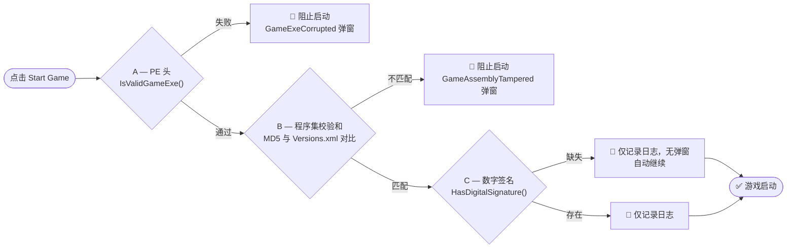

[](../README.md)
[](README.ko.md)
[](README.de.md)
[](README.es.md)
[](README.fr.md)
[](README.pl.md)
[](README.ru.md)
[](README.it.md)
[](README.jp.md)
[](README.pt.md)
[](README.vi.md)
[](README.zh-CN.md)
[](README.zh-TW.md)

# ModAPI(v1) v2.0.9623 - 20260920

> 原作: FluffyFish / Philipp Mohrenstecher (德国 恩格尔斯基兴)
> 升级: zzangae (大韩民国)

---

## 概述

ModAPI 是一款用于管理 **5款官方支持游戏** 模组的桌面应用程序。此升级版包含多游戏支持、全面重新设计的 Settings 标签页、Steam 路径配置、持久化 UI 设置、动态字体大小系统、游戏启动验证、Debug/Release 构建分离，以及通过游戏内测试验证的大量崩溃修复。

---

## 支持的游戏

| 游戏 | 引擎 | 版本 | Steam ID | 可执行文件 |
|---|---|---|---|---|
| The Forest | Unity 5 | v1.12 (VR) | 242760 | `TheForest.exe` |
| Subnautica | Unity | 2025补丁 | 264710 | `Subnautica.exe` |
| RAFT | Unity | v1.1.02 (测试版) | 648800 | `Raft.exe` |
| Escape The Pacific | Unity 6 | v0.67.0.0 | 655290 | `EscapeThePacific.exe` |
| Green Hell | Unity 2019 | v2.9.5 | 763790 | `GH.exe` |

<details>
<summary><b>The Forest</b></summary>

| 项目 | 值 |
|---|---|
| 引擎 | Unity 5 (由 Unity 4 升级) |
| 最新版本 | v1.12 (VR) |
| 最后更新 | 2019年9月11日 — VR支持补丁；此后无重大内容更新 |
| 可执行文件 | `TheForest.exe` |
| 数据文件夹 | `TheForest_Data/Managed/` |
| Mods文件夹 | `mods/TheForest/` |
| 项目文件夹 | `projects/TheForest/` |
| Steam App ID | `242760` |
| IL2CPP | ❌ Mono — 完全支持 |

The Forest 从 Unity 4 升级到 Unity 5，画面和物理效果都有了显著提升。2019年9月的 VR 补丁是最后一次重大更新，此后一直保持稳定的完成状态，非常适合制作模组。
</details>

<details>
<summary><b>Subnautica</b></summary>

| 项目 | 值 |
|---|---|
| 引擎 | Unity (2022年与 Below Zero 整合为统一代码库) |
| 最新版本 | 2025补丁 (v18810395) |
| 最后更新 | 2025年8月12日 — 随移动版发布进行的错误修复及性能改进 |
| 可执行文件 | `Subnautica.exe` |
| 数据文件夹 | `Subnautica_Data/Managed/` |
| Mods文件夹 | `mods/Subnautica/` |
| 项目文件夹 | `projects/Subnautica/` |
| Steam App ID | `264710` |
| IL2CPP | ❌ Mono — 支持 |

Subnautica 最初基于 Unity 5 发布，在2022年末的「Living Large」更新(v2.0)中与 Below Zero 整合了引擎代码库，优化和稳定性都得到了提升。备注：续作 *Subnautica 2* 将使用 Unreal Engine 5。

> **v2.0.9610 中重写 XML**：`XGamingRuntime.dll`、`XblPCSandbox.dll`、`FMODUnity.dll`、`Newtonsoft.Json.dll`、`Unity.InputSystem.dll`、`Unity.Collections.dll`、`Unity.Burst.dll` 已添加到 `copyAssembly`。
</details>

<details>
<summary><b>RAFT</b></summary>

| 项目 | 值 |
|---|---|
| 引擎 | Unity |
| 最新版本 | v1.1.02 (测试版) / v1.09 (稳定版) |
| 最后更新 | 2026年3月 — 测试分支中的语音聊天及多人游戏错误修复 |
| 可执行文件 | `Raft.exe` |
| 数据文件夹 | `Raft_Data/Managed/` |
| Mods文件夹 | `mods/Raft/` |
| 项目文件夹 | `projects/Raft/` |
| Steam App ID | `648800` |
| IL2CPP | ❌ Mono — 支持 |
| Versions.xml | `1.1.01` (含校验和) |

自 v1.0 *The Final Chapter* 官方剧情完结以来，网络代码改进及稳定性方面的补丁仍在持续。2026年3月的测试分支更新修复了语音聊天及多人游戏问题。
</details>

<details>
<summary><b>Escape The Pacific</b></summary>

| 项目 | 值 |
|---|---|
| 引擎 | Unity 6 (2025年末从 Unity 2021/2022 迁移) |
| 最新版本 | v0.67.0.0 |
| 最后更新 | 2025年6月26日 — 岛屿分布重新设计及引擎更新；截至2026年热修复仍在进行中 |
| 可执行文件 | `EscapeThePacific.exe` |
| 数据文件夹 | `EscapeThePacific_Data/Managed/` |
| Mods文件夹 | `mods/EscapeThePacific/` |
| 项目文件夹 | `projects/EscapeThePacific/` |
| IL2CPP | ❌ Mono — 支持 |

2025年末完成了主要系统重新设计及 Unity 6 迁移，实现了更具动态性的环境。游戏目前仍处于抢先体验开发阶段。

> **v2.0.9610 中重写 XML**：移除 `extends="GenericUnityGame"`；将 `includeAssembly` 设置为仅 `Assembly-CSharp.dll` — 防止 `Assembly-CSharp-firstpass.dll` 继承错误。
</details>

<details>
<summary><b>Green Hell</b></summary>

| 项目 | 值 |
|---|---|
| 引擎 | Unity 2019 |
| 最新版本 | v2.9.5 |
| 最后更新 | 2026年2月4日 — Steam Deck 优化及文本可读性改进 |
| 可执行文件 | `GH.exe` |
| 数据文件夹 | `GH_Data/Managed/` |
| Mods文件夹 | `mods/GH/` |
| 项目文件夹 | `projects/GH/` |
| Steam App ID | `763790` |
| IL2CPP | ❌ Mono — 支持 |
| Versions.xml | `2.9.5` (含校验和) |

在游戏生命周期中经历了 Unity 2017 → 2018 → 2019 的开发。2026年2月的热修复主要集中在 Steam Deck 兼容性及 UI 可读性方面。

> **v2.0.9610 中重写 XML**：添加 `AmplifyBloom.dll`、`AmplifyColor.dll`、`AmplifyMotion.dll`、`com.rlabrecque.steamworks.net.dll`、`Unity.ProBuilder.dll`、`Unity.Postprocessing.Runtime.dll`；移除不存在的 `DOTweenPro.dll`。
</details>

---

<details>
<summary><b>架构</b></summary>

### 运行时分离

| 组件 | 目标 | 运行时 | 原因 |
|---|---|---|---|
| `ModAPI.exe` | .NET Framework 4.8 | Windows .NET 4.8 | 桌面应用程序，完全支持最新 API |
| `ModAPI_Shared.dll` | .NET Framework 4.8 | Windows .NET 4.8 | 共享库 |
| `BaseModLib.dll` | .NET Framework 3.5 | Game Mono 2.0 | **永久固定** — PE 头必须显示为 `v2.0.50727` |
| Mod DLL (用户) | .NET Framework 4.8 | Game Mono 2.0 (已修补) | 使用 4.8 构建，在 Apply 时修补 PE 头 |

### 开发者工具

用于项目管理的独立 WPF 实用程序。不会分发给最终用户。

| 工具 | 项目 | 目的 |
|---|---|---|
| `MODAPI_VersionTool.exe` | `VersionTool\MODAPI_VersionTool.csproj` | 同时更新 `AssemblyInfo.cs` 和 `App.xaml.cs` 的版本号 |
| `MODAPI_LangTool.exe` | `LangTool\MODAPI_LangTool.csproj` | 语言文件管理 — 添加、编辑、禁用、内置切换 |

**VersionTool — 版本管理**

只需点击一次即可更新版本号的独立 WPF 工具。

- 自动显示当前版本 (从 `App.xaml.cs` 读取)
- 输入新版本后点击 **Apply Version** 即可同时更新两个文件
- 格式验证：仅接受 `X.X.XXXX` 格式

| 文件 | 路径 | 变更内容 |
|---|---|---|
| `AssemblyInfo.cs` | `ModAPI\Properties\` | `AssemblyVersion`、`AssemblyFileVersion` |
| `App.xaml.cs` | `ModAPI\` | `public static string Version` |

**LangTool — 语言系统**

```
resources/langs/langs.json          ← 语言注册表 (builtin / active 标志)
resources/langs/Language.XX.xaml    ← 各语言的翻译键
resources/langs/Language.XX.png     ← 国旗图片 (36×24，由 flagcdn.com/h24/ 提供)
```

内置切换流程 (Update 按钮)：
```
builtin: false → true (langs.json)
  → 重写 CreateDefaultLangsJson() (LangTool\MainWindow.xaml.cs)
  → 注册 Language.XX.xaml (ModAPI\ModAPI.csproj)
  → 下次构建：语言完全内置，可离线使用
```

### Debug / Release 构建分离

所有文件验证及程序集处理均通过 `#if DEBUG` / `#else` 根据构建配置进行分支处理。

| 位置 | Debug 构建 | Release 构建 |
|---|---|---|
| `CheckSteam()` | 仅 `File.Exists()` — 虚拟文件也能通过 | `FileValidator.IsValidSteamExe()` — PE 头 + 最小 1 MB |
| `CheckGamePath()` | 仅 `File.Exists()` — 虚拟文件也能通过 | `FileValidator.IsValidAssemblyDll()` — PE 头 + CLR 元数据 + 最小 8 KB |
| `ModLib.Create()` — IncludeAssemblies | `File.Copy()` — 跳过 Cecil 解析 | 完整的 Mono.Cecil 解析 + IL 修改 + `module.Write()` |
| `ModLib.Create()` — 未找到文件 | 记录警告日志，跳过并继续 | 记录错误日志，弹出提示后中止 |

**Debug 测试** 使用 `create_dummy_Debug_games.ps1` 在 `bin\Debug\dummy_games\`、`bin\Debug\dummy_steam\`、`bin\Debug\gamefiles\original\` 下生成 0 字节占位文件。这些文件可通过 `File.Exists()` 检测，无需实际安装游戏即可测试完整的 UI 工作流程。

**Release 构建** 应用 `FileValidator` (PE 头 + .NET CLR 元数据验证) 拒绝 0 字节文件、文本文件及任意二进制文件。只有有效的 Windows 可执行文件和 .NET 程序集才能通过。

### FileValidator — PE 头验证

`ModAPI_Shared\Utils\FileValidator.cs` — 仅在 Release 构建中应用。

| 方法 | 检查项 | 最小大小 |
|---|---|---|
| `IsValidSteamExe(path)` | MZ 签名 + PE\0\0 签名 | 1 MB |
| `IsValidGameExe(path)` | MZ 签名 + PE\0\0 签名 | 512 KB |
| `IsValidAssemblyDll(path)` | MZ + PE\0\0 + CLR 元数据头 (数据目录 #14) | 8 KB |

```
检查的 PE 头布局：
[0x00] 4D 5A          ← "MZ" DOS 签名
[0x3C] XX XX XX XX   ← PE 头偏移量 (小端序)
[offset] 50 45 00 00 ← "PE\0\0" 签名
[Optional Header → DataDirectory[14]] RVA+Size != 0 ← .NET CLR 头存在
```

### 程序集重映射流水线

```
[Mod 开发者使用 .NET 4.8 构建]
  → Mod DLL: PE 头 v4.0.30319，mscorlib 4.0.0.0

[ModAPI Apply — ModProject.cs]
  → AssemblyVersionMap.RemapAllReferences(modModule)
      mscorlib 4.0.0.0 → 2.0.0.0 等
  → modModule.RuntimeVersion = "v2.0.50727"
      PE 头：v4.0.30319 → v2.0.50727

[Game Mono 2.0]
  → PE 头验证通过 ✅  →  引用解析成功 ✅
```

### 程序集解析器回退

```
1. gamefiles/original/{GameId}/{AssemblyPath}   ← 备份文件夹
2. {ActualGameInstallPath}/{AssemblyPath}        ← 游戏安装文件夹 (回退)
```

### C# 7.3 功能支持

| 功能 | 状态 | 备注 |
|---|---|---|
| 模式匹配 (`is`, `switch`) | ✅ | 已通过游戏内验证 |
| 字符串插值 (`$""`) | ✅ | 已通过游戏内验证 |
| `out` 变量内联 | ✅ | 已通过游戏内验证 |
| `async` / `await` | ✅ | 通过 AsyncBridge + System.Threading 填充库实现 |
| 元组 (`ValueTuple`) | ❌ 硬性限制 | Mono 2.0 `mscorlib` ABI — 无解决方案 |
</details>

<details>
<summary><b>主题系统 [详细参考](v2.0.9613_themes_en.md)</b></summary>

自 v2.0.9613 起，主题选择 UI 已从 Settings 标签页移至专属的 **Themes 标签页**。添加新主题只需在 `App.xaml.cs` 字典中添加一行即可。

| 索引 | ID | 文件 | 配色 |
|---|---|---|---|
| 0 | `classic` | 仅 `Dictionary.xaml` | 原版 ModAPI 纹理背景 |
| 1 | `light` | `FluentStylesLight.xaml` | 浅色调 + 蓝色强调色 |
| 2 | `dark` | `FluentStyles.xaml` | 深色调 + 蓝色强调色 (默认) |
| 3 | `diablo` | `FluentStylesDiablo.xaml` | 红 + 黑 |
| 4 | `nebula` | `FluentStylesNebula.xaml` | 深邃宇宙 |
| 5 | `sunset` | `FluentStylesSunset.xaml` | 明亮日落 |
| 6 | `ocean` | `FluentStylesOcean.xaml` | 深邃海洋 |
| 7 | `nordic` | `FluentStylesNordic.xaml` | 明亮北欧风 |
| 8 | `citrus` | `FluentStylesCitrus.xaml` | 明亮柑橘色 |
| 9 | `bloom` | `FluentStylesBloom.xaml` | 明亮花卉色 |

切换主题时，应用会自动重启。(保存至 `theme.cfg`)

| 主题 | 主题 |
| :---: | :---: |
|**01. Classic 主题**|**02. Light 主题**|
|  |  |
|**03. Dark 主题**|**04. Diablo 主题**|
|  |  |
|**05. Nebula 主题**|**06. Sunset 主题**|
|  |  |
|**07. Ocean 主题**|**08. Nordic 主题**|
|  |  |
|**09. Citrus 主题**|**10. Bloom 主题**|
|  |  |

### 背景纹理

在 Themes 标签页的 **背景纹理** 卡片中选择图片，即可将其应用为应用全局背景。支持格式：`.png` / `.jpg` / `.jpeg`，最大 50MB，4K 分辨率以下。图片会以 JPEG Q75 压缩，并附带 16 字节的魔术头，保存为 `resources\textures\ui_bg\bg.dat` (隐藏属性)。通过 SHA-256 哈希进行完整性验证；检测到篡改时会自动重置并弹出警告提示。

背景启用后，UI 透明度会分两层处理：第 1 层 (MergedDictionaries 叠加) 用于 `{DynamicResource}` 面板，第 2 层 (WalkStyleBackgrounds) 为基于 `{StaticResource}` 的面板应用半透明效果。

### 字体大小系统

| 资源键 | 基础值 | 说明 |
|---|---|---|
| `AppBaseFontSize` | 13 | 普通文本 |
| `AppBaseHeaderFontSize` | 16 | 标题、面板标题 |
| `AppBaseSmallFontSize` | 12 | 辅助标签 |
| `AppBaseTinyFontSize` | 10 | 提示文本 |
| `AppBaseLargeFontSize` | 20 | 大型显示文本 |

### 持久化 UI 配置 — `ui.cfg`

| 键 | 默认值 | 说明 |
|-----|---------|-------------|
| `ModListWidth` | `150` | Mods 标签页列表宽度 (px) |
| `ProjectListWidth` | `150` | Development 标签页项目列表宽度 (px) |
| `AppFontSize` | `13` | 全局 UI 字体大小 (px) |
| `AlwaysOnTop` | `false` | 窗口始终置顶 |
| `TexturePath` | *(无)* | 背景纹理原始文件名 (仅显示用) |
| `TextureHash` | *(无)* | 背景纹理 SHA-256 哈希 |
| `TextureActive` | `false` | 背景纹理启用状态 |
| `GamePathReset_{GameId}` | *(无)* | 游戏路径重置标志 |
| `SteamPathReset` | *(无)* | Steam 路径重置标志 |
</details>

<details>
<summary><b>项目结构</b></summary>

```
ModAPI/
├── App.xaml / App.xaml.cs              # ThemeRegistry, ThemeIds, ApplyTheme()
├── ui.cfg                               # 持久化 UI 设置
├── theme.cfg                            # 当前主题
├── Windows/
│   ├── MainWindow.xaml / .cs            # 主 UI — 6个标签页、主题、设置、Steam路径、
│   │                                    #   0字节下载保护、滑块防抖、静默设置读取
│   └── SubWindows/
│       ├── SpecifyGamePath.xaml / .cs   # 游戏路径弹窗 (动态 GameNameLabel)
│       ├── FirstSetup.xaml / .cs        # 首次运行设置 + 默认值初始化
│       └── (其他14个 SubWindows)
├── Themes/
│   ├── Dictionary.xaml                  # Classic 主题
│   ├── FluentStyles.xaml                # Dark 主题
│   ├── FluentStylesLight.xaml           # Light 主题
│   ├── FluentStylesDiablo.xaml          # Diablo 主题
│   ├── FluentStylesNebula.xaml          # Nebula 主题
│   ├── FluentStylesSunset.xaml          # Sunset 主题
│   ├── FluentStylesOcean.xaml           # Ocean 主题
│   ├── FluentStylesNordic.xaml          # Nordic 主题
│   ├── FluentStylesCitrus.xaml          # Citrus 主题
│   └── FluentStylesBloom.xaml           # Bloom 主题
├── Data/
│   ├── Mod.cs                           # Mod文件加载、LF/CRLF头解析、诊断日志
│   ├── ModLib.cs                        # BaseModLib生成 + 重映射 (#if DEBUG分离)
│   ├── Models/
│   │   └── ModProject.cs                # 项目创建/构建/应用 + null保护
│   ├── ViewModels/
│   │   ├── ModsViewModel.cs             # FilteredMods, SelectedModItem, SelectedGameFilter,
│   │   │                                #   防止损坏的Mod重试
│   │   ├── ModViewModel.cs              # 从文件夹路径提取GameId
│   │   ├── ModProjectsViewModel.cs      # DispatcherTimer的Dispose()
│   │   └── SettingsViewModel.cs         # UseSteam/AutoUpdate/UpdateVersions默认值为true
│   └── AssemblyVersionMap.cs            # Mono 2.0程序集版本映射 (20个程序集)
├── Utils/
│   ├── CustomAssemblyResolver.cs        # 基于名称的解析器 (带缓存)
│   └── MonoHelper.cs                    # Mono.Cecil IL辅助工具
├── resources/
│   ├── langs/                           # 13个语言文件 + langs.json (v2.0.9620中新增LangTool.*键)
│   └── textures/ui_bg/
│       └── bg.dat                       # 压缩及安全处理的背景图片 (运行时生成)
└── configs/
    ├── games/
    │   ├── TheForest.xml
    │   ├── Subnautica.xml               # v2.0.9610全面重写
    │   ├── Raft.xml
    │   ├── EscapeThePacific.xml         # v2.0.9610全面重写
    │   ├── GH.xml                       # v2.0.9610全面重写
    │   ├── SonsOfTheForest.xml          # IL2CPP — 不支持
    │   └── {GameId}/Versions.xml        # Raft, GH, Subnautica, EscapeThePacific
    └── UserConfiguration.xml

ModAPI_Shared/
├── Configurations/
│   └── Configuration.cs                 # 带silent参数的GetPath/GetString/GetInt
├── Data/
│   ├── Game.cs                          # ApplyMods自动备份生成、条件解析器、
│   │                                    #   游戏文件夹回退、轻量构造函数 + ModLib初始化修复
│   └── ModLib.cs                        # #if DEBUG分离，IncludeAssemblies/CopyAssemblies的游戏文件夹回退
└── Utils/
    └── FileValidator.cs                 # PE头 + CLR元数据验证 (仅限Release，最小8 KB)

BaseModLib/
├── BaseModLib.csproj                    # .NET 3.5 + LangVersion 7.3
└── libs/polyfills/
    ├── AsyncBridge.dll
    └── System.Threading.dll

VersionTool/
├── MODAPI_VersionTool.csproj            # 独立WPF版本更新工具
├── App.config
├── App.xaml / App.xaml.cs
├── MainWindow.xaml / .cs               # 版本输入、Apply按钮、当前版本显示
└── Properties/
    ├── AssemblyInfo.cs
    ├── Resources.Designer.cs / .resx
    └── Settings.Designer.cs / .settings

LangTool/
├── MODAPI_LangTool.csproj               # 独立WPF语言管理工具
├── App.xaml / App.xaml.cs              # 语言加载/切换，langtool.cfg
├── MainWindow.xaml / .cs               # 主UI — 语言列表、编辑面板、路径选择器
├── AddLanguageDialog.xaml / .cs        # ISO 3166-1国家选择ComboBox
├── ModApiDialog.xaml / .cs             # ModAPI风格的自定义对话框 (信息/警告/确认/询问)
├── Models/
│   ├── LanguageEntry.cs                # 语言条目模型 (isoCode, langCode, builtin, active)
│   ├── LangsJson.cs                    # langs.json根模型
│   └── IsoCountry.cs                   # ComboBox用ISO国家模型
└── Helpers/
    ├── LangsJsonHelper.cs              # langs.json的读写
    ├── FlagDownloader.cs               # flagcdn.com h24 国旗下载
    ├── XamlGenerator.cs                # Language.XX.xaml的生成/保存/解析
    ├── MissingKeyDetector.cs           # 以英语为基准检测缺失的键
    ├── IsoCountryList.cs               # ISO 3166-1全196个国家列表 (离线)
    └── BuiltinCodeWriter.cs            # 重写CreateDefaultLangsJson() + 注册ModAPI.csproj

bin\Debug\                               # 仅用于Debug测试
├── create_dummy_Debug_games.ps1         # 生成虚拟游戏/Steam结构
├── dummy_games\{GameId}\               # 虚拟游戏安装路径
├── dummy_steam\Steam.exe               # 虚拟Steam可执行文件
└── gamefiles\original\{GameId}\        # ModLib用虚拟备份路径
```

---

</details>

<details>
<summary><b>安装与设置</b></summary>

### 步骤1 — 前提条件

| 项目 | 是否必需 |
|---|---|
| Windows 10 / 11 | ✅ |
| .NET Framework 4.8 | ✅ (Windows 11已预装；Windows 10请[下载](https://dotnet.microsoft.com/download/dotnet-framework/net48)) |
| Steam | 必需 — 需在Settings标签页中配置 |
| 至少1款受支持的游戏 | 必需 — 需在Settings标签页中配置 |

### 步骤2 — 安装 ModAPI

1. 从 GitHub 下载最新版本
2. 解压到任意文件夹 (例如：`C:\ModAPI\`)
3. 运行 `ModAPI.exe`
4. 首次启动时会显示 **Welcome** 界面 — 完成设置后点击 **Continue**

### 步骤3 — 配置 Steam 路径 (Settings 标签页)

1. 前往 **Settings** 标签页
2. 找到 **Steam Installation Path** 项目
3. 点击 **Browse** → 选择 `Steam.exe`
4. 点击 **Save**

### 步骤4 — 配置游戏路径 (Settings 标签页)

1. 点击游戏卡片标题以展开
2. 点击 **Browse** → 选择游戏根文件夹 (`.exe` 所在位置)
3. 点击 **Save**

| 游戏 | 可执行文件 | 路径示例 |
|---|---|---|
| The Forest | `TheForest.exe` | `C:\Steam\steamapps\common\The Forest\` |
| Subnautica | `Subnautica.exe` | `C:\Steam\steamapps\common\Subnautica\` |
| RAFT | `Raft.exe` | `C:\Steam\steamapps\common\Raft\` |
| Escape The Pacific | `EscapeThePacific.exe` | `C:\Steam\steamapps\common\Escape The Pacific\` |
| Green Hell | `GH.exe` | `C:\Steam\steamapps\common\Green Hell\` |

### 步骤5 — 下载模组 (Downloads 标签页)

1. 前往 **Downloads** 标签页
2. 在游戏筛选中选择游戏
3. 浏览或搜索模组后点击 **Download**

> **离线模式**：从 `modapi.survivetheforest.net` 手动下载 `.mod` 文件，并放置到对应文件夹中：

| 游戏 | 文件夹 |
|---|---|
| The Forest | `mods/TheForest/` |
| Subnautica | `mods/Subnautica/` |
| RAFT | `mods/Raft/` |
| Escape The Pacific | `mods/EscapeThePacific/` |
| Green Hell | `mods/GH/` |

### 步骤6 — 应用模组并启动游戏 (Mods 标签页)

1. 前往 **Mods** 标签页
2. 在 **Game Filter** 中选择游戏 (第0列)
3. 在 **Mod List** 中勾选要启用的模组 (第1列)
4. 点击 **Start Game**

启动游戏前会自动运行以下检查：

| # | 检查项 | 失败时弹窗 |
|---|---|---|
| 1 | Steam 路径已配置且有效 | SteamNotFound |
| 2 | `mods/` 文件夹中的游戏与 Settings 标签页中的游戏匹配 | GameModsMismatch |
| 3 | 至少选择了一个模组 | NoModSelected |
| 4 | 未混合选择多个游戏的模组 | MixedGameMods |
| 5 | 游戏路径已配置且可执行文件存在 | GamePathNotSet / GameNotInstalled |

---

</details>

<details>
<summary><b>标签页概览</b></summary>

### Welcome 标签页
首次运行设置界面 (标签页索引0)。配置 AutoUpdate、Steam 连接及 VersionsData 表设置。之后启动时会提供社区链接及发行说明。

### Mods 标签页
主要的模组管理工作流 — 3列布局：

| 列 | 内容 |
|---|---|
| 第0列 | Game Filter — 5款受支持游戏的单选按钮 |
| 第1列 | Mod List — 带版本选择器和启用复选框的已安装模组 |
| 第2列 | Information — 所选模组的详细信息、说明、版本历史 |

### Downloads 标签页
从 `modapi.survivetheforest.net` 浏览并下载模组。

- **Game Filter**：TheForest / DedicatedServer / VR / Subnautica / RAFT / EscapeThePacific / GH
- **Category Filter**：12个分类 (错误修复、平衡性调整、作弊、……)
- **Search**：按模组名称、说明或作者搜索
- **Offline mode**：显示所有5款受支持游戏的文件夹说明

### Development 标签页
模组开发工作流 — Game Filter 面板 (第0列) 涵盖全部5款受支持游戏。

- 按游戏创建、构建及应用模组项目
- 语言资源管理
- 带3步验证的 ModLib 生成 (Steam → 项目 → 游戏路径)
- 通过轻量级 `Game` 构造函数安全切换游戏 (不调用 `Verify()`)

### Themes 标签页
主题选择及背景纹理管理。

- **主题选择**：10种主题 (Classic, Light, Dark, Diablo, Nebula, Sunset, Ocean, Nordic, Citrus, Bloom)
- **背景纹理**：选择图片作为应用全局背景 (JPEG压缩 + 安全处理)
- 背景纹理启用时，主题选择将被锁定

### Settings 标签页
集中式配置 — 4行：

| 行 | 内容 |
|---|---|
| 0 | 语言 / 字体大小 / 最大宽度 / Mod List宽度 / Project List宽度 |
| 1 | 保留 VersionsData / 自动更新 / Steam 连接 / 始终置顶 |
| 2 | Steam Installation Path (文本框 + Browse + Save + Reset) |
| 3 | Game Installation Paths — 按游戏可展开的卡片 (文本框 + Browse + Save + Reset) |

---

</details>

<details>
<summary><b>Lang Tool</b></summary>

### MODAPI_LangTool (语言管理工具)

用于管理 ModAPI 语言文件的独立 WPF 工具，作为 `LangTool\MODAPI_LangTool.csproj` 添加到解决方案中。

**位置**：`LangTool\MODAPI_LangTool.csproj`

**核心功能**

| 功能 | 说明 |
|---|---|
| 语言列表 | 显示 `langs.json` 中所有语言及状态图标 (🔒 内置 / 🚫 已禁用 / ✅ 已启用) |
| 添加语言 | 在 ISO 3166-1 ComboBox 中选择国家 → 从 `flagcdn.com/h24/{iso}.png` 自动下载国旗 → 基于英语模板自动生成 `Language.XX.xaml` |
| 编辑语言 | `isoCode` / `langCode` 锁定；仅在启用状态下可编辑 `langName` 及翻译键 |
| 禁用 / 启用 | 切换 `langs.json` 中的 `active` 标志 — 保留文件，但从 ModAPI 列表中隐藏 |
| 更新 (内置切换) | 将 `builtin: false` → `true` — 不可撤销，需二次确认 — 从源代码自动重写 `CreateDefaultLangsJson()`，并在 `ModAPI.csproj` 中注册 `Language.XX.xaml` |
| 缺失键检测 | 与英语基准对比 — 显示缺失/空白键数量及翻译进度 |
| 内置保护 | `builtin: true` 的语言为只读 — 无法编辑、禁用或更新 |
| 禁用保护 | `active: false` 的语言在重新启用前为只读 |
| 语言 UI | LangTool 本身支持全部13种 ModAPI 语言 — 右上角带国旗的语言选择器 |
| 路径保存 | 将选定的 ModAPI 根路径保存至 `langtool.cfg` — 下次启动时自动加载 |
| 自定义对话框 | 所有弹窗均使用 ModAPI 风格的深色主题 `ModApiDialog`，而非系统 MessageBox |

**langs.json 结构**

```json
{
  "languages": [
    { "isoCode": "us", "langCode": "EN",    "langName": "English",   "builtin": true,  "active": true },
    { "isoCode": "kr", "langCode": "KR",    "langName": "한국어",     "builtin": true,  "active": true },
    { "isoCode": "gb", "langCode": "EN-GB", "langName": "English (UK)", "builtin": false, "active": true }
  ]
}
```

**国旗图片规则**

```
ISO代码 (小写) → flagcdn.com/h24/{iso}.png → Language.{LANGCODE}.png
                                                  resources/langs/
```

**Update 按钮的行为**

对非内置且已启用的语言点击 Update 按钮时：

1. `langs.json` — `builtin: false` → `true`
2. `LangTool\MainWindow.xaml.cs` — 以当前所有 `builtin: true` 的语言重写 `CreateDefaultLangsJson()`
3. `ModAPI\ModAPI.csproj` — 注册 `<Resource Include="resources\langs\Language.XX.xaml" />`
4. 下次构建 — 语言完全内置，可离线使用

**新增的语言键** (`Lang.LangTool.*`)

包含 LangTool UI 字符串、对话框消息、状态文本的53个新键已添加到全部13个语言文件中。

---

</details>

<details>
<summary><b>Version Tool</b></summary>

### MODAPI_VersionTool (版本更新工具)

只需点击一次即可更新版本号的独立 WPF 工具。

**位置**：`VersionTool\MODAPI_VersionTool.csproj`


**功能**
- 自动显示当前版本 (从 `App.xaml.cs` 读取)
- 输入新版本后点击 **Apply Version** 即可同时更新两个文件
- 格式验证：仅接受 `X.X.XXXX` 格式

**修改的文件**

| 文件 | 路径 | 变更内容 |
|---|---|---|
| `AssemblyInfo.cs` | `ModAPI\Properties\` | `AssemblyVersion`、`AssemblyFileVersion` |
| `App.xaml.cs` | `ModAPI\` | `public static string Version` |

**使用方法**
1. 运行 `MODAPI_VersionTool.exe`
2. 输入新版本 (例如：`2.0.9619`)
3. 点击 **Apply Version**
4. 在 Visual Studio 中重新构建 ModAPI 解决方案

**StatusBar 版本显示**

- `VersionLabel.Text` 现在引用 `App.Version`，而非硬编码的说明符
- 使用 VersionTool 更新版本并重新构建后，StatusBar 会立即反映更新

---

</details>

<details>
<summary><b>Log</b></summary>

### 日志系统 — 双文件分离 (`ModAPI.log` / `ModAPI.detailed.log`)

以往仅限于 `#if DEBUG` 的开发者专用诊断日志，导致在最需要排查用户问题的 Release 构建中无法查看。现改为双文件系统：

| 文件 | 内容 |
|---|---|
| `ModAPI.log` | 面向用户的核心日志 — 与以往格式相同，不会比以前更多 |
| `ModAPI.detailed.log` | 无论 Release/Debug，始终记录所有日志调用 — 用于用户咨询时的诊断 |

**`Debug.cs`** — `Log()` 新增了 `detailedOnly` 参数。当为 `true` 时，消息仅记录到 `ModAPI.detailed.log`；不再完全移除现有的所有 `#if DEBUG` 代码块，而是切换为该标志，使 Release 版本也能始终记录到 detailed 文件。由此构成四级严重程度体系：

| 级别 | 含义 |
|---|---|
| Verbose (`detailedOnly: true`) | 重复性/机械性追踪 — 按类型、文件、方法分类 |
| Notice | 人类可读的流程 — 进度及成功消息 |
| Warning | 潜在问题，尚未失败 |
| Error | 确定的失败 |

**曾占用 `ModAPI.log` 的日志噪音来源及切换为 `detailedOnly: true` 的项目：**

| 文件 | 曾溢出到 `ModAPI.log` 的内容 |
|---|---|
| `ModsViewModel.cs` | 每秒重复的 `FindMods()` 扫描/跳过/队列消息 |
| `Game.cs` | `UpdateVersions()` 的 TLS/URL 追踪行、Cecil 类型映射条目 |
| `ModLib.cs` | Cecil 按类型/方法进行的程序集处理 (`Validating`、`Processing`、`Changed ... accessibility`) — 一次 Green Hell 模组构建即可产生数万行，是占用 `ModAPI.log` 容量最多的主要来源 |
| `Mod.cs` | 每次加载模组时转储整个模组头 XML (`configuration.ToString()`) |

**校验和不匹配日志 — 从逐条记录改为摘要：** `Header.Verify()` 之前对每个不兼容的 `InjectInto`/`AddMethod`/`AddField`/`AddClass` 条目都会输出一行 `Mismatched checksum at "..."`，一个旧模组可能产生数十行。现在 `ModAPI.log` 中仅记录单条 Warning 级别摘要 (例如：`Mod "MarsarahMod" has 14 checksum mismatch(es). This usually means the mod is incompatible with the current game version. See ModAPI.detailed.log for the full list.`)。逐条完整列表仍可在 `ModAPI.detailed.log` 中查看。

---

</details>

<details open>
<summary><b>v2.0.9623 的变更内容</b></summary>

## v2.0.9623 的变更内容

### 更新检查与应用 — 启动器式、手动触发、不强制

首次启动弹窗(`FirstSetup` 窗口)原本提供 3 个选项 —— **保持最新版本**、**搜索更新**、**Steam 连接** —— 其中一些功能的开发曾被搁置。在恢复工作前调查实际代码状态后发现，Steam 连接和保持最新版本其实早已完全可用；只有搜索更新（检查是否存在更新的 ModAPI 版本）未完成 —— 下载/安装流水线本身是存在的，但从来没有任何代码调用过它。

**本次实现的内容：**

- **`Game.CheckForNewVersion(out releaseNotes)`**（`ModAPI_Shared\Data\Game.cs`）—— 调用 GitHub Releases API（`/repos/{owner}/ModAPI/releases/latest`），返回最新标签及其发行说明（`body` 字段，使用一个最简 JSON 字符串反转义逻辑解析，未新增任何依赖）。`UpdateRepoOwner` 对普通用户始终指向 `FluffyFishGames`（运营仓库），只有以 `--dev` 参数启动时才会切换到维护者的开发仓库 —— 绝不会因为设置标签页的"开发者日志"复选框而切换。该复选框仅用于崩溃日志的详细程度，不应该在用户只是打开日志时就把他们悄悄转移到未经验证的测试渠道。
- **设置标签页**：原本不起作用的"搜索更新"复选框已移除，替换为单个**更新**按钮（启动器式，而非后台开关）。点击后会检查新版本，如果存在，会立即进入下载→解压→应用流程，中间没有"现在还是稍后"的选择。
- **首次启动弹窗**：已失效的"自动更新"选项及其不再使用的配置写入代码已被移除；弹窗现在只询问 Steam 连接和保持最新版本这两项。
- **`OperationPending` 窗口** 新增了一个默认折叠的发行说明显示区域和 `Confirmed` 事件。下载/解压达到 100% 后，发行说明会显示出来，"完成"按钮随之启用 —— 只有点击该按钮才会真正启动 `Updater.exe` 并退出 ModAPI（此前是解压一结束就自动执行这个流程，用户没有机会先看看改了什么）。`Updater.exe` 本身（原作者代码，未修改）会等待 ModAPI 退出后覆盖文件并自动重启 ModAPI。
- ModAPI 不会因为版本过旧而阻止使用：版本检查只在用户点击"更新"按钮时才会执行，启动时绝不会介入 —— 无论更新状态如何，应用始终可以正常使用，这与典型游戏启动器的强制更新门槛不同。

### UI 修复 — 发行说明面板未自动换行

`OperationPending` 进度窗口新增的发行说明区域最初被渲染成需要横向滚动的单行难读文本，原因有两个叠加在一起：

1. `TextBox` 的 `HorizontalScrollBarVisibility` 默认值是 `Hidden` 而不是 `Disabled` —— 除非显式设为 `Disabled`，否则 WPF 会忽略 `TextWrapping="Wrap"`，让这一行无限延伸下去。
2. 所有弹窗共用的 `SubWindow` 样式设置了 `SizeToContent="WidthAndHeight"`（`FluentStyles.xaml`），因此通过 `*` 网格列拉伸的区域没有固定宽度作为换行依据 —— 必须显式指定宽度。

解决方法是给该区域绑定一个固定宽度到 `ProgressBar.ActualWidth`（使其右边缘与上方的进度条对齐），并把 `TextBox` 改成只读的 `TextBlock` + `ScrollViewer` 组合（完全避开 `TextBox` 的 `PART_ContentHost` 忽略换行的怪癖）。同时给该区域指定了不透明的 `FluentCardBrush` 背景 —— 此前它默认继承窗口的透明度。之前为强行撑大窗口而加入的手动 `Height +=` 代码与 `SizeToContent` 存在冲突，因此被移除 —— 区域一旦可见，窗口现在会自动正确地变大。

### 端到端实测验证（手动测试）

使用可丢弃的虚拟发行数据，真实跑通了检查→下载→解压→确认→重启的完整流程，确认包括原作者未修改的 `Updater.exe` 在内的整条链路都能正常工作。测试过程中发现一个有用的事实：`App.xaml.cs` 会在 ModAPI **自身启动时**先自行清理（应用）残留的 `_update` 文件夹 —— 因此如果在启动 ModAPI *之前* 就预先创建一个假的 `_update` 文件夹进行测试，它会在 `Updater.exe` 看到之前就被悄悄消耗掉。`_update` 文件夹必须在 **ModAPI 已经在运行的状态下** 创建，才能真实还原实际下载填充该文件夹时的情形。为了以后能在不触碰原有重启逻辑的前提下更容易诊断此类问题，已在 `Updater.cs` 中加入了可选的诊断日志（`Updater.diag.log`，用 try/catch 包裹，独立于正常逻辑路径之外）。

### 开发笔记 — 使用 `--dev` 运行

`App.DevMode`（`ModAPI\App.xaml.cs`）只有在以 `--dev` 命令行参数启动应用时才会为 `true` —— 这与设置标签页的"开发者日志"复选框是两回事，该复选框只应影响日志详细程度，**绝不能**被用来控制日志以外的任何东西（例如绝不能用它来切换某个功能所连接的服务器/仓库 —— 用户为了报告崩溃而打开详细日志，不应该因此被悄悄切换到未发布的测试渠道）。

在本地以 `--dev` 运行：
- **Visual Studio（F5 调试）**：`ModAPI` 项目 → 属性 → Debug 选项卡 → "命令行参数"中输入 `--dev`。
- **已构建的 .exe**：在终端中以 `ModAPI.exe --dev` 运行，或在快捷方式的目标字段末尾添加 `--dev`。

### "保持版本表"复选框 — 现在会在功能无实际作用前被禁用

`Game.Verify()` 只有在游戏路径有效（`CheckGamePath()` 通过）时才会执行到 `VersionsData.Refresh()`（实际下载版本表的代码）——否则会提前返回。这意味着在未配置游戏路径的情况下打开"保持版本表"其实什么都不会发生，这一点很容易让人困惑（已通过实测确认：在没有游戏路径的情况下，即使勾选了该复选框，日志中也不会出现任何 `[UpdateVersions]` 行）。

新增了 `SettingsViewModel.CanUpdateVersionsTable`（`App.Game != null && App.Game.CheckGamePath()`），并将其绑定到复选框的 `IsEnabled`。每当保存/重置游戏路径，或 Development 标签页的游戏筛选切换游戏时，该值都会重新评估。禁用状态下，悬停会显示说明原因的提示；启用状态下，悬停会说明打开它的实际作用。此外还将韩语标签从"최신버전 유지"（"保持最新版本"）改为"버전 테이블 유지"（"保持版本表"）——其他所有语言这里都已经写着"表"，只有韩语漏了这个词，容易与另一个不相关的"更新"按钮混淆。

### 全局修复 — Classic（默认）主题下的提示框(Tooltip)一直没有样式

本次会话中出现的上述提示框，渲染出来是系统默认的纯白提示框，而不是应用自己的主题外观。追查后发现，应用中从来没有任何一个提示框在默认的"classic"主题下被测试过：`FluentStyles*.xaml`（非默认主题）各自都定义了带主题的 `ToolTip` 样式，而 `classic` 只加载 `Dictionary.xaml`，其中从未有过这个样式。为 `Dictionary.xaml` 添加了匹配的 `ToolTip` 样式（不透明背景，因为该主题的其他半透明卡片画刷是设计来叠在背景图片上的，而不是叠在悬浮提示框上）。这一修复对默认主题下应用内**所有**提示框生效，而不仅仅是这一处。

### 首次启动弹窗重新设计

首次启动弹窗不再询问 Steam 连接 / 保持版本表——两者都已经在 Settings 标签页中提供，这里重复询问是多余的。取而代之，弹窗现在会显示一个可滚动的"此版本的新变化"摘要。介绍文字和按钮也一并重新设计：

- Steam 连接 / 保持版本表的复选框及其说明文字已移除；取而代之的是一个固定宽度、包含本次更新要点的可滚动面板。
- Welcome 标签页原本的"환영합니다!"（"欢迎！"）标题被替换为一个同名按钮——点击它可以随时重新打开首次启动弹窗，例如重新查看当前版本的变更内容。以这种方式重新打开时，弹窗的按钮文字会变为"关闭"而不是"继续"，不会重新执行首次设置流程（不写入 `SetupDone`，也不调用 `FirstSetupDone()`），关闭它也不会退出应用（`FirstSetup` 构造函数的 `isReopen: true` 参数控制以上所有行为）。
- **跨主题测试中发现的窗口尺寸 Bug**：该弹窗所用的 `SubWindow` 样式同时组合了 `AllowsTransparency="True"` + `WindowStyle="None"` + `SizeToContent="WidthAndHeight"` —— 在这种组合下，WPF 在自动计算尺寸时并不能可靠地遵守 `MaxWidth`。在 `classic` 主题下碰巧看起来正常，但在 Diablo 等其他主题下会渲染得过宽（文字未换行、被截断）。修复方式是在该窗口上局部覆盖为 `SizeToContent="Height"`（该弹窗的卡片本身设计为固定宽度，本就不需要自动计算宽度）——这样一来，所有主题下的布局都得到了统一修复，而不需要逐主题打补丁。
- **可读性问题，仅限 `classic` 主题**：`classic` 共用的 `NormalLabel` 样式（白色文字 + 投影，本是为叠在照片式图片面板上的文字设计的）在本弹窗纯色的 `PanelCenter` 卡片背景上可读性不佳。没有去改动这个到处都在用的共享样式，也没有硬编码在其他主题下会显得不对的颜色，而是新增了 `FirstSetup.ApplyClassicThemeTextFix()`，严格限定在 `App.GetCurrentTheme() == "classic"` 时才生效，只针对这一个弹窗、只在这一个主题下切换为深色、无投影的外观。其他所有主题都未受影响，继续使用各自已经正确的 `NormalLabel`/`PanelCenter` 颜色。

### 游戏完整性检查 — 步骤 C 不再每次启动都弹窗

用户反馈了对启动前完整性检查的真实不满：对于原本就不带数字签名发布的游戏（常见于 Green Hell 这类独立游戏），"无签名"警告弹窗在他们**每一次**点击 Start Game 时都会出现，需要手动点击一次"继续"——即便实际上什么问题都没有。仅仅缺少签名并不能证明文件被篡改，因此这纯粹是一种干扰，而不是真正有效的安全检查。



- **A（PE 头）** 和 **B（程序集校验和）** 保持不变——真正的文件损坏或篡改仍会阻止启动并弹出警告（`NoProjectWarning`，与应用内其他弹窗一样通过共享的 `SubWindow` 样式实现主题化，因此会自动匹配当前使用的主题）。
- **C（数字签名）** 不再显示任何弹窗，也不再要求任何一种确认——它只会记录一条 `Notice` 级别的日志（`[Integrity] Game executable has no digital signature (not necessarily tampered — many games ship unsigned)`），然后让游戏继续启动。此前使用的 `GameIntegrityWarning` 弹窗类现在已经没有任何地方调用它（保留在代码中，未删除，但不再被使用）。
- 这张流程图的目的是方便以后讨论该检查的结构——例如未来是否要以更轻量的形式恢复步骤 C（曾考虑过"不再提示一次"而非彻底移除，但最终按用户的方向选择了彻底移除），此图可作为参考起点。

### Steam 连接 — 自动检测路径，以及一个手动编辑相关的 Bug

调查了原作者的"Steam 连接"功能除了让用户选择 Steam 路径之外实际还做了什么，发现它还会通过 `Steam.exe -applaunch {AppId}` 启动游戏（以支持 Steam 叠加层），并通过 `steam://validate/{AppId}` 修复损坏的文件——这两项功能本次均未改动，此前就已实现。

- "Steam 连接"一打开，`MainWindow.UseSteamCheckBox_Checked` 就会直接从注册表（`HKEY_CURRENT_USER\Software\Valve\Steam`）读取 Steam 路径并自动填入——无论 Steam 装在哪个盘符都适用，而不仅限于 `C:` 盘。
- Steam 连接打开期间，手动路径相关控件（文本框、Browse、Save、Reset）本应被禁用，因为路径已由系统自动管理。**发现并修复了一个 Bug**：容纳这些控件的容器 Grid（`SteamAndGamePathsPanel`）在代码后台从未设置过它的 `DataContext`——只有 `Settings` 和 `SettingsCheckboxes` 设置了——导致 `{Binding CanEditSteamPathManually}` 静默失败，默认回退为 `IsEnabled="true"`。这些控件*看起来*是禁用的，但 Reset 按钮实际上仍可以正常点击。修复方式是显式设置 `SteamAndGamePathsPanel.DataContext = SettingsVm;`，与另外两处保持一致。
- 另外发现，在 classic 主题下，应用内所有禁用状态的控件都完全没有任何视觉反馈——`NormalButton` 的 `ControlTemplate` 没有 `IsEnabled="False"` 触发器（Fluent 系列主题早已有）。添加了对应的触发器，在 classic 主题下将禁用按钮的不透明度降至 40%，全应用范围生效。

### 主题系统统一 — Classic 与 Fluent 系列的对齐

起因是"如果 classic 和 Fluent 主题系列并没有实质性差异，为什么还要把它单独维护"这个问题——对 `Dictionary.xaml`（classic）与 9 个 `FluentStyles*.xaml` 文件之间每一处显式与隐式样式做了完整审计。

- 发现了实实在在、正在生效中的缺口：`Slider`（用于 Settings 标签页的 Mod List/Project List 宽度滑块）和 `ComponentsInputs:MultilingualTextField`（模组名称/说明字段所用的语言旗帜+文本组合控件）只存在于 classic 中，在 Fluent 系列中没有对应实现——在 Fluent 主题下，这两个控件会悄悄退回使用 classic 的 Scale9 图片皮肤，破坏了 Fluent 的扁平化外观。为两者构建了扁平化、基于 `DynamicResource` 的替代实现，放入新建的共享文件 **`ModAPI\Themes\FluentStylesShared.xaml`**，通过 `ResourceDictionary.MergedDictionaries` 合并进全部 9 个 `FluentStyles*.xaml` 中——今后调整一次颜色只需要改一个地方，而不是九个。
- 也发现了反方向的缺口：`GridSplitter`（`MainWindow.xaml` 中 Mod List/版本列表之间的分隔条）在全部 9 个 Fluent 主题中都有样式，但 classic 中没有，导致它在 classic 主题下渲染成系统默认的灰色分隔条。为 `Dictionary.xaml` 添加了对应的扁平化样式。
- 沿途还发现了确实已死的代码——定义了但实际 UI 中没有任何地方引用的样式：`PasswordBox`（只被 `LoginWindow.xaml` 使用，而后者本身从未在任何地方被实例化——登录系统早在 v2.0.9400 就已被移除）、`Components:ModProjectButton`、四个社交登录按钮样式（`FacebookButton`/`TwitterButton`/`YoutubeButton`/`TwitchButton`），以及一组 `TimeSlider`/`TimeHorizontalSlider`/`TimeSliderThumbStyle`（很可能是从未上线过的昼夜循环滑块）。按照本项目"不删除原作者代码"的原则，这些均未被移除——每一处都用 XML 注释包裹，并附上未被引用的说明，作为历史记录留在文件中，而不是从历史中消失。
- 还发现两个完全没有接入构建的遗留文件：`ModAPI\Windows\Dictionary.xaml`（早期重构过程中产生的死路径重复文件，从未被 `App.xaml` 或 `.csproj` 引用）和 `ModAPI\Themes\FluentStylesClassic.xaml`（主题系统早期原型——在每个主题拥有专属文件之前，它原本是除 `light` 外所有主题的回退皮肤；该回退逻辑被替换后即成为孤儿文件）。经 git 历史确认两者均与原作者的代码无关，因此——与上面那些死样式不同——这两个文件被直接删除而非注释保留，`.csproj` 中随之悬空的 `FluentStylesClassic.xaml` 的 `<Page>` 条目也一并移除。
- classic 自身的 `Slider` 随后被重新设计，以匹配 Fluent 共享样式的扁平外观（相同的 `Border`+`Track` 结构，重新配色为 classic 的金棕色调：`#B8963E` 滑块、半透明 `#40FFFFFF` 轨道），取代了原先的 Scale9 图片式滑条——旧实现（`SliderThumbStyle`、`SliderButtonStyle`、`HorizontalSlider`、`VerticalSlider`，以及旧的隐式 `Slider` 样式）同样是注释保留而非删除。

### Settings 标签页剩余复选框的 开/关 提示框

将"保持版本表"上已经用过的"悬停查看作用"模式，扩展到 Settings 标签页其余四个复选框——**Steam 连接**、**开发者日志**、**启动时清除日志**、**始终置顶**——每一个现在都会根据自身当前的勾选状态显示不同的提示，说明打开或关闭它分别会有什么效果（例如 Steam 连接启用状态下的提示会说明上文提到的自动路径检测和叠加层支持）。新增 8 个语言键 × 13 种语言。

### 欢迎弹窗 — 完整详细内容，与发行说明同步

本次会话中"此版本的新变化"面板经历了多轮迭代：从简短的要点列表 → 逐节对应 `Docs/RELEASE_NOTES_2.0.9623.md` 的完整说明（使用纯文本的 `■`/`▸`/`•` 符号，因为 `TextBlock` 无法渲染 Markdown），并翻译为全部 13 种语言。过程中发现并修复了两个相关的布局 Bug：

- 该可滚动文本区域最初写死了 `Width="450"`，导致滚动条前方留有一道空隙（在 classic 主题下还会使文字过早换行）。修复方式是去掉固定宽度，改为给 `ScrollViewer` 设置 `Padding="14"`——这与 `OperationPending` 详情面板中已经验证过的做法一致。
- 外层容器（`WhatsNewBorder`）随后需要一个宽度，而写死一个像素值最终证明是个错误的做法：`SubWindow` 模板自身的内容边距因主题而异（classic 下总共 32px，Fluent 下为 72px，因为 Fluent 的模板同时叠加了外层 `Border` 边距和 `ContentPresenter` 边距）。一个刚好填满 classic 较宽松布局的宽度值，在 Fluent 主题下会**把滚动条直接裁切到可视区域之外**。修复方式是彻底移除显式宽度和 `HorizontalAlignment="Left"`——该容器现在默认使用 `Stretch`，在任何主题下都能正确填满主题外壳实际留出的空间。
- 这段弹窗文字刻意选择**不**从 GitHub Releases 页面实时拉取——那样要么会向非英语用户展示原始英文，要么就得搭建一套翻译流水线（例如随每次发布同步发布一份各语言 JSON 文件，或接入机器翻译 API），而这两者本项目目前都不具备。因此它保持为一段简短的、人工翻译的摘要，每次更新当前版本的发行说明时会被整体重写（原地替换全部内容，而不是追加）。

### 新增/更新的语言键（13 种语言）

| 键 | 中文值 |
|---|---|
| `Lang.Options.Buttons.Update` | 更新 |
| `Lang.Windows.OperationPending.Tasks.Update.Done` | 更新已就绪 — 请查看下方的变更内容后点击完成。 |
| `Lang.Windows.NoUpdateAvailable.Title` | 已是最新版本 |
| `Lang.Windows.NoUpdateAvailable.Text` | 您当前使用的是最新版本的 ModAPI。 |
| `Lang.Windows.NoUpdateAvailable.Buttons.OK` | 确定 |
| `Lang.Options.Labels.UpdateVersionsTableDisabledHint` | 请先设置游戏路径才能使用此功能。 |
| `Lang.Options.Labels.UpdateVersionsTableEnabledHint` | 游戏更新补丁后，ModAPI 需要识别出新版本。打开此项可以自动保持该信息为最新。 |
| `Lang.Options.Labels.UseSteamEnabledHint` / `UseSteamDisabledHint` | 说明自动检测 Steam 路径（或手动输入）分别的作用 |
| `Lang.Options.Labels.DevLogEnabledHint` / `DevLogDisabledHint` | 说明额外的 `ModAPI.dev.log` 文件与常规日志的区别 |
| `Lang.Options.Labels.ClearLogsOnStartEnabledHint` / `ClearLogsOnStartDisabledHint` | 说明每次启动时清空日志与追加到上次日志的区别 |
| `Lang.Options.Labels.AlwaysOnTopEnabledHint` / `AlwaysOnTopDisabledHint` | 说明保持窗口置于其他窗口之上与允许被遮挡的区别 |
| `Lang.Windows.FirstSetup.WhatsNewTitle` | 此版本的新功能 |
| `Lang.Windows.FirstSetup.WhatsNewText` | 逐节完整摘要（■/▸/• 符号）— 随每次发布原地重写，实际文本请见应用内当前版本 |
| `Lang.Windows.FirstSetup.Buttons.Close` | 关闭 |
| `Lang.Mods.Welcome.Buttons.OpenWelcomePopup` | 欢迎! |

**已移除**（已失效的"自动更新"功能）：`Lang.Options.Labels.AutoUpdate`（已由上方的 `Lang.Options.Buttons.Update` 取代）、`Lang.Windows.FirstSetup.AutoUpdate`、`Lang.Windows.FirstSetup.AutoUpdateText`。

**已移除**（首次启动弹窗重新设计）：`Lang.Windows.FirstSetup.Steam`、`Lang.Windows.FirstSetup.SteamText`、`Lang.Windows.FirstSetup.UpdateVersions`、`Lang.Windows.FirstSetup.UpdateVersionsText`、`Lang.Mods.Welcome.Title0`（已由 `Lang.Mods.Welcome.Buttons.OpenWelcomePopup` 取代）。

---

</details>

<details>
<summary><b>v2.0.9622 的变更内容</b></summary>

## v2.0.9622 的变更内容

### 错误修复 — 校验和计算方式统一

此前 `StartGame()` 的完整性检查（验证 B）会通过 `FileValidator.ComputeAssemblyChecksum()` 自行重新计算校验和，而该方法始终只对固定的两个文件（`Assembly-CSharp` + `Assembly-CSharp-firstpass`）计算哈希。这与 The Forest 这类链接 4 个文件（firstpass + 主体 + UnityScript-firstpass + UnityScript）的游戏在结构上不匹配——即使游戏文件完全未被改动，该检查也会误报校验和不匹配。

- `Game.CheckSumGame`（已由 `GenerateCheckSums()` 在 `Verify()` 时按每个游戏实际的 `VersionsData.CheckFiles` 列表正确计算好——Green Hell 为 2 个文件，The Forest 为 4 个文件，以此类推）现在被公开为 `public`，并直接在 `StartGame()` 中复用，而不再用另一套固定的文件集合重新计算。
- 无论某个游戏实际需要多少个文件，校验和计算现在都统一到唯一的数据来源（`GenerateCheckSums()`）。

### 修改的文件

| 文件 | 路径 | 变更内容 |
|---|---|---|
| `Game.cs` | `ModAPI_Shared\Data\` | `CheckSumGame` 由 `protected` 改为 `public` |
| `MainWindow.xaml.cs` | `ModAPI\Windows\` | `StartGame()` 的完整性检查改为复用 `targetGame.CheckSumGame`，不再通过 `FileValidator.ComputeAssemblyChecksum()` 重新计算 |

---

</details>

<details>
<summary><b>v2.0.9621 的变更内容</b></summary>

## v2.0.9621 的变更内容

### 新功能

#### 全 Steam 库自动检测

现在，如果通过固定的 `SearchPaths` 找不到游戏，`FindGamePath()` 还会搜索**系统中已注册的所有 Steam 库**（从 `libraryfolders.vdf` 解析一次，会话期间缓存）。此功能适用于全部 5 款支持的游戏，而不仅仅是当前激活的那一款。

- 新增 `Game.GetSteamLibraryFolders()` —— 解析 `libraryfolders.vdf`，按会话静态缓存
- 由 **Steam 连接** 复选框控制：关闭（全新安装的默认值）→ 全部 5 款游戏都跳过自动检测，路径保持为空直到手动设置。开启 → 全部 5 款游戏都通过同一方法一致地进行搜索。

#### 自动检测其他游戏的模组

放错游戏文件夹的 `.mod` 文件（例如把 Green Hell 的模组复制到了 `mods\TheForest\`）现在会被自动检测出来，而不是悄悄破坏 Apply 操作。

- `Game.CheckModGameCompatibility()`（在 `ApplyMods()` 内部使用）会在注入开始前，验证模组声明的每个 `AddMethod`/`AddField`/`InjectInto` 类型是否真实存在于目标游戏的实际程序集中。不匹配的模组会自动从该次 Apply 中排除；其余模组照常应用。
- `Game.CheckModGameCompatibilityLight()` + `Game.GetCachedTypeNames()` 在模组加载时执行同样的轻量级检查（将程序集字节读入内存，提取类型名后立即释放文件句柄）。不匹配的模组会在 Mods 标签页中显示 **⚠ 警告徽章** 及提示，甚至在点击 Apply 之前就能看到。
- 如果有模组被排除和/或最终没有任何内容被应用，Start Game 会显示一个合并后的弹窗，而不是多个堆叠的弹窗；如果没有任何模组最终应用成功，游戏将不会启动（`Game.LastAppliedModCount`）。

#### 设置标签页 —— 开发者日志 / 启动时清除日志

在 **Steam 连接** 之后、**始终置顶** 之前新增两个复选框：

| 键 | 说明 |
|---|---|
| `Lang.Options.Labels.DevLog` | 启用 `ModAPI.dev.log`（由 `ModAPI.detailed.log` 更名而来）—— 等同于使用 `--dev` 启动 |
| `Lang.Options.Labels.ClearLogsOnStart` | 每次启动时清空 `logs\` 文件夹 |

`Debug.ClearLogs()` 会在删除文件前先关闭已打开的日志流，避免"文件正在使用"错误。

#### 全局未处理异常日志

`App.xaml.cs` 现在挂钩了 `DispatcherUnhandledException`（UI 线程）和 `AppDomain.UnhandledException`（后台线程）。以前会导致应用无声崩溃、日志中毫无痕迹的异常，现在会在进程退出前记录下类型、消息和完整的调用堆栈。

---

### 关键错误修复

| # | 文件 | 问题 | 修复 |
|---|---|---|---|
| 1 | `Configuration.cs` | `GetPath()` 会把明确重置为空字符串的路径解析为 `RootPath` 而不是 `""`，原因是 `Path.GetFullPath(RootPath + 分隔符 + "")` 会被归约为 `RootPath` | 存储值为空字符串时，现在会在路径拼接之前直接返回 `""` |
| 2 | `MainWindow.xaml.cs` | "全部"筛选和特定筛选下 Start Game 的验证顺序不一致，有时会在更根本的问题（缺少 Steam/游戏路径）之前先弹出模组选择或游戏选择弹窗 | 两条路径现在遵循同样的顺序：Steam → 游戏路径 → 模组选择 → 游戏选择 |
| 3 | `MainWindow.xaml.cs` | Start Game 收集模组时忽略了当前激活的游戏筛选 —— 其他（不可见）游戏中被勾选的模组仍会被计入，导致弹出错误的窗口 | 模组收集现在会遵循当前筛选；只有"全部"才会跨所有游戏汇总 |
| 4 | `ModsViewModel.cs` | `Mod.Mods` 仅以 `{ModId}-{版本}` 作为键，导致两个不同游戏文件夹下相同的文件名发生冲突 —— 第二个的 `Load()` 从未被调用 | 键现在包含 GameId：`{GameId}-{ModId}-{版本}` |
| 5 | `ModsViewModel.cs` | 修复第 4 项后，`UpdateMods()` 仍仅按 ModId 对列表条目分组，导致来自不同游戏的同名模组被合并为一个条目 —— 当两者声明相同版本时，会因 `ArgumentException: An item with the same key has already been added` 而崩溃 | 显示分组现在也会比较 GameId |
| 6 | `Game.cs` | Green Hell 的 `Versions.xml` 中 `<files>` 列表以不同大小写（`_Data`/`_data`）重复列出了相同的两个文件；`CheckFiles` 是区分大小写的 `HashSet<string>`，因此两者都被哈希，使计算出的校验和翻倍，造成虚假的完整性错误 | `CheckFiles` 现在使用 `StringComparer.OrdinalIgnoreCase` |
| 7 | `Game.cs` / `ModLib.cs` | `ModLib.Create()` 的"移除旧文件"步骤对被锁定的 `BaseModLib.dll` 没有重试保护，`Game.CreateModLibrary()` 也完全没有异常处理 —— 文件被锁定时会导致整个应用在后台线程中崩溃 | 在删除步骤中添加了 10×500ms 的重试循环；`CreateModLibrary()` 现在用 try/catch 包裹调用 |
| 8 | `MainWindow.xaml.cs` | 当 `ApplyMods()` 结束时实际应用的模组数为零（例如全部被排除），仍会像真正成功一样发出完成信号，导致游戏在未做任何修改的情况下启动 | `Game.LastAppliedModCount` 用于区分"未应用任何内容"与"已应用 N 个"；为 0 时跳过启动 |
| 9 | `MainWindow.xaml.cs` | 无论是更改字体大小、启动时加载已保存的大号字体，还是切换到设置标签页（`Tabs_SelectionChanged` 是空的），窗口高度都不会重新计算 —— 大字号下最下方的游戏路径卡片会被裁切 | 在这三处都添加了高度重新计算 |
| 10 | `MainWindow.xaml.cs` | `UpdateWindowHeight()` 没有上限 —— 同时展开全部 5 张游戏路径卡片可能使窗口达到整个屏幕大小甚至更大 | 高度现在被限制在 `SystemParameters.WorkArea.Height` 以内 |
| 11 | `MainWindow.xaml.cs` | 无论游戏是否已安装，每次启动都会无条件为全部 5 款游戏创建 `mods\`/`projects\` 文件夹 | 现在仅为路径已验证且可执行文件存在的游戏创建文件夹 |
| 12 | `Game.cs` | 如果目标文件夹尚不存在，`UpdateVersions()` 可能无法保存 `Versions.xml`（此前一直被掩盖，因为全部 5 个文件夹都已预先提交随分发包一起发布） | 保存前立即通过 `Directory.CreateDirectory()` 创建文件夹 |

---

### 设置标签页 —— 首次运行默认值变更

`AutoUpdate`、`UseSteam`（Steam 连接）和 `UpdateVersionsTable`（保持 VersionsData 最新）在全新安装时现在默认**关闭**（此前默认开启）。这三项功能的服务器端实现仍不完整，因此现在改为选择性开启（opt-in）—— 与 `DevLog`/`ClearLogsOnStart` 保持一致。

### 界面

- 设置标签页复选框行（`SettingsCheckboxes`）：从 `StackPanel` 改为 `WrapPanel`，使标签在字体过大时自动换行而不是被裁切。

### 新增语言键（13 种语言）

| 键 | 英文值 |
|---|---|
| `Lang.Options.Labels.DevLog` | Developer Log |
| `Lang.Options.Labels.ClearLogsOnStart` | Clear Logs on Start |
| `Lang.Windows.IncompatibleModsExcluded.Title` | Some Mods Excluded |
| `Lang.Windows.IncompatibleModsExcluded.Text` | The following mod(s) appear to be built for a different game and were excluded: {0} |
| `Lang.Windows.IncompatibleModsExcluded.OK` | OK |
| `Lang.Windows.NoModsApplied.Title` | No Mods Applied |
| `Lang.Windows.NoModsApplied.Text` | No valid mods remained to apply, so the game was not started. |
| `Lang.Windows.NoModsApplied.OK` | OK |

### 修改的文件

| 文件 | 路径 | 变更内容 |
|---|---|---|
| `MainWindow.xaml.cs` | `ModAPI\Windows\` | 统一 Start Game 验证顺序、按筛选收集模组、合并结果弹窗、由 UseSteam 控制的 4 款游戏 Steam 库自动检测、窗口高度修复（字体大小 / 标签切换 / 上限） |
| `MainWindow.xaml` | `ModAPI\Windows\` | 设置标签页 DevLog/ClearLogsOnStart 复选框、`WrapPanel` |
| `Game.cs` | `ModAPI_Shared\Data\` | Steam 库搜索、不区分大小写的 `CheckFiles`、模组兼容性检查（完整版 + 轻量版）、`LastAppliedModCount`/`LastExcludedModsSummary`、`CreateModLibrary()` 异常处理、由 UseSteam 控制的自动检测 |
| `ModLib.cs` | `ModAPI_Shared\Data\` | 删除旧文件时的重试循环 |
| `Mod.cs` | `ModAPI_Shared\Data\` | `GameMismatchReason` 字段 |
| `Configuration.cs` | `ModAPI_Shared\Configurations\` | 修复 `GetPath()` 的空路径错误 |
| `Debug.cs` | `ModAPI_Shared\` | 更名为 `ModAPI.dev.log`、`DevMode` 字段、`ClearLogs()` |
| `App.xaml.cs` | `ModAPI\` | 全局异常处理器、接入 `Debug.DevMode` |
| `ModsViewModel.cs` | `ModAPI\Data\ViewModels\` | 按游戏区分的 `Mod.Mods` 键、按游戏分组显示、不匹配徽章、日志刷屏抑制 |
| `ModViewModel.cs` | `ModAPI\Data\ViewModels\` | `HasGameMismatch`/`GameMismatchTooltip` |
| `SettingsViewModel.cs` | `ModAPI\Data\ViewModels\` | `DevLog`/`ClearLogsOnStart`，现有 3 个复选框改为选择性开启默认值 |
| `FirstSetup.xaml` | `ModAPI\Windows\SubWindows\` | 3 个复选框默认值改为关闭 |
| `ModsExcludedWarning.xaml` / `.cs` | `ModAPI\Windows\SubWindows\` | 新增 |
| 13x `Language.XX.xaml` | `ModAPI\resources\langs\` | 新增 8 个键 |

---

</details>

<details>
<summary><b>v2.0.9620 的变更内容</b></summary>

## v2.0.9620 的变更内容

### 新增 MODAPI_LangTool

新增了用于管理 ModAPI 语言文件的独立 WPF 工具 (`LangTool\MODAPI_LangTool.csproj`) — 完整内容请参阅上方的 **Lang Tool** 章节。

---

### 错误修复

| # | 文件 | 问题 | 修复内容 |
|---|---|---|---|
| 1 | `App.xaml.cs` | 在非英语 Windows 系统上，.NET 异常消息中混入了法语 | 在 `App()` 构造函数开头固定 `CultureInfo.InvariantCulture` |
| 2 | `Game.cs` | `UpdateVersions()` 中出现 SSL/TLS 错误 — 无法创建 SSL/TLS 安全通道 | 通过 `ServicePointManager.SecurityProtocol` 明确设置 TLS 1.2 |
| 3 | `MainWindow.xaml.cs` | 即使路径已配置，Green Hell 仍显示 `GamePathNotSet` 弹窗 | `App.Game.GamePath` 为空 → 从 `Configuration` 读取已保存的路径 |
| 4 | `ModsViewModel.cs` | 手动放置在 `mods\TheForest\` 中的模组文件未显示在列表中 | 添加文件名格式验证的诊断日志 |
| 5 | `MainWindow.xaml.cs` | `MixedGameMods` 弹窗阻止了多个游戏的模组选择 | 移除阻止弹窗 — 改用 `SelectGameDialog` |

---

### 新功能

#### 游戏启动 — 游戏选择弹窗 (`SelectGameDialog`)

当选择了不同游戏的模组，或启用了 **All** 筛选时，不再阻止启动，而是显示游戏选择弹窗。

**触发条件：**
- 选择 `All` 筛选 + 点击 Start Game
- 同时启用了2个以上不同游戏的模组

**行为：**
- 仅显示路径已配置且可执行文件存在的游戏
- 仅应用所选游戏的模组 — 其他游戏的模组将被完全忽略
- 弹窗关闭后，将单选按钮同步至所选游戏 (`SyncModGameFilterRadioButton`)

**新增文件**：`ModAPI\Windows\SubWindows\SelectGameDialog.xaml / .cs`

#### 游戏完整性验证 (仅限 Release 构建，`#if !DEBUG`)

每次游戏启动前都会执行3步完整性检查：

| 层级 | 方法 | 失败时 |
|---|---|---|
| A — PE头 | `FileValidator.IsValidGameExe()` | 阻止 + `GameExeCorrupted` 弹窗 |
| B — 程序集校验和 | MD5 → 与 `Versions.xml` 比对 | 阻止 + `GameAssemblyTampered` 弹窗 |
| C — 数字签名 | `HasDigitalSignature()` | 警告 + 用户选择 (`GameIntegrityWarning`) |

**新增文件**：`ModAPI\Windows\SubWindows\GameIntegrityWarning.xaml / .cs`

**添加到 `FileValidator.cs` 的新方法**：
- `ComputeAssemblyChecksum(managedFolder)` — Assembly-CSharp.dll 的 MD5 哈希 (如存在firstpass则包含)
- `HasDigitalSignature(path)` — 验证 Authenticode 签名

---

### 新增诊断日志

#### `ModAPI_Shared\Data\Game.cs` — `UpdateVersions()` (12项，Release + Debug)

| # | 阶段 | 类型 | 内容 |
|---|---|---|---|
| 1 | TLS设置 | Notice | 变更前后的协议 |
| 2 | 下载开始 | Notice | 服务器列表 |
| 3 | URL尝试 | Notice | 正在尝试的各个URL |
| 4 | 下载成功 | Notice | URL、响应长度、使用的协议 |
| 5 | WebException | Error | URL、HTTP状态、协议、详细内容 |
| 6 | 其他异常 | Error | URL、异常类型、详细内容 |
| 7 | 下载完成 | Notice | 成功数 / 总服务器数 |
| 8 | 解析成功 | Notice | 变更前后的文件及版本数 |
| 9 | 解析失败 | Error | 异常类型及详细内容 |
| 10 | 保存成功 | Notice | 保存路径、总版本/文件数 |
| 11 | 保存失败 | Error | 路径、异常类型、详细内容 |
| 12 | 无响应 | Error | 尝试的服务器、协议 |

#### `ModAPI\Data\ViewModels\ModsViewModel.cs` — `FindMods()` (7项，仅限 `#if DEBUG`)

| # | 情况 | 类型 | 内容 |
|---|---|---|---|
| 1 | 扫描开始 | Notice | Mods文件夹路径、发现的总文件数 |
| 2 | 已加载 | Notice | 文件名 |
| 3 | 非.mod文件 | Notice | 文件名 |
| 4 | 模式匹配成功 | Notice | 加入队列的文件名 |
| 5 | 模式匹配失败 | Warning | 文件名 + 原因 + 预期格式 |
| 6 | 扫描完成 | Notice | 队列添加数 / 总文件数 |
| 7 | 异常 | Error | 异常详细内容 |

#### `ModAPI\Windows\MainWindow.xaml.cs` — `StartGame()` (10项，Release + Debug)

| # | 情况 | 类型 | 内容 |
|---|---|---|---|
| 1 | 弹窗条件 | Notice | 当前筛选、所选游戏ID、needGameSelect |
| 2 | 候选游戏 | Notice | 弹窗候选ID列表 |
| 3 | 路径未设置 | Notice | 跳过游戏 — 路径未设置 |
| 4 | 不在Configuration中 | Notice | 跳过游戏 — 不在Configuration.Games中 |
| 5 | 已确认安装 | Notice | 游戏 + 可执行文件路径 |
| 6 | 无可执行文件 | Warning | 跳过游戏 — 无可执行文件 |
| 7 | 无已安装游戏 | Error | 候选数为0 → GamePathNotSet |
| 8 | 自动选择 | Notice | 单一候选自动选择 |
| 9 | 用户取消 | Notice | SelectGameDialog已取消 |
| 10 | 游戏选择+模组 | Notice | 所选游戏、收集的模组数/列表 |

---

### 开发者 / 用户日志分离 (`#if DEBUG`)

| 文件 | 日志 | 原因 |
|---|---|---|
| `ModsViewModel.cs` | `Scanning mods folder`, `Skip (already loaded)`, `Skip (not .mod)`, `Queued for load`, `Scan complete` | 每秒重复 — 占全部日志的81% |
| `Game.cs` | `Modified by: SiXxKilLuR`, `Checksum:`, `Type entry:`, `Backed up:`, `Added folder to resolver`, `TLS protocol set`, `Starting version file download`, `Trying URL` | 开发者专用内部细节信息 |

保留在 Release 日志中：下载成功/失败、解析/保存结果、模式匹配失败、异常、完整性检查结果。

---

### 版本表更新 — 架构

#### 设计意图

```
游戏收到Steam更新
  → Assembly-CSharp.dll发生变化
  → ModAPI在Versions.xml中检查已知的校验和
  → 若未找到 → 从服务器下载最新的Versions.xml
  → 无需重新安装ModAPI即可自动注册新版本
```

#### 连接结构

```
Settings标签页 → KeepVersionsData复选框
  → Configuration.xml: "UpdateVersions" = true/false
    → Verify() → 调用UpdateVersions()
      → 从VersionUpdateDomains[]下载Versions.xml
      → 覆盖本地的configs\games\{GameId}\Versions.xml
```

#### GitHub Raw URL 整合

不再仅依赖 `modapi.survivetheforest.net`，为便于直接管理，改用 GitHub Raw URL 作为主要来源：

```csharp
public static readonly string[] VersionUpdateDomains =
{
    // GitHub — 直接管理，优先级1
    "https://raw.githubusercontent.com/FluffyFishGames/ModAPI/master/ModAPI/configs/games/{0}/Versions.xml",
    // 旧版服务器 — 回退，优先级2
    "http://modapi.survivetheforest.net/app/configs/games/{0}/Versions.xml",
};
```

| 项目 | 详细内容 |
|---|---|
| 默认 | GitHub Raw URL — 推送后立即生效 |
| 回退 | 旧版服务器 — 当GitHub不可用时 |
| 路径 | 仓库中的 `ModAPI/configs/games/{GameId}/Versions.xml` |
| 修改的文件 | `ModAPI_Shared\Data\Game.cs` — `VersionUpdateDomains` |

---

### Versions.xml 更新

| 游戏 | 文件 | 变更内容 |
|---|---|---|
| Green Hell | `configs\games\GH\Versions.xml` | 校验和修复 (错误的SHA-256大写) — 为 `2.9.5b114117` 设置正确的MD5 |
| The Forest | `configs\games\TheForest\Versions.xml` | 添加 `1.12` (BuildID: 20229486) — 128字符MD5校验和 |

---

### 新增语言键 (13种语言)

| 键 | 英语值 |
|---|---|
| `Lang.Windows.SelectGame.Title` | Select Game |
| `Lang.Windows.SelectGame.Message` | Select the game to launch: |
| `Lang.Windows.GameExeCorrupted.Title` | Executable Corrupted |
| `Lang.Windows.GameExeCorrupted.Text` | The game executable failed validation... |
| `Lang.Windows.GameAssemblyTampered.Title` | Game Files Tampered |
| `Lang.Windows.GameAssemblyTampered.Text` | The game assembly checksum does not match... |
| `Lang.Windows.GameNoSignature.Title` | Integrity Warning |
| `Lang.Windows.GameNoSignature.Text` | The game executable has no digital signature... |
| `Lang.Windows.GameNoSignature.Continue` | Continue Anyway |
| `Lang.Windows.GameNoSignature.Cancel` | Cancel |
| `Lang.Savegames.*` (133个键) | 为12种语言添加英语值 (DE已翻译) |

---

### 修改的文件

| 文件 | 路径 | 变更内容 |
|---|---|---|
| `App.xaml.cs` | `ModAPI\` | 启动时固定 `CultureInfo.InvariantCulture` |
| `MainWindow.xaml.cs` | `ModAPI\Windows\` | SelectGameDialog、完整性检查、移除MixedGameMods、单选按钮同步、10项日志 |
| `SelectGameDialog.xaml/.cs` | `ModAPI\Windows\SubWindows\` | 新增 |
| `GameIntegrityWarning.xaml/.cs` | `ModAPI\Windows\SubWindows\` | 新增 |
| `ModsViewModel.cs` | `ModAPI\Data\ViewModels\` | 文件名诊断日志、#if DEBUG分离 |
| `Game.cs` | `ModAPI_Shared\Data\` | TLS 1.2、UpdateVersions 12项日志、GitHub URL、#if DEBUG分离 |
| `FileValidator.cs` | `ModAPI_Shared\Utils\` | `ComputeAssemblyChecksum()`、`HasDigitalSignature()` |
| 13个 `Language.XX.xaml` | `ModAPI\resources\langs\` | 10个新键 + 133个Savegames键 (共515个，所有语言一致) |
| `GH\Versions.xml` | `ModAPI\configs\games\` | 校验和修复 |
| `TheForest\Versions.xml` | `ModAPI\configs\games\` | 添加 `1.12` |
| `LangTool\` (13个文件) | 解决方案根目录 | 新增 |
| `ModAPI.sln` | 解决方案根目录 | 注册LangTool |

---

### 附加修复及日志系统全面改造 (2026-06-21)

#### StartGame 验证 — 全面重新设计

将验证顺序修正为严格的3个步骤，并修复了游戏选择弹窗，使其无论路径是否已设置，均能反映所有已启用模组所属的游戏。

| 步骤 | 检查项 | 失败时弹窗 |
|---|---|---|
| 1 | 确认Steam已安装 | SteamNotFound |
| 2 | 所选游戏的路径已配置 + 可执行文件存在 | GamePathNotSet |
| 3 | 所选游戏中至少存在1个已启用的模组 | NoModSelected |

- **选择All筛选 / 多游戏模组选择时** → 弹窗会显示所有存在已启用模组的游戏，**包括路径未设置的游戏** — 选择未设置路径的游戏时不会静默从列表消失或出现无关错误，而是准确显示 `GamePathNotSet`
- **选择特定游戏筛选时** → 对该游戏直接以相同的1→2→3顺序执行路径/模组检查

#### 主要错误修复

| # | 文件 | 问题 | 修复内容 |
|---|---|---|---|
| 1 | `Game.cs` | `UpdateVersions()` 会合并所有成功响应的服务器 (GitHub + 旧版)，当两者都成功时校验和会翻倍损坏(64字符→128字符) — 导致误触发 `GameAssemblyTampered` 阻止 | 仅解析最先成功的服务器响应，一旦有一处成功便不再尝试其他服务器 |
| 2 | `MainWindow.xaml.cs` | `DeleteMod_Click` 使用的是 `App.Game` (当前启用的筛选) 而非模组自身所属的游戏 — 在TheForest处于启用状态下删除Green Hell模组时，会搜索错误的Managed文件夹，导致删除静默失败 | 现在从 `mod.Game` (模组实际所属的游戏实例) 查找已部署的DLL路径，若 `GamePath` 为空则从 `Configuration` 补充 |
| 3 | `Configuration.cs` / `MainWindow.xaml.cs` | 重新下载已删除的模组时，启用徽章会以开启状态恢复 — 删除时未清除持久保存的 `Selected`/`Version` 键或内存中的ViewModel缓存 | 在 `Configuration.cs` 中添加 `RemoveKey()` / `RemoveKeysWithPrefix()`；`DeleteMod_Click` 在删除时强制设置 `ModViewModel.Selected = false` 并移除所有 `Mods.{GameId}.{ModId}.*` 键 |
| 4 | `ModsViewModel.cs` | 在选择了特定游戏筛选("All"以外)的状态下删除模组时，看起来会一直残留在列表中，直到切换到All再切回来 | 文件删除检测轮询循环中，`_Mods.RemoveAt()` 之后缺少 `FilteredMods` 变更通知 — 现已修复为每次实际移除模组时都会触发通知 |
| 5 | `GameIntegrityWarning.xaml.cs` / `MainWindow.xaml.cs` | 生成/显示无签名警告弹窗时若发生异常，ModAPI可能会在没有任何日志记录的情况下静默强制退出 | 将弹窗的生成/显示及消息格式化用try-catch包裹，失败时记录原因并让用户可以安全继续 (因为无签名并非阻止的理由，而只是建议事项) |

#### 数字签名警告 — 消息明确化

`GameNoSignature` 的文案现在会明确指出具体的游戏名称，并清楚说明无签名并非篡改的可能性，而是**独立游戏中常见的情况，不会影响游戏进程**。已在全部13个语言文件中更新为包含游戏显示名称 (例如 "The Forest"、"Green Hell") 的 `{0}` 占位符。

#### 日志系统 — 双文件分离

将原本被 `#if DEBUG` 包裹的诊断日志切换为 `detailedOnly` 标志，分离为 `ModAPI.log` (面向用户) 与 `ModAPI.detailed.log` (始终完整记录) — 完整内容请参阅上方的 **Log** 章节。

#### 修改的文件 (附加部分)

| 文件 | 路径 | 变更内容 |
|---|---|---|
| `MainWindow.xaml.cs` | `ModAPI\Windows\` | StartGame验证重新设计、DeleteMod_Click游戏实例修复、GameIntegrityWarning的try-catch、游戏显示名称映射 |
| `Game.cs` | `ModAPI_Shared\Data\` | UpdateVersions单一响应修复 |
| `Configuration.cs` | `ModAPI_Shared\Configurations\` | `RemoveKey()`、`RemoveKeysWithPrefix()` |
| `ModsViewModel.cs` | `ModAPI\Data\ViewModels\` | 删除时的`FilteredMods`变更通知、`#if DEBUG` → `detailedOnly` |
| `ModLib.cs` | `ModAPI_Shared\Data\` | `#if DEBUG` → `detailedOnly` (25处调用) |
| `Mod.cs` | `ModAPI\Data\` | 将头XML转储移至detailedOnly，校验和不匹配摘要化 |
| `Debug.cs` | `ModAPI_Shared\` | `detailedOnly`参数、双文件记录、4级日志指南注释 |
| `GameIntegrityWarning.xaml/.cs` | `ModAPI\Windows\SubWindows\` | `{0}`游戏名称占位符、try-catch安全处理 |
| 13个 `Language.XX.xaml` | `ModAPI\resources\langs\` | 使用游戏名称占位符重写 `GameNoSignature.Text` |

---


</details>

<details>
<summary><b>v2.0.9619 的变更内容</b></summary>

### 错误修复

- **空备份文件夹导致模组应用中断**：`gamefiles\original\` 为空 → 在读取程序集之前从游戏安装路径自动生成备份
- **游戏DLL文件锁定 (IOException)**：备份存在时，程序集解析器会有条件地排除游戏文件夹 — 防止 `DirectoryCopy` 期间Cecil持有文件锁
- **损坏模组的无限重试循环**：头部损坏的 `.mod` 文件会引发每秒重扫描循环 — 现已注册到 `LoadedFiles` 以防止重复扫描
- **拒绝LF换行的模组文件**：头部解析器的 `EndsWith("</Mod>\r")` 在Unix风格的 `.mod` 文件上失败 — 现使用 `TrimEnd` 同时处理CRLF和LF
- **小型DLL验证失败**：`Assembly-UnityScript-firstpass.dll` (21 KB) 被 `FileValidator` 拒绝 — 将最小程序集大小从64 KB降低至8 KB
- **不必要的WARNING日志**：未设置的游戏路径及首次运行设置键产生噪音 — 为 `GetPath`/`GetString`/`GetInt` 添加了 `silent` 参数

### 改进事项

- **0字节下载检测**：当服务器返回空的 `.mod` 文件时弹窗通知 + 清理临时文件 (`Lang.Windows.DownloadEmpty`)
- **滑块保存防抖**：`ModListWidth` / `ProjectListWidth` 不再随每次像素变化保存，而是在拖动结束后500ms才保存一次至 `ui.cfg`
- **条件性游戏文件夹生成**：`mods/` 及 `projects/` 文件夹仅在已配置路径的游戏中创建 — 不会无条件为全部5款游戏创建
- **头部解析诊断日志**：`.mod` 文件解析失败时显示行数及内容预览 (便于排查问题)

### 新增语言键 (13种语言)

| 键 | 英语值 |
|-----|---------------|
| `Lang.Windows.DownloadEmpty.Title` | Download Failed |
| `Lang.Windows.DownloadEmpty.Text` | The downloaded mod file is empty (0 bytes). The file may not exist on the server. |
| `Lang.Windows.DownloadEmpty.Buttons.OK` | OK |

### 修改的文件

| 文件 | 路径 | 变更内容 |
|---|---|---|
| `Game.cs` | `ModAPI_Shared\Data\` | 自动备份生成、条件解析器、游戏文件夹回退 |
| `ModLib.cs` | `ModAPI_Shared\Data\` | IncludeAssemblies/CopyAssemblies用游戏文件夹回退 |
| `FileValidator.cs` | `ModAPI_Shared\Utils\` | MinAssemblyBytes 64 KB → 8 KB |
| `Configuration.cs` | `ModAPI_Shared\Configurations\` | GetPath/GetString/GetInt添加 `silent` 参数 |
| `MainWindow.xaml.cs` | `ModAPI\Windows\` | 0字节下载保护、滑块防抖、静默设置读取、条件性文件夹生成 |
| `ModsViewModel.cs` | `ModAPI\Data\ViewModels\` | 防止损坏模组重试 |
| `Mod.cs` | `ModAPI\Data\` | LF/CRLF头解析、诊断日志 |
| 13个 `Language.XX.xaml` | `resources\langs\` | `DownloadEmpty` 弹窗键 |

---

</details>

<details>
<summary><b>v2.0.9618 的变更内容</b></summary>


### 新增 MODAPI_VersionTool

新增了只需点击一次即可更新版本号的独立 WPF 工具 (`VersionTool\MODAPI_VersionTool.csproj`) — 完整内容请参阅上方的 **Version Tool** 章节。

- `VersionLabel.Text` 现在引用 `App.Version`，而非硬编码的 `Version.Descriptor`，因此重新构建后会立即反映到 StatusBar。

---

</details>

<details>
<summary><b>v2.0.9617 的变更内容</b></summary>


### Settings 标签页 — 新增路径重置按钮

Steam 安装路径及各游戏安装路径行都新增了 **Reset** 按钮。

**Steam路径行**
```
[TextBox] [Browse] [Save] [Reset]
```

**游戏路径行 (按游戏)**
```
[TextBox] [Browse] [Save] [Reset]
```

**重置行为**
- 立即清空路径文本框
- 将重置标志保存至 `ui.cfg` (`GamePathReset_{GameId}=1`、`SteamPathReset=1`)
- 重启后文本框仍保持空白
- 绕过Configuration XML不保存空字符串的问题

**Browse自动保存**
- 之前：Browse后需单独点击Save按钮
- 现在：选择文件后自动保存 — 切换到Mods标签页后仍会保留

**新增语言键**

| 键 | 值 |
|---|---|
| `Lang.Options.Labels.PathReset` | Reset |

---

</details>

<details>
<summary><b>v2.0.9616 的变更内容</b></summary>

### Versions.xml — 新增/更新4款游戏

| 游戏 | 文件路径 | BuildID | 备注 |
|---|---|---|---|
| Subnautica | `configs/games/Subnautica/Versions.xml` | `20241558` | 新建 |
| Raft | `configs/games/Raft/Versions.xml` | `22312909` | 校验和更新 |
| EscapeThePacific | `configs/games/EscapeThePacific/Versions.xml` | `19000490` | 新建 |
| GH | `configs/games/GH/Versions.xml` | `21698250` | 校验和更新 |

### 校验和构成规则

校验和格式因各游戏是否存在 `Assembly-CSharp-firstpass.dll` 而不同。

| 游戏 | firstpass.dll | 校验和格式 |
|---|---|---|
| GH | ✅ 存在 | `firstpass MD5` + `Assembly-CSharp MD5` 连接 (64字符) |
| Subnautica | ✅ 存在 | `firstpass MD5` + `Assembly-CSharp MD5` 连接 (64字符) |
| EscapeThePacific | ✅ 存在 | `firstpass MD5` + `Assembly-CSharp MD5` 连接 (64字符) |
| Raft | ❌ 不存在 | 仅 `Assembly-CSharp MD5` (32字符) |

### 游戏更新时的 Versions.xml 更新流程

在不删除现有条目的情况下添加新的 `<version>` 条目。

**步骤1 — 查找新的BuildID**
```powershell
Get-Content "C:\Program Files (x86)\Steam\steamapps\appmanifest_{AppID}.acf" | Select-String "buildid"
```

| 游戏 | AppID |
|---|---|
| Subnautica | 264710 |
| Raft | 648800 |
| EscapeThePacific | 655290 |
| GH | 815370 |

**步骤2 — 提取新的校验和**
```powershell
# 存在firstpass.dll的游戏 (GH, Subnautica, EscapeThePacific)
Get-FileHash "...\Assembly-CSharp-firstpass.dll" -Algorithm MD5
Get-FileHash "...\Assembly-CSharp.dll" -Algorithm MD5
# → 按顺序连接两个Hash值 (firstpass在前)

# 不存在firstpass.dll的游戏 (Raft)
Get-FileHash "...\Assembly-CSharp.dll" -Algorithm MD5
```

**步骤3 — 在Versions.xml中添加条目**
```xml
<version id="{new BuildID}">
    <checksum>{new checksum}</checksum>
</version>
```

---

</details>

<details>
<summary><b>v2.0.9615 的变更内容</b></summary>

### 修复 Settings 标签页游戏路径展开问题

- **卡片展开高度**：展开游戏路径卡片时，窗口下方恰好按输入框的高度精确增长
- **`UpdateWindowHeight()` 改进**：在测量 `SizeToContent.Height` 前调用 `UpdateLayout()`；背景纹理启用时，将 `TextureLayer1` 临时设为 `Collapsed`，以防止4K图片原始尺寸影响高度计算
- **内部Grid行修复**：将游戏路径面板内部Grid的最后一行从 `Height="*"` 改为 `Height="Auto"` — 移除不必要的底部空白

---

</details>

<details>
<summary><b>v2.0.9614 的变更内容</b></summary>

### 修复最大化按钮行为

- **最大化**：使用 `SystemParameters.WorkArea` 进行手动最大化，而非 `WindowState.Maximized` — 精确适配当前屏幕分辨率，不与任务栏重叠
- **还原**：最大化前保存 `Left`、`Top`、`Width`、`Height`、`MaxWidth`，点击还原按钮时恢复
- **`MaxWidth` 处理**：最大化时设为 `∞`，恢复正常大小时还原为保存的值

---

</details>

<details>
<summary><b>v2.0.9613 的变更内容</b></summary>

### 新增 Themes 标签页

标签页顺序已变更为：

```
Welcome → Mods → Downloads → Development → Themes → Settings
```

主题选择UI已从Settings标签页移至专属的 **Themes 标签页**。
图标：Segoe MDL2 Assets `&#xE790;` (调色板)

### 主题注册表 (数据驱动结构)

现在添加新主题只需在 `App.xaml.cs` 字典中添加 **一行** 即可完成。
所有 switch 语句均已移除 — 无需修改其他位置的代码。

```csharp
// App.xaml.cs
public static readonly Dictionary<string, string> ThemeRegistry = new Dictionary<string, string>
{
    { "classic", null },
    { "light",   "FluentStylesLight.xaml" },
    { "dark",    "FluentStyles.xaml" },
    { "diablo",  "FluentStylesDiablo.xaml" },
    { "nebula",  "FluentStylesNebula.xaml" },
    { "sunset",  "FluentStylesSunset.xaml" },
    { "ocean",   "FluentStylesOcean.xaml" },
    { "nordic",  "FluentStylesNordic.xaml" },
    { "citrus",  "FluentStylesCitrus.xaml" },
    { "bloom",   "FluentStylesBloom.xaml" },
};

public static readonly List<string> ThemeIds = new List<string>(new[]
{
    "classic", "light", "dark", "diablo",
    "nebula", "sunset", "ocean", "nordic", "citrus", "bloom"
});
```

`ThemeSelector` 的ComboBox项目由 `ThemeIds` 循环自动生成。
语言键规则：`Lang.Options.Theme.{PascalCase}` (例如：`Lang.Options.Theme.Nebula`)

### 支持的主题

| 索引 | ID | 文件 | 配色 |
|---|---|---|---|
| 0 | `classic` | 仅 `Dictionary.xaml` | 原版 ModAPI 纹理背景 |
| 1 | `light` | `FluentStylesLight.xaml` | 浅色调 + 蓝色强调色 |
| 2 | `dark` | `FluentStyles.xaml` | 深色调 + 蓝色强调色 (默认) |
| 3 | `diablo` | `FluentStylesDiablo.xaml` | 红 + 黑 |
| 4 | `nebula` | `FluentStylesNebula.xaml` | 深邃宇宙 |
| 5 | `sunset` | `FluentStylesSunset.xaml` | 明亮日落 |
| 6 | `ocean` | `FluentStylesOcean.xaml` | 深邃海洋 |
| 7 | `nordic` | `FluentStylesNordic.xaml` | 明亮北欧风 |
| 8 | `citrus` | `FluentStylesCitrus.xaml` | 明亮柑橘色 |
| 9 | `bloom` | `FluentStylesBloom.xaml` | 明亮花卉色 |

切换主题时，应用会自动重启。(保存至 `theme.cfg`)

### 背景纹理功能

在Themes标签页的 **背景纹理** 卡片中选择图片，即可将其应用为应用全局背景。无论选择哪种主题均可使用。

**支持的输入格式**：`.png` / `.jpg` / `.jpeg`，最大50MB，4K分辨率以下

**图片处理流水线**

```
用户选择的图片 (.png / .jpg / .jpeg，最大50MB，4K以下)
  ↓
JPEG Q75压缩 (内存缓冲区)
  ↓
插入16字节魔术头
  "MODAPI" + "BG" + 版本 + 填充 (FF 00 FE 00)
  ↓
保存为resources\textures\ui_bg\bg.dat (隐藏属性)
  ↓
SHA-256哈希 → 保存至ui.cfg作为TextureHash
```

**安全层**

| 层级 | 方法 | 效果 |
|---|---|---|
| 魔术头 | 在JPEG签名(FF D8 FF)前添加16字节 | 外部查看器无法识别文件 |
| 隐藏属性 | `FileAttributes.Hidden` | 资源管理器中默认隐藏 |
| SHA-256完整性 | 加载时验证哈希 | 检测到篡改时自动重置 + 警告弹窗 |

**篡改检测行为**
1. 删除 `bg.dat`
2. 重置 `ui.cfg` 中的 `TexturePath`、`TextureHash`、`TextureActive` 键
3. 重置文本框及切换开关
4. 显示 `Lang.Windows.TextureTampered` 弹窗

**ui.cfg 键**

| 键 | 值 | 说明 |
|---|---|---|
| `TexturePath` | 文件名 (仅显示用) | 文本框中显示的原始文件名 |
| `TextureHash` | SHA-256十六进制 | 完整性验证哈希 |
| `TextureActive` | `true` / `false` | 启用状态 |

**透明度处理**

背景图片启用后，UI背景会分两层处理。

- **第1层 — MergedDictionaries叠加**：引用 `{DynamicResource FluentBgBrush}` 等的面板会自动变透明。禁用时通过单次 `Remove()` 调用即可恢复。

  目标键：`FluentBgBrush`、`FluentBgSecondaryBrush`、`FluentBgTertiaryBrush`、`FluentSurfaceBrush`、`FluentCardBrush`、`FluentTabBarBrush`、`FluentBorderBrush`

- **第2层 — 视觉树遍历 (`WalkStyleBackgrounds`)**：Fluent主题中的 `{StaticResource}` 元素不受第1层影响，因此直接遍历视觉树，根据原始颜色应用半透明画刷。

  ```
  MakeSemiTransparent(originalBrush, alpha: 100)
  // alpha 0=完全透明，255=不透明 → 100 ≈ 39%不透明
  ```

  处理对象：`Panel` (Grid除外)、`Border`、`ListBox` / `ListView`

  排除对象：`Grid` (保留背景，遍历子元素)、`TabPanel` (标签头保护)、`ButtonBase` / `ComboBox`、`Collapsed`元素

  恢复：样式Setter来源 → `ClearValue()`，XAML本地值来源 → 直接恢复原始画刷

**标签切换**

由于WPF的TabControl会延迟加载标签内容，标签切换时会以 `ContextIdle` 优先级重新执行 `WalkStyleBackgrounds(this)`。已处理的元素会通过 `ContainsKey` 检查而跳过。

**ThemeSelector锁定**

背景纹理启用后，主题选择器上方会显示 `ThemeSelectorOverlay` 边框，阻止交互。

- XAML：`ThemeSelectorOverlay` 边框添加在ThemeSelector上方 (`IsHitTestVisible=True`)
- 启用时：`ThemeSelectorOverlay.Visibility = Visible`
- 禁用时：`ThemeSelectorOverlay.Visibility = Collapsed`
- `_textureActive` 标志同时保护 `ThemeSelector_SelectionChanged`

**UI状态流程**

```
选择图片 (Browse)
  → 生成bg.dat → 解锁切换开关 → 自动启用 → 显示TextureLayer1
  → SaveAndClearBrushes() → 显示ThemeSelectorOverlay

禁用切换开关
  → RestoreThemeState() → RestoreBrushes() → 隐藏ThemeSelectorOverlay
  → 隐藏TextureLayer1

点击Clear按钮
  → 删除bg.dat → 锁定切换开关 → 隐藏TextureLayer1 → 恢复画刷
  → GC.Collect() (释放4K图片内存)
```

**新增语言键**

| 键 | 说明 |
|---|---|
| `Lang.Options.Theme.Diablo` ~ `Lang.Options.Theme.Bloom` | 7个新增主题名称 |
| `Lang.Options.Labels.TextureBackground` | 背景纹理标签 |
| `Lang.Options.Labels.TextureEnable` | 启用标签 |
| `Lang.Options.Labels.TextureClear` | Clear按钮 |
| `Lang.Windows.TextureTooLarge` | 文件大小超出限制警告 |
| `Lang.Windows.TextureTampered` | 篡改检测警告 |

**文件结构**

```
ModAPI\
├── App.xaml.cs                    # ThemeRegistry, ThemeIds, ApplyTheme()
├── Windows\
│   ├── MainWindow.xaml            # Themes标签页、ThemeSelectorOverlay、TextureLayer1
│   └── MainWindow.xaml.cs         # 主题 & 纹理逻辑
├── Themes\
│   ├── Dictionary.xaml            # Classic主题
│   ├── FluentStyles.xaml          # Dark主题
│   ├── FluentStylesLight.xaml     # Light主题
│   ├── FluentStylesDiablo.xaml    # Diablo主题
│   ├── FluentStylesNebula.xaml    # Nebula主题
│   ├── FluentStylesSunset.xaml    # Sunset主题
│   ├── FluentStylesOcean.xaml     # Ocean主题
│   ├── FluentStylesNordic.xaml    # Nordic主题
│   ├── FluentStylesCitrus.xaml    # Citrus主题
│   └── FluentStylesBloom.xaml     # Bloom主题
└── resources\
    └── textures\
        └── ui_bg\
            └── bg.dat             # 压缩及安全处理的背景图片 (运行时生成)
```

**已知设计限制**

| 项目 | 详细内容 |
|---|---|
| ComboBox的`IsEnabled=false` | 引发 `ElementNotEnabledException` 崩溃 → 改用 `IsHitTestVisible` 叠加方式 |
| 直接替换 `MergedDictionaries` 键 | 布局过程中崩溃 → 仅使用 `Add`/`Remove` 模式 |
| 覆盖隐藏文件 | `Access Denied` → 写入前需重设为 `FileAttributes.Normal` |
| `{StaticResource}` 背景 | 不受第1层影响 → 需要WalkStyleBackgrounds (第2层) |

---

</details>

<details>
<summary><b>v2.0.9612 的变更内容</b></summary>

### 主题模块分离

- **新增 `Themes/` 文件夹**：将 `Dictionary.xaml`、`FluentStyles.xaml`、`FluentStylesLight.xaml`、`FluentStylesClassic.xaml` 移至 `ModAPI\Themes\`
- **`App.xaml.cs`**：`ApplyTheme()` — Classic主题仅使用 `Dictionary.xaml`；Light/Dark/其他Fluent主题加载对应的XAML
- **`ModAPI.csproj`**：将主题XAML路径更新为 `Themes\` 子目录；注册 `FluentStylesClassic.xaml`

---

</details>

<details>
<summary><b>v2.0.9611 的变更内容</b></summary>

### 错误修复

- **主题切换后Mod List宽度未应用**：修复了在Light/Dark主题切换及重启后Mod List宽度未应用的问题 — 在 `InitModListWidth()` 中添加了 `ApplyModListWidth(width)` 调用

---

</details>

<details>
<summary><b>v2.0.9610 的变更内容</b></summary>

### 新增内容

#### 游戏XML & Versions配置

| # | 文件 | 变更内容 |
|---|------|--------|
| 1 | `GH.xml` | 全面重写 — 移除不存在的 `DOTweenPro.dll`；添加 `AmplifyBloom/Color/Motion.dll`、`com.rlabrecque.steamworks.net.dll`、`Unity.ProBuilder.dll`、`Unity.Postprocessing.Runtime.dll` |
| 2 | `Subnautica.xml` | 全面重写 — 移除 `extends="GenericUnityGame"`；添加 `XGamingRuntime.dll`、`XblPCSandbox.dll`、`FMODUnity.dll`、`Newtonsoft.Json.dll`、`Unity.InputSystem.dll`、`Unity.Collections.dll`、`Unity.Burst.dll` |
| 3 | `EscapeThePacific.xml` | 全面重写 — 移除 `extends="GenericUnityGame"`；`includeAssembly` → 仅 `Assembly-CSharp.dll` |
| 4 | `Raft/Versions.xml` | 创建 — 含校验和的版本 `1.1.01` |
| 5 | `GH/Versions.xml` | 创建 — 含校验和的版本 `2.9.5` |
| 6 | `Subnautica/Versions.xml` | 创建 — 无校验和 (更新过于频繁) |

#### 严重错误修复

| # | 类型 | 问题 | 修复内容 |
|---|------|-------|-----|
| 1 | 挂起 | `extends="GenericUnityGame"` 导致继承 `Assembly-CSharp-firstpass.dll` → `CreateModLibrary` 挂起 | 从所有非TheForest XML中移除 `extends` |
| 2 | 崩溃 | 应用Subnautica时出现 `ResolutionException: XGamingRuntime.XUserGamertagComponent` | 将 `XGamingRuntime.dll`、`XblPCSandbox.dll` 添加至 `copyAssembly` |
| 3 | 崩溃 | 备份生成后，`copyAssembly` 中新增的DLL导致解析器失败 | `Game.cs`：将实际安装文件夹添加为解析器回退路径 |
| 4 | 崩溃 | `CreateModLibrary` 与 `ApplyMods` 之间出现 `BaseModLib.dll` 文件锁定 `IOException` | 重试循环：最多10次×500ms读取 + 最多30次×500ms存在等待 |
| 5 | 崩溃 | `NullReferenceException` — `typesMap` 条目的Value为null (游戏未安装) | 添加 `if (entry.Value == null) continue` |
| 6 | 崩溃 | `NullReferenceException` — 轻量级 `Game` 构造函数中缺失 `ModLibrary = new ModLib(this)` → `CreateModLibrary()` 崩溃 | 在轻量级构造函数中添加 `ModLibrary = new ModLib(this)` |
| 7 | 崩溃 | `SwitchDevGame()` — 轻量级构造函数后 `App.Game.GamePath` 为空 → `CreateModLibrary` 崩溃 | 在轻量级构造函数后设置 `App.Game.GamePath = savedPath` |
| 8 | 错误的游戏 | `EscapeThePacific` 的模组被归类为TheForest | `ModsViewModel`：从文件夹路径提取 `GameId` |
| 9 | 错误的路径 | `GetGameFolder()` → `""` → 被解析为驱动器根目录 (例如：`E:\`) | 在全部6处调用位置添加null/空值保护 |

#### Debug / Release 构建分离

- **`FileValidator.cs`** — 新增文件 `ModAPI_Shared\Utils\FileValidator.cs`；注册至 `ModAPI_Shared.csproj`
  - `IsValidSteamExe()` — PE头 (MZ + PE\0\0) + 最小1 MB
  - `IsValidGameExe()` — PE头 + 最小512 KB
  - `IsValidAssemblyDll()` — PE头 + .NET CLR元数据头 + 最小8 KB
- **`CheckSteam()`** — `#if DEBUG`：仅 `File.Exists()` / `#else`：`FileValidator.IsValidSteamExe()`
- **`CheckGamePath()`** — `#if DEBUG`：仅 `File.Exists()` / `#else`：`FileValidator.IsValidAssemblyDll()`
- **`ModLib.Create()` IncludeAssemblies** — `#if DEBUG`：跳过Cecil的 `File.Copy()` / `#else`：完整Cecil解析 + IL修改
- **`ModLib.Create()` 文件未找到** — `#if DEBUG`：记录警告日志并跳过 / `#else`：记录错误日志并中止

#### Debug测试

- **`create_dummy_Debug_games.ps1`** — 用于 `bin\Debug\` 的PowerShell脚本；为全部5款游戏在 `dummy_games\`、`dummy_steam\`、`gamefiles\original\` 下生成0字节占位文件 — 无需实际安装游戏即可测试完整UI工作流程

#### Settings标签页

- **Steam路径卡片** — 整合至Game Installation Paths卡片；`InitSteamPath()`、`SteamBrowse_Click()`、`SteamSave_Click()`
- **游戏路径面板** — 带各游戏可展开卡片的 `BuildGamePathsPanel()`；文本框使用 `HorizontalAlignment=Stretch`
- **Expand All / Collapse All** 按钮
- **AlwaysOnTop** 复选框 (保存至 `ui.cfg`)
- **Mod/Project List宽度** 滑块 — 从最小值 `150` 开始；保存至 `ui.cfg`
- **字体大小** ComboBox — FHD 10~16，4K 10~22，8K 10~28
- **复选框同步** — `SettingsCheckboxes.DataContext = SettingsVm`；AutoUpdate / UseSteam / UpdateVersions现已正确同步
- **`_uiInitialized` 标志** — 防止WPF启动过程中过早写入 `ui.cfg`

#### Mods标签页 — 游戏启动验证

每次点击Start Game时，无论模组列表状态如何，都会执行5步验证：

| 步骤 | 检查 | 弹窗 |
|---|---|---|
| 1 | Settings标签页 Steam路径有效 (`Steam.exe` 存在) | SteamNotFound |
| 2 | `mods/{GameId}/` 文件夹中的游戏与Settings配置的游戏一致 | GameModsMismatch |
| 3 | 至少选择了1个模组 | NoModSelected |
| 4 | 未混合选择多个游戏的模组 | MixedGameMods |
| 5 | 游戏路径已配置 + 可执行文件存在 | GamePathNotSet / GameNotInstalled |

#### Development标签页 — ModLib验证

点击Mod Library Regeneration时进行3步验证：

| 步骤 | 检查 | 弹窗 |
|---|---|---|
| 1 | Settings标签页 Steam路径有效 | SteamNotFound |
| 2 | 至少存在1个项目 | NoProjectWarning |
| 3 | `App.Game.GamePath` 已设置 | GamePathNotSet |

#### Downloads标签页
- 调试字符串替换为 `Lang.Downloads.Status.NoDownloads`
- 所有状态消息应用一致的内边距
- 更新支持的5款游戏的离线手动文本；通过两个TextBlock换行

#### First Setup & 游戏路径系统
- `FirstSetup.Check()` — `UseSteam`、`AutoUpdate`、`UpdateVersions` 默认值为 `true`
- `FirstSetupDone()` — 为全部5款游戏创建 `mods/` 及 `projects/` 文件夹
- `SpecifyGamePath` — `GameNameLabel` 显示是哪款游戏；`NavigateToSettings()` 跳转至Settings标签页

#### 新增/更新的语言键

| 键 | 英语值 |
|-----|---------------|
| `Lang.Downloads.Status.NoDownloads` | No downloadable files for this mod. |
| `Lang.Options.Labels.ModListWidth` | Mod List Width |
| `Lang.Options.Labels.ProjectListWidth` | Project List Width |
| `Lang.Options.Labels.FontSize` | Font Size |
| `Lang.Options.Labels.MaxWidth` | Max Width |
| `Lang.Development.Labels.GameFilter` | Game Filter |
| `Lang.Options.Labels.SteamPath` | Steam Installation Path |
| `Lang.Windows.SteamNotFound.Title` | Steam Not Found |
| `Lang.Windows.SteamNotFound.Text` | Steam is not installed. Please configure Steam in the Settings tab. |
| `Lang.Windows.GameModsMismatch.Title` | Game Mismatch |
| `Lang.Windows.GameModsMismatch.Text` | The game in the mods folder does not match the game configured in the Settings tab. |
| `Lang.Downloads.Offline.Manual2` | (e.g. mods/TheForest, mods/Subnautica, …) |

### 未包含的功能

| 功能 | 原因 |
|---|---|
| 自动更新 (保持最新版本) | 服务器端基础设施尚未建成 |
| 更新搜索 | 服务器端基础设施尚未建成 |

### 已移除的项目

| 项目 | 原因 |
|---|---|
| 启动时的 `SpecifyGamePath` 弹窗 | 所有路径均在Settings标签页中配置 |
| 启动时的 `SpecifySteamPath` 弹窗 | Steam路径已在Settings标签页中配置 |
| 登录系统 | 原服务器已停止运行 (v2.0.9400中移除) |
| `Portable.System.ValueTuple.dll` | 在Mono 2.0上无法运行 (v2.0.9586中移除) |
| Steam检查中的 `UseSteam` 条件 | 游戏启动及Mod Library Regeneration时，Steam现在始终最先被验证 |

---

</details>

<details>
<summary><b>v2.0.9600 的变更内容</b></summary>

### 新增内容

- **Downloads标签页**：5个游戏筛选 (TheForest, Subnautica, RAFT, EscapeThePacific, GH)
- **Welcome标签页**：添加至最左侧位置 (索引0)
- **Mods标签页**：3列布局 (WrapPanel → 垂直列表)；自动宽度调整；模组名称换行
- **`ModsViewModel`**：按游戏筛选，为每个模组匹配正确 `Game` 实例的 `ResolveGame()`
- **`Game.cs`**：轻量级构造函数 `new Game(config, true)` — 仅用于识别，无 `Verify()`
- **构建**：4个游戏XML文件以 `CopyToOutputDirectory=Always` 注册至 `ModAPI.csproj`
- **构建**：清理警告 — CS0168、CS0618、CS0252
- **游戏XML**：修正TheForest、Raft、GH的DLL列表
- **语言国旗**：全部13种语言徽章的图片尺寸标准化

### 已移除的项目

| 项目 | 原因 |
|---|---|
| 游戏XML文件中的 `extends="GenericUnityGame"` | 导致 `Assembly-CSharp-firstpass.dll` 被错误继承的问题 — 已从Subnautica、Raft、EscapeThePacific、GH中移除 |
| Mods标签页的 `WrapPanel` 布局 | 替换为3列Grid布局 (Game Filter / Mod List / Information) |

---

</details>

---

## 版本历史

<details>
<summary><b>Phase 6-3 — 主题系统扩展、设置改进、稳定性 & 工具新增</b></summary>

### v2.0.9621 — 2026-07-28

- 全部 5 款游戏的全 Steam 库自动检测，由 Steam 连接复选框控制
- 自动检测并排除为其他游戏构建的模组（列表阶段 + Apply 阶段），Mods 标签页显示 ⚠ 徽章
- 将排除的模组 / 未应用任何模组的提示合并为一个弹窗，不再堆叠多个弹窗；应用的模组为零个时游戏不再启动
- 新增全局未处理异常日志记录（UI 线程 + 后台线程）
- 用 `ModAPI.dev.log` 取代 `ModAPI.detailed.log`；设置标签页新增开发者日志、启动时清除日志开关
- `AutoUpdate`/`UseSteam`/`UpdateVersionsTable` 全新安装时默认改为关闭
- 修复：`Configuration.GetPath()` 空路径错误、Start Game 验证顺序不一致、忽略筛选的模组收集、跨游戏的 `Mod.Mods` 键冲突及由此导致的 `UpdateMods()` 崩溃、Green Hell 校验和重复计算（`_Data`/`_data`）、`BaseModLib.dll` 文件锁定崩溃、无条件创建 `mods\`/`projects\`、文件夹不存在时 `Versions.xml` 保存失败、字体大小变更/标签切换时窗口高度未重新计算、"全部展开"时窗口高度无限扩大

### v2.0.9620 — 2026-06-21

**新增MODAPI_LangTool及主要修复**
- 新增MODAPI_LangTool (独立WPF语言管理工具)
- 修复SSL/TLS (TLS 1.2)
- 修复法语混入问题 (`CultureInfo.InvariantCulture`)
- 修复Green Hell的`GamePathNotSet`
- SelectGameDialog (All筛选 + 多游戏模组启动)
- 移除MixedGameMods阻止机制
- 3步游戏完整性验证 (PE头 / 程序集校验和 / 数字签名)
- 开发者/用户日志分离
- UpdateVersions 12项 + FindMods 7项 + StartGame 10项日志
- 优先应用GitHub Raw URL (`VersionUpdateDomains`)
- 修复GH的`Versions.xml`校验和
- TheForest的`Versions.xml`新增`1.12`
- 13个语言文件515个键完全一致

**附加修复 (2026-06-21)**
- 修复StartGame验证顺序 (Steam → 游戏路径 → 模组)
- 游戏选择弹窗准确显示路径未设置的游戏
- 通过UpdateVersions单一响应处理解决校验和重复问题
- `DeleteMod`使用模组自身的游戏实例，而非当前启用的筛选
- 解决重新下载已删除模组时启用徽章残留的问题
- 无论游戏筛选状态如何，删除模组后立即更新列表
- 防止`GameIntegrityWarning`弹窗强制退出
- 改进数字签名警告消息，明确游戏名称并说明独立游戏相关情况
- 将`#if DEBUG`日志迁移至双文件日志系统(`ModAPI.log` / `ModAPI.detailed.log`) — 在Release构建中也能获取完整诊断日志，同时保持用户界面简洁

### v2.0.9619 — 2026-05-25

- 从游戏安装路径自动生成备份
- 修复文件锁定 (条件解析器)
- 防止损坏模组无限重试
- 兼容LF换行的模组文件
- 0字节下载检测弹窗
- 滑块保存防抖 (500ms)
- 条件性游戏文件夹生成
- `FileValidator`最小程序集大小从64 KB改为8 KB
- `GetPath`/`GetString`/`GetInt`的`silent`参数
- 头部解析诊断日志
- `DownloadEmpty`语言键 (13种语言)

### v2.0.9618 — 2026-04-25
新增MODAPI_VersionTool (独立WPF版本更新工具)，StatusBar版本显示与App.Version关联

### v2.0.9617 — 2026-04-24
Settings标签页新增Steam/游戏路径重置按钮，Browse自动保存，通过ui.cfg标志保留重置状态

### v2.0.9616 — 2026-04-18
创建/更新4款游戏的Versions.xml (Subnautica, Raft, EscapeThePacific, GH)，建立校验和构成规则，记录游戏更新流程文档

### v2.0.9615 — 2026-04-18
修复Settings标签页游戏路径卡片展开高度精度，防止UpdateWindowHeight受背景纹理干扰

### v2.0.9614 — 2026-04-18
最大化按钮基于WorkArea的手动最大化，保存并恢复先前的大小/位置

### v2.0.9613 — 2026-04-18
新增Themes标签页，主题注册表数据驱动结构，支持10种主题，背景纹理功能 (压缩、安全、双层透明度)，ThemeSelector锁定叠加层，12个新增语言键

### v2.0.9612 — 2026-04-18
Themes/文件夹分离，主题XAML模块化

### v2.0.9611 — 2026-04-18
修复主题切换后Mod List宽度未应用的问题

</details>

<details>
<summary><b>Phase 6-2 — 设置、路径安全化、崩溃修复 & Debug/Release分支</b></summary>

### v2.0.9610 — 2026-04-13

- 修正多游戏XML (GH, Subnautica, EscapeThePacific)
- 新增 `Versions.xml`
- 重新设计Settings标签页 (Steam路径、游戏路径面板、宽度滑块、字体大小、复选框同步)
- 游戏路径null安全处理 (6处)
- 用Settings标签页替代启动时弹窗
- Mods标签页5步游戏启动验证 (Steam始终最先验证)
- Dev标签页3步ModLib验证
- 新增 `GameModsMismatch` 弹窗
- 修复轻量级构造函数的 `ModLibrary` null问题
- 修复 `SwitchDevGame` 的 `GamePath`
- `FileValidator` PE头验证 (Release)
- `#if DEBUG` 构建分离 (`CheckSteam` / `CheckGamePath` / `ModLib.Create`)
- `create_dummy_Debug_games.ps1`
- 持久化 `ui.cfg`
- 5级字体系统
- 多项崩溃修复
- 语言键更新

</details>

<details>
<summary><b>Phase 6-1 — 多游戏 & Mods重新设计</b></summary>

### v2.0.9600 — 2026-04-09
> 5个游戏筛选、Mods标签页3列布局、自动宽度调整、轻量级`Game`构造函数、`ModsViewModel`游戏筛选、注册4个XML文件、清理构建警告、Welcome标签页、语言国旗标准化

</details>

<details>
<summary><b>Phase 5-6B — C# 7.3 & 填充库</b></summary>

### v2.0.9586 — 2026-03-31
> 修复黑屏问题，确定填充库，移除ValueTuple，验证C# 7.3

</details>

<details>
<summary><b>Phase 5-5 — 程序集解析</b></summary>

### v2.0.9561 — 2026-03-06
> C# 7.3支持，PE头修补，填充库流水线，恢复程序集解析

</details>

<details>
<summary><b>Phase 5-1 — Downloads标签页 & 13种语言</b></summary>

### v2.0.9552 — 2026-02-25
> Downloads标签页，图标现代化，主题统一，支持13种语言

</details>

<details>
<summary><b>初期阶段</b></summary>

### Phase 3 — UI重新设计 & 主题系统
v2.0.9500
> 主题系统 (Classic/Light/Dark)，Fluent Design UI，SubWindow系统

### Phase 4 — 代码整理
v2.0.9400
> 代码整理，移除登录功能，遗留代码现代化

### Phase 2 — 构建环境 & Fluent Design
v2.0.9300
> 构建环境，UnityEngine桩DLL，ModernWpf整合

### Phase 1 — .NET 4.8迁移
v2.0.9200
> .NET Framework 4.8迁移

### v1.x
原版FluffyFish发行版

</details>

---

## 构建要求

| 要求 | 版本 | 备注 |
|---|---|---|
| Visual Studio | 2022 | |
| .NET Framework SDK | 4.8 | ModAPI项目使用 |
| .NET Framework SDK | 3.5 | 仅BaseModLib使用 |
| ModernWpf | 0.9.6 | NuGet |
| AsyncBridge | 0.3.1 | NuGet — `libs/polyfills/` |
| TaskParallelLibrary | 1.0.2856 | NuGet — `libs/polyfills/`中的`System.Threading.dll` |

---

## 许可证

GNU General Public License v3.0 — 遵循原始许可证。
