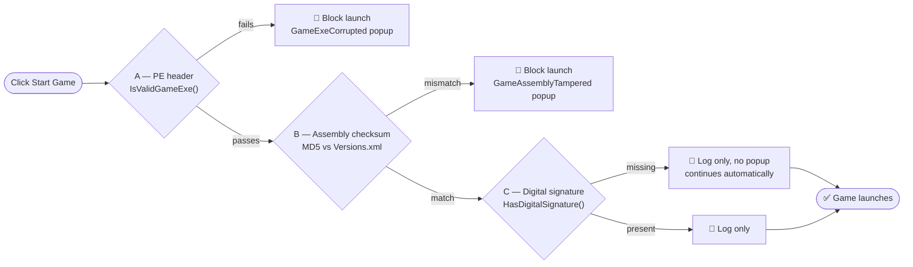

[](README.md)
[](Docs/README.ko.md)
[](Docs/README.de.md)
[](Docs/README.es.md)
[](Docs/README.fr.md)
[](Docs/README.pl.md)
[](Docs/README.ru.md)
[](Docs/README.it.md)
[](Docs/README.jp.md)
[](Docs/README.pt.md)
[](Docs/README.vi.md)
[](Docs/README.zh-CN.md)
[](Docs/README.zh-TW.md)

# ModAPI(v1) v2.0.9623 - 20260920

> Original: FluffyFish / Philipp Mohrenstecher (Engelskirchen, Germany)
> Upgrade: zzangae (Republic of Korea)

---

## Overview

ModAPI is a desktop application for managing mods for **5 officially supported games**. This upgraded edition includes multi-game support, a fully redesigned Settings tab, Steam path configuration, persistent UI settings, a dynamic font size system, game start validation, Debug/Release build split, and numerous crash fixes verified through in-game testing.

---

## Supported Games

| Game | Engine | Version | Steam ID | Executable |
|---|---|---|---|---|
| The Forest | Unity 5 | v1.12 (VR) | 242760 | `TheForest.exe` |
| Subnautica | Unity | 2025 Patch | 264710 | `Subnautica.exe` |
| RAFT | Unity | v1.1.02 (Beta) | 648800 | `Raft.exe` |
| Escape The Pacific | Unity 6 | v0.67.0.0 | 655290 | `EscapeThePacific.exe` |
| Green Hell | Unity 2019 | v2.9.5 | 763790 | `GH.exe` |

<details>
<summary><b>The Forest</b></summary>

| Item | Value |
|---|---|
| Engine | Unity 5 (upgraded from Unity 4) |
| Latest Version | v1.12 (VR) |
| Last Update | September 11, 2019 — VR support patch; no further major content updates |
| Executable | `TheForest.exe` |
| Data Folder | `TheForest_Data/Managed/` |
| Mods Folder | `mods/TheForest/` |
| Projects Folder | `projects/TheForest/` |
| Steam App ID | `242760` |
| IL2CPP | ❌ Mono — fully supported |

The Forest was upgraded from Unity 4 to Unity 5, significantly improving visuals and physics. The September 2019 VR patch was the final major update. The game now remains in a stable, finalized state — ideal for modding.
</details>

<details>
<summary><b>Subnautica</b></summary>

| Item | Value |
|---|---|
| Engine | Unity (integrated codebase, unified with Below Zero in 2022) |
| Latest Version | 2025 Patch (v18810395) |
| Last Update | August 12, 2025 — bug fixes and performance improvements alongside mobile release |
| Executable | `Subnautica.exe` |
| Data Folder | `Subnautica_Data/Managed/` |
| Mods Folder | `mods/Subnautica/` |
| Projects Folder | `projects/Subnautica/` |
| Steam App ID | `264710` |
| IL2CPP | ❌ Mono — supported |

Originally built on Unity 5, Subnautica received the 'Living Large' update (v2.0) in late 2022 which merged the engine codebase with Below Zero for improved optimization and stability. Note: the upcoming *Subnautica 2* uses Unreal Engine 5.

> **XML rewritten in v2.0.9610**: `XGamingRuntime.dll`, `XblPCSandbox.dll`, `FMODUnity.dll`, `Newtonsoft.Json.dll`, `Unity.InputSystem.dll`, `Unity.Collections.dll`, `Unity.Burst.dll` added to `copyAssembly`.
</details>

<details>
<summary><b>RAFT</b></summary>

| Item | Value |
|---|---|
| Engine | Unity |
| Latest Version | v1.1.02 (Beta) / v1.09 (Stable) |
| Last Update | March 2026 — voice chat and multiplayer bug fixes via beta branch |
| Executable | `Raft.exe` |
| Data Folder | `Raft_Data/Managed/` |
| Mods Folder | `mods/Raft/` |
| Projects Folder | `projects/Raft/` |
| Steam App ID | `648800` |
| IL2CPP | ❌ Mono — supported |
| Versions.xml | `1.1.01` (with checksum) |

After the official story conclusion in v1.0: *The Final Chapter*, patches have continued for network code improvements and stability. A beta branch update in March 2026 addressed voice chat and multiplayer issues.
</details>

<details>
<summary><b>Escape The Pacific</b></summary>

| Item | Value |
|---|---|
| Engine | Unity 6 (migrated from Unity 2021/2022 in late 2025) |
| Latest Version | v0.67.0.0 |
| Last Update | June 26, 2025 — island distribution rework and engine update; hotfixes ongoing into 2026 |
| Executable | `EscapeThePacific.exe` |
| Data Folder | `EscapeThePacific_Data/Managed/` |
| Mods Folder | `mods/EscapeThePacific/` |
| Projects Folder | `projects/EscapeThePacific/` |
| IL2CPP | ❌ Mono — supported |

Completed a major system rebuild and Unity 6 migration in late 2025, enabling more dynamic environments. The game remains in active Early Access development.

> **XML rewritten in v2.0.9610**: `extends="GenericUnityGame"` removed; `includeAssembly` set to `Assembly-CSharp.dll` only — prevents `Assembly-CSharp-firstpass.dll` inheritance errors.
</details>

<details>
<summary><b>Green Hell</b></summary>

| Item | Value |
|---|---|
| Engine | Unity 2019 |
| Latest Version | v2.9.5 |
| Last Update | February 4, 2026 — Steam Deck optimization and text readability improvements |
| Executable | `GH.exe` |
| Data Folder | `GH_Data/Managed/` |
| Mods Folder | `mods/GH/` |
| Projects Folder | `projects/GH/` |
| Steam App ID | `763790` |
| IL2CPP | ❌ Mono — supported |
| Versions.xml | `2.9.5` (with checksum) |

Developed through Unity 2017 → 2018 → 2019 across its lifecycle. The February 2026 hotfix focused on Steam Deck compatibility and UI readability.

> **XML rewritten in v2.0.9610**: `AmplifyBloom.dll`, `AmplifyColor.dll`, `AmplifyMotion.dll`, `com.rlabrecque.steamworks.net.dll`, `Unity.ProBuilder.dll`, `Unity.Postprocessing.Runtime.dll` added; non-existent `DOTweenPro.dll` removed.
</details>

---

<details>
<summary><b>Architecture</b></summary>

### Runtime Split

| Component | Target | Runtime | Reason |
|---|---|---|---|
| `ModAPI.exe` | .NET Framework 4.8 | Windows .NET 4.8 | Desktop application, full modern API |
| `ModAPI_Shared.dll` | .NET Framework 4.8 | Windows .NET 4.8 | Shared library |
| `BaseModLib.dll` | .NET Framework 3.5 | Game Mono 2.0 | **Permanently fixed** — PE header must read `v2.0.50727` |
| Mod DLLs (user) | .NET Framework 4.8 | Game Mono 2.0 (patched) | Built with 4.8, PE header patched at Apply time |

### Developer Tools

Standalone WPF utilities for project management. Not distributed to end users.

| Tool | Project | Purpose |
|---|---|---|
| `MODAPI_VersionTool.exe` | `VersionTool\MODAPI_VersionTool.csproj` | Updates `AssemblyInfo.cs` and `App.xaml.cs` version simultaneously |
| `MODAPI_LangTool.exe` | `LangTool\MODAPI_LangTool.csproj` | Manages language files — add, edit, deactivate, built-in conversion |

**VersionTool — Version Management**

A standalone WPF tool for updating the version number with a single click.

- Automatically displays the current version (read from `App.xaml.cs`)
- Enter a new version and click **Apply Version** to update both files simultaneously
- Format validation: only `X.X.XXXX` format accepted

| File | Path | Change |
|---|---|---|
| `AssemblyInfo.cs` | `ModAPI\Properties\` | `AssemblyVersion`, `AssemblyFileVersion` |
| `App.xaml.cs` | `ModAPI\` | `public static string Version` |

**LangTool — Language System**

```
resources/langs/langs.json          ← Language registry (builtin / active flags)
resources/langs/Language.XX.xaml    ← Translation keys per language
resources/langs/Language.XX.png     ← Flag image (36×24, from flagcdn.com/h24/)
```

Built-in conversion flow (Update button):
```
builtin: false → true (langs.json)
  → CreateDefaultLangsJson() rewritten (LangTool\MainWindow.xaml.cs)
  → Language.XX.xaml registered (ModAPI\ModAPI.csproj)
  → Next build: language fully embedded, available offline
```

### Debug / Release Build Split

All file validation and assembly processing branches on the build configuration via `#if DEBUG` / `#else`.

| Location | Debug Build | Release Build |
|---|---|---|
| `CheckSteam()` | `File.Exists()` only — dummy files pass | `FileValidator.IsValidSteamExe()` — PE header + min 1 MB |
| `CheckGamePath()` | `File.Exists()` only — dummy files pass | `FileValidator.IsValidAssemblyDll()` — PE header + CLR metadata + min 8 KB |
| `ModLib.Create()` — IncludeAssemblies | `File.Copy()` — skip Cecil parsing | Full Mono.Cecil parse + IL modification + `module.Write()` |
| `ModLib.Create()` — file not found | Log warning, skip and continue | Log error, abort with popup |

**Debug testing** uses `create_dummy_Debug_games.ps1` to generate 0-byte placeholder files under `bin\Debug\dummy_games\`, `bin\Debug\dummy_steam\`, and `bin\Debug\gamefiles\original\`. These pass `File.Exists()` checks and allow full UI workflow testing without a real game installation.

**Release builds** apply `FileValidator` (PE header + .NET CLR metadata verification) to reject 0-byte files, text files, and arbitrary binaries. Only valid Windows executables and .NET assemblies pass.

### FileValidator — PE Header Verification

`ModAPI_Shared\Utils\FileValidator.cs` — applied in Release builds only.

| Method | Checks | Min Size |
|---|---|---|
| `IsValidSteamExe(path)` | MZ signature + PE\0\0 signature | 1 MB |
| `IsValidGameExe(path)` | MZ signature + PE\0\0 signature | 512 KB |
| `IsValidAssemblyDll(path)` | MZ + PE\0\0 + CLR metadata header (data directory #14) | 8 KB |

```
PE Header layout checked:
[0x00] 4D 5A          ← "MZ" DOS signature
[0x3C] XX XX XX XX   ← PE header offset (little-endian)
[offset] 50 45 00 00 ← "PE\0\0" signature
[Optional Header → DataDirectory[14]] RVA+Size != 0 ← .NET CLR header present
```

### Assembly Remapping Pipeline

```
[Mod Developer builds with .NET 4.8]
  → Mod DLL: PE header v4.0.30319, mscorlib 4.0.0.0

[ModAPI Apply — ModProject.cs]
  → AssemblyVersionMap.RemapAllReferences(modModule)
      mscorlib 4.0.0.0 → 2.0.0.0, etc.
  → modModule.RuntimeVersion = "v2.0.50727"
      PE header: v4.0.30319 → v2.0.50727

[Game Mono 2.0]
  → PE header accepted ✅  →  References resolved ✅
```

### Assembly Resolver Fallback

```
1. gamefiles/original/{GameId}/{AssemblyPath}   ← backup folder
2. {ActualGameInstallPath}/{AssemblyPath}        ← game install folder (fallback)
```

### C# 7.3 Feature Support

| Feature | Status | Notes |
|---|---|---|
| Pattern matching (`is`, `switch`) | ✅ | In-game verified |
| String interpolation (`$""`) | ✅ | In-game verified |
| `out` variable inline | ✅ | In-game verified |
| `async` / `await` | ✅ | Via AsyncBridge + System.Threading polyfills |
| Tuples (`ValueTuple`) | ❌ Hard limit | Mono 2.0 `mscorlib` ABI — no workaround |
</details>

<details>
<summary><b>Theme System [Detailed Reference](Docs/v2.0.9613_themes_en.md)</b></summary>

As of v2.0.9613, the theme selection UI has been moved from the Settings tab to a dedicated **Themes tab**. Adding a new theme requires only one line in the `App.xaml.cs` dictionary.

| Index | ID | File | Palette |
|---|---|---|---|
| 0 | `classic` | `Dictionary.xaml` only | Original ModAPI texture background |
| 1 | `light` | `FluentStylesLight.xaml` | Light tone + blue accent |
| 2 | `dark` | `FluentStyles.xaml` | Dark tone + blue accent (default) |
| 3 | `diablo` | `FluentStylesDiablo.xaml` | Red + black |
| 4 | `nebula` | `FluentStylesNebula.xaml` | Dark space |
| 5 | `sunset` | `FluentStylesSunset.xaml` | Bright sunset |
| 6 | `ocean` | `FluentStylesOcean.xaml` | Dark ocean |
| 7 | `nordic` | `FluentStylesNordic.xaml` | Bright Nordic |
| 8 | `citrus` | `FluentStylesCitrus.xaml` | Bright citrus |
| 9 | `bloom` | `FluentStylesBloom.xaml` | Bright floral |

Theme changes trigger an automatic app restart. (saved to `theme.cfg`)

| Theme | Theme |
| :---: | :---: |
|**01. Classic theme**|**02. Light theme**|
|  |  |
|**03. Dark theme**|**04. Diablo theme**|
|  |  |
|**05. Nebula theme**|**06. Sunset theme**|
|  |  |
|**07. Ocean theme**|**08. Nordic theme**|
|  |  |
|**09. Citrus theme**|**10. Bloom theme**|
|  |  |

### Background Texture

Select an image in the **Background Texture** card on the Themes tab to apply it as the app-wide background. Supported formats: `.png` / `.jpg` / `.jpeg`, up to 50MB, 4K resolution or below. The image is compressed as JPEG Q75 with a 16-byte magic header and saved as `resources\textures\ui_bg\bg.dat` (Hidden attribute). SHA-256 hash for integrity verification; tampering triggers automatic reset + warning popup.

When the background is active, UI transparency is processed in two layers: Layer 1 (MergedDictionaries overlay) for `{DynamicResource}` panels, Layer 2 (WalkStyleBackgrounds) for `{StaticResource}`-based panels with semi-transparency.

### Font Size System

| Resource Key | Base | Description |
|---|---|---|
| `AppBaseFontSize` | 13 | Normal text |
| `AppBaseHeaderFontSize` | 16 | Headers, panel titles |
| `AppBaseSmallFontSize` | 12 | Secondary labels |
| `AppBaseTinyFontSize` | 10 | Hint text |
| `AppBaseLargeFontSize` | 20 | Large display text |

### Persistent UI Configuration — `ui.cfg`

| Key | Default | Description |
|-----|---------|-------------|
| `ModListWidth` | `150` | Mods tab list width (px) |
| `ProjectListWidth` | `150` | Development tab project list width (px) |
| `AppFontSize` | `13` | Global UI font size (px) |
| `AlwaysOnTop` | `false` | Window always-on-top |
| `TexturePath` | *(none)* | Background texture original filename (display only) |
| `TextureHash` | *(none)* | Background texture SHA-256 hash |
| `TextureActive` | `false` | Background texture activation state |
| `GamePathReset_{GameId}` | *(none)* | Game path reset flag |
| `SteamPathReset` | *(none)* | Steam path reset flag |
</details>

<details>
<summary><b>Project Structure</b></summary>

```
ModAPI/
├── App.xaml / App.xaml.cs              # ThemeRegistry, ThemeIds, ApplyTheme()
├── ui.cfg                               # Persistent UI settings
├── theme.cfg                            # Current theme
├── Windows/
│   ├── MainWindow.xaml / .cs            # Main UI — 6 tabs, Themes, Settings, Steam path,
│   │                                    #   0-byte download guard, slider debounce, silent config reads
│   └── SubWindows/
│       ├── SpecifyGamePath.xaml / .cs   # Game path popup (dynamic GameNameLabel)
│       ├── FirstSetup.xaml / .cs        # First-run setup + default initialization
│       └── (14 other SubWindows)
├── Themes/
│   ├── Dictionary.xaml                  # Classic theme
│   ├── FluentStyles.xaml                # Dark theme
│   ├── FluentStylesLight.xaml           # Light theme
│   ├── FluentStylesDiablo.xaml          # Diablo theme
│   ├── FluentStylesNebula.xaml          # Nebula theme
│   ├── FluentStylesSunset.xaml          # Sunset theme
│   ├── FluentStylesOcean.xaml           # Ocean theme
│   ├── FluentStylesNordic.xaml          # Nordic theme
│   ├── FluentStylesCitrus.xaml          # Citrus theme
│   └── FluentStylesBloom.xaml           # Bloom theme
├── Data/
│   ├── Mod.cs                           # Mod file loading, LF/CRLF header parsing, diagnostic log
│   ├── ModLib.cs                        # BaseModLib generation + remapping (#if DEBUG split)
│   ├── Models/
│   │   └── ModProject.cs                # Project create/build/apply + null guards
│   ├── ViewModels/
│   │   ├── ModsViewModel.cs             # FilteredMods, SelectedModItem, SelectedGameFilter,
│   │   │                                #   corrupted mod retry prevention
│   │   ├── ModViewModel.cs              # GameId from folder path
│   │   ├── ModProjectsViewModel.cs      # Dispose() for DispatcherTimer
│   │   └── SettingsViewModel.cs         # Default true for UseSteam/AutoUpdate/UpdateVersions
│   └── AssemblyVersionMap.cs            # Mono 2.0 assembly version mapping (20 assemblies)
├── Utils/
│   ├── CustomAssemblyResolver.cs        # Name-based resolver with caching
│   └── MonoHelper.cs                    # Mono.Cecil IL helper utilities
├── resources/
│   ├── langs/                           # 13 language files + langs.json (LangTool.* keys added v2.0.9620)
│   └── textures/ui_bg/
│       └── bg.dat                       # Compressed & secured background image (runtime-generated)
└── configs/
    ├── games/
    │   ├── TheForest.xml
    │   ├── Subnautica.xml               # Full rewrite v2.0.9610
    │   ├── Raft.xml
    │   ├── EscapeThePacific.xml         # Full rewrite v2.0.9610
    │   ├── GH.xml                       # Full rewrite v2.0.9610
    │   ├── SonsOfTheForest.xml          # IL2CPP — not supported
    │   └── {GameId}/Versions.xml        # Raft, GH, Subnautica, EscapeThePacific
    └── UserConfiguration.xml

ModAPI_Shared/
├── Configurations/
│   └── Configuration.cs                 # GetPath/GetString/GetInt with silent parameter
├── Data/
│   ├── Game.cs                          # ApplyMods backup auto-creation, conditional resolver,
│   │                                    #   game folder fallback, lightweight constructor + ModLib init fix
│   └── ModLib.cs                        # #if DEBUG split, game folder fallback for IncludeAssemblies/CopyAssemblies
└── Utils/
    └── FileValidator.cs                 # PE header + CLR metadata validation (Release only, min 8 KB)

BaseModLib/
├── BaseModLib.csproj                    # .NET 3.5 + LangVersion 7.3
└── libs/polyfills/
    ├── AsyncBridge.dll
    └── System.Threading.dll

VersionTool/
├── MODAPI_VersionTool.csproj            # Standalone WPF version update tool
├── App.config
├── App.xaml / App.xaml.cs
├── MainWindow.xaml / .cs               # Version input, Apply button, current version display
└── Properties/
    ├── AssemblyInfo.cs
    ├── Resources.Designer.cs / .resx
    └── Settings.Designer.cs / .settings

LangTool/
├── MODAPI_LangTool.csproj               # Standalone WPF language management tool
├── App.xaml / App.xaml.cs              # Language load/switch, langtool.cfg
├── MainWindow.xaml / .cs               # Main UI — language list, edit panel, path selector
├── AddLanguageDialog.xaml / .cs        # ISO 3166-1 country selector ComboBox
├── ModApiDialog.xaml / .cs             # ModAPI-style custom dialog (Info/Warning/Confirm/Ask)
├── Models/
│   ├── LanguageEntry.cs                # Language entry model (isoCode, langCode, builtin, active)
│   ├── LangsJson.cs                    # langs.json root model
│   └── IsoCountry.cs                   # ISO country model for ComboBox
└── Helpers/
    ├── LangsJsonHelper.cs              # langs.json read/write
    ├── FlagDownloader.cs               # flagcdn.com h24 flag download
    ├── XamlGenerator.cs                # Language.XX.xaml generate/save/parse
    ├── MissingKeyDetector.cs           # English-reference missing key detection
    ├── IsoCountryList.cs               # ISO 3166-1 full country list (196 countries, offline)
    └── BuiltinCodeWriter.cs            # CreateDefaultLangsJson() rewrite + ModAPI.csproj registration

bin\Debug\                               # Debug testing only
├── create_dummy_Debug_games.ps1         # Generates dummy game/steam structure
├── dummy_games\{GameId}\               # Dummy game install paths
├── dummy_steam\Steam.exe               # Dummy Steam executable
└── gamefiles\original\{GameId}\        # Dummy backup paths for ModLib
```

---

</details>

<details>
<summary><b>Installation & Setup</b></summary>

### Step 1 — Prerequisites

| Item | Required |
|---|---|
| Windows 10 / 11 | ✅ |
| .NET Framework 4.8 | ✅ (pre-installed on Windows 11; [download](https://dotnet.microsoft.com/download/dotnet-framework/net48) for Windows 10) |
| Steam | Required — must be configured in Settings tab |
| At least one supported game | Required — must be configured in Settings tab |

### Step 2 — Install ModAPI

1. Download the latest release from GitHub
2. Extract to any folder (e.g. `C:\ModAPI\`)
3. Run `ModAPI.exe`
4. On first launch the **Welcome** screen appears — configure preferences and click **Continue**

### Step 3 — Configure Steam Path (Settings Tab)

1. Go to the **Settings** tab
2. Find **Steam Installation Path**
3. Click **Browse** → select `Steam.exe`
4. Click **Save**

### Step 4 — Configure Game Paths (Settings Tab)

1. Click a game card header to expand it
2. Click **Browse** → select the game root folder (where the `.exe` is located)
3. Click **Save**

| Game | Executable | Example Path |
|---|---|---|
| The Forest | `TheForest.exe` | `C:\Steam\steamapps\common\The Forest\` |
| Subnautica | `Subnautica.exe` | `C:\Steam\steamapps\common\Subnautica\` |
| RAFT | `Raft.exe` | `C:\Steam\steamapps\common\Raft\` |
| Escape The Pacific | `EscapeThePacific.exe` | `C:\Steam\steamapps\common\Escape The Pacific\` |
| Green Hell | `GH.exe` | `C:\Steam\steamapps\common\Green Hell\` |

### Step 5 — Download Mods (Downloads Tab)

1. Go to the **Downloads** tab
2. Select a game from the game filter
3. Browse or search for a mod and click **Download**

> **Offline**: Download `.mod` files manually from `modapi.survivetheforest.net` and place them in the corresponding folder:

| Game | Folder |
|---|---|
| The Forest | `mods/TheForest/` |
| Subnautica | `mods/Subnautica/` |
| RAFT | `mods/Raft/` |
| Escape The Pacific | `mods/EscapeThePacific/` |
| Green Hell | `mods/GH/` |

### Step 6 — Apply Mods & Start Game (Mods Tab)

1. Go to the **Mods** tab
2. Select a game from **Game Filter** (Col 0)
3. Check mods to activate in **Mod List** (Col 1)
4. Click **Start Game**

The following checks run automatically before launch:

| # | Check | Failure Popup |
|---|---|---|
| 1 | Steam path configured and valid | SteamNotFound |
| 2 | `mods/` folder game matches Settings game path | GameModsMismatch |
| 3 | At least one mod selected | NoModSelected |
| 4 | No mixed-game mods in selection | MixedGameMods |
| 5 | Game path configured and executable exists | GamePathNotSet / GameNotInstalled |

---

</details>

<details>
<summary><b>Tab Overview</b></summary>

### Welcome Tab
First-run setup screen (tab index 0). Configure AutoUpdate, Steam connection, and VersionsData table preferences. On subsequent launches this tab provides community links and release notes.

### Mods Tab
Primary mod management workflow — 3-column layout:

| Column | Content |
|---|---|
| Col 0 | Game Filter — radio buttons for 5 supported games |
| Col 1 | Mod List — installed mods with version picker and activation checkbox |
| Col 2 | Information — selected mod details, description, version history |

### Downloads Tab
Browse and download mods from `modapi.survivetheforest.net`.

- **Game filter**: TheForest / DedicatedServer / VR / Subnautica / RAFT / EscapeThePacific / GH
- **Category filter**: 12 categories (Bugfixes, Balancing, Cheats, …)
- **Search**: by mod name, description, or author
- **Offline mode**: displays folder instructions for all 5 supported games

### Development Tab
Mod development workflow — game filter panel (Col 0) covers all 5 supported games.

- Create, build, and apply mod projects per game
- Language resource management
- ModLib generation with 3-step validation (Steam → project → game path)
- Safe game switching via lightweight `Game` constructor (no `Verify()` call)

### Themes Tab
Theme selection and background texture management.

- **Theme selection**: 10 themes (Classic, Light, Dark, Diablo, Nebula, Sunset, Ocean, Nordic, Citrus, Bloom)
- **Background texture**: Select an image as the app-wide background (JPEG compression + security processing)
- When background texture is active, theme selection is locked

### Settings Tab
Centralized configuration — 4 rows:

| Row | Content |
|---|---|
| 0 | Language / Font Size / Max Width / Mod List Width / Project List Width |
| 1 | Keep VersionsData / Auto Update / Steam Connection / Always On Top |
| 2 | Steam Installation Path (TextBox + Browse + Save + Reset) |
| 3 | Game Installation Paths — expandable card per game (TextBox + Browse + Save + Reset) |

---

</details>

<details>
<summary><b>Lang Tool</b></summary>

### MODAPI_LangTool (Language Management Tool)

A standalone WPF tool for managing ModAPI language files. Added to the solution as `LangTool\MODAPI_LangTool.csproj`.

**Location**: `LangTool\MODAPI_LangTool.csproj`

**Core Features**

| Feature | Description |
|---|---|
| Language list | Displays all languages from `langs.json` with status icons (🔒 built-in / 🚫 inactive / ✅ active) |
| Language add | Select country from ISO 3166-1 ComboBox → flag auto-downloaded from `flagcdn.com/h24/{iso}.png` → `Language.XX.xaml` auto-generated from English template |
| Language edit | `isoCode` / `langCode` locked; `langName` and translation keys editable when active |
| Deactivate / Activate | Toggles `active` flag in `langs.json` — file preserved, hidden from ModAPI list |
| Update (built-in) | Converts `builtin: false` → `true` — irreversible, 2-step confirmation — auto-rewrites `CreateDefaultLangsJson()` in source and registers `Language.XX.xaml` in `ModAPI.csproj` |
| Missing key detection | Compares against English reference — shows missing / empty key count and translation progress |
| Built-in protection | `builtin: true` languages are read-only — no edit, deactivate, or update allowed |
| Inactive protection | `active: false` languages are read-only until reactivated |
| Language UI | LangTool itself supports all 13 ModAPI languages — language selector in top-right corner with flag |
| Path memory | Selected ModAPI root path saved to `langtool.cfg` — auto-loaded on next launch |
| Custom dialogs | All popups use ModAPI-style dark-themed `ModApiDialog` instead of system MessageBox |

**langs.json Structure**

```json
{
  "languages": [
    { "isoCode": "us", "langCode": "EN",    "langName": "English",   "builtin": true,  "active": true },
    { "isoCode": "kr", "langCode": "KR",    "langName": "한국어",     "builtin": true,  "active": true },
    { "isoCode": "gb", "langCode": "EN-GB", "langName": "English (UK)", "builtin": false, "active": true }
  ]
}
```

**Flag Image Convention**

```
ISO code (lowercase) → flagcdn.com/h24/{iso}.png → Language.{LANGCODE}.png
                                                     resources/langs/
```

**Update Button Behavior**

When the Update button is clicked on a non-built-in active language:

1. `langs.json` — `builtin: false` → `true`
2. `LangTool\MainWindow.xaml.cs` — `CreateDefaultLangsJson()` rewritten with all current `builtin: true` languages
3. `ModAPI\ModAPI.csproj` — `<Resource Include="resources\langs\Language.XX.xaml" />` registered
4. Next build — language fully embedded, available offline

**Language Keys Added** (`Lang.LangTool.*`)

53 new keys added to all 13 language files covering all LangTool UI strings, dialog messages, and status texts.

---

</details>

<details>
<summary><b>Version Tool</b></summary>

### MODAPI_VersionTool (Version Update Tool)

A standalone WPF tool for updating the version number with a single click.

**Location**: `VersionTool\MODAPI_VersionTool.csproj`


**Features**
- Automatically displays the current version (read from `App.xaml.cs`)
- Enter a new version and click **Apply Version** to update both files simultaneously
- Format validation: only `X.X.XXXX` format accepted

**Files Modified**

| File | Path | Change |
|---|---|---|
| `AssemblyInfo.cs` | `ModAPI\Properties\` | `AssemblyVersion`, `AssemblyFileVersion` |
| `App.xaml.cs` | `ModAPI\` | `public static string Version` |

**Usage**
1. Run `MODAPI_VersionTool.exe`
2. Enter new version (e.g. `2.0.9619`)
3. Click **Apply Version**
4. Rebuild the ModAPI solution in Visual Studio

**StatusBar Version Display**

- `VersionLabel.Text` references `App.Version` instead of a hardcoded descriptor
- Updating the version with VersionTool and rebuilding reflects immediately in the StatusBar

---

</details>

<details>
<summary><b>Log</b></summary>

### Logging System — Two-File Separation (`ModAPI.log` / `ModAPI.detailed.log`)

Developer-only diagnostic logs were previously gated with `#if DEBUG`, which meant they were invisible in Release builds exactly when troubleshooting a user's issue required them most. A two-file system replaces this:

| File | Contents |
|---|---|
| `ModAPI.log` | User-facing core log — unchanged in appearance, no noisier than before |
| `ModAPI.detailed.log` | Every log call, always, in Release and Debug alike — for diagnosing user-reported issues |

**`Debug.cs`** — `Log()` has a `detailedOnly` parameter. When `true`, the message is written only to `ModAPI.detailed.log`; all prior `#if DEBUG` blocks were converted to this flag instead of being compiled out entirely, so they're always captured in the detailed file even in Release. This results in a 4-tier severity model:

| Tier | Meaning |
|---|---|
| Verbose (`detailedOnly: true`) | Repetitive/mechanical traces — per-type, per-file, per-method |
| Notice | Human-readable flow — progress and success messages |
| Warning | Potential issues, not yet failures |
| Error | Confirmed failures |

**Sources of log noise identified and converted to `detailedOnly: true`:**

| File | What was flooding `ModAPI.log` |
|---|---|
| `ModsViewModel.cs` | `FindMods()` scan/skip/queue messages repeating every 1-second poll |
| `Game.cs` | `UpdateVersions()` TLS/URL trace lines, Cecil type-map entries |
| `ModLib.cs` | Cecil per-type/per-method assembly processing (`Validating`, `Processing`, `Changed ... accessibility`) — was responsible for the vast majority of `ModAPI.log` volume (tens of thousands of lines for a single Green Hell mod build) |
| `Mod.cs` | Full mod header XML dump (`configuration.ToString()`) logged in full on every mod load |

**Checksum mismatch logging — summarized instead of per-item:** `Header.Verify()` previously logged one `Mismatched checksum at "..."` line per incompatible `InjectInto`/`AddMethod`/`AddField`/`AddClass` entry, which could mean dozens of lines for a single outdated mod. It now logs a single Warning-level summary to `ModAPI.log` (e.g. `Mod "MarsarahMod" has 14 checksum mismatch(es). This usually means the mod is incompatible with the current game version. See ModAPI.detailed.log for the full list.`), while the full per-item breakdown remains available in `ModAPI.detailed.log`.

---

</details>

<details open>
<summary><b>What Changed in v2.0.9623</b></summary>

## What Changed in v2.0.9623

### Update Check & Apply — Launcher-Style, Manual, Non-Blocking

The first-run popup (`FirstSetup` window) used to offer 3 options — **Keep Latest Version**, **Update Search**, and **Steam Connect** — whose development had been on hold. Investigating the actual code state before resuming work turned up that Steam Connect and Keep Latest Version were already fully working; only Update Search (checking whether a newer ModAPI release exists) was unfinished — the download/install pipeline existed, but nothing ever called it.

**What was built:**

- **`Game.CheckForNewVersion(out releaseNotes)`** (`ModAPI_Shared\Data\Game.cs`) — calls the GitHub Releases API (`/repos/{owner}/ModAPI/releases/latest`) and returns the latest tag plus its release notes (`body` field, parsed with a minimal JSON-string unescaper — no new dependency added). `UpdateRepoOwner` resolves to `FluffyFishGames` for all normal users and only switches to the maintainer's development repository when the app is launched with `--dev` — never based on the Settings tab's "Developer Log" checkbox, since that checkbox is meant purely for crash-log verbosity and must not silently move a user to an unreleased test channel.
- **Settings tab**: the non-functional "Update Search" checkbox is gone, replaced with a single **Update** button (launcher-style, not a background toggle). Clicking it checks for a new version and, if one exists, immediately starts the download/extract/apply flow — no intermediate "now or later" choice.
- **First-run popup**: the dead "Auto-Update" option was removed along with its now-unused config write; the popup now only asks about Steam Connect and Keep Latest Version.
- **`OperationPending` window** gained an optional, collapsed-by-default release-notes panel and a `Confirmed` event. When the download/extract reaches 100%, the release notes become visible and the "Done" button enables — clicking it is what actually launches `Updater.exe` and exits ModAPI (previously this happened automatically the instant extraction finished, with no chance to see what changed). `Updater.exe` itself (original author's code, unmodified) waits for ModAPI to exit, overwrites the files, and restarts ModAPI automatically.
- ModAPI never blocks on being out of date: the version check only ever runs when the user clicks Update, never at startup, so the app is fully usable regardless of update status — unlike a typical game-launcher forced-update gate.

### UI Fix — Release Notes Panel Wasn't Wrapping

The `OperationPending` progress window's new release-notes panel initially rendered as a single unreadable line requiring horizontal scroll, for two separate reasons layered on top of each other:

1. `TextBox`'s default `HorizontalScrollBarVisibility` is `Hidden`, not `Disabled` — and unless it's explicitly `Disabled`, WPF ignores `TextWrapping="Wrap"` and lets the line grow indefinitely instead.
2. The `SubWindow` style used by all popup windows sets `SizeToContent="WidthAndHeight"` (`FluentStyles.xaml`), so a panel that stretches via a `*` grid column has no fixed width to wrap against — it has to be given an explicit width.

Fixed by giving the panel a fixed width bound to `ProgressBar.ActualWidth` (so its right edge lines up with the progress bar above it) and switching from `TextBox` to a read-only `TextBlock` inside a `ScrollViewer` (`TextBlock` doesn't have `TextBox`'s `PART_ContentHost` wrapping quirk). Also gave the panel an opaque `FluentCardBrush` background — it inherited window transparency by default. A manual `Height +=` adjustment that had been added to force the window taller was removed, since it actively fought `SizeToContent` — the window now grows correctly on its own once the panel becomes visible.

### Verified End-to-End (Manual Test)

Ran the full check → download → extract → confirm → restart cycle for real (against a disposable dummy release payload) to confirm the whole chain works, including the original unmodified `Updater.exe`. One useful thing learned while testing: `App.xaml.cs` already consumes a leftover `_update` folder on ModAPI's own startup (as a self-cleanup step) — so any manual test that pre-creates a fake `_update` folder *before* launching ModAPI will have it silently swallowed before `Updater.exe` ever sees it. The folder has to be created *while ModAPI is already running*, matching how the real download populates it. Added optional diagnostic logging to `Updater.cs` (`Updater.diag.log`, wrapped in try/catch, off the normal logic path) to make this kind of thing easier to diagnose in the future without needing to touch the original restart logic itself.

### Development Notes — Running with `--dev`

`App.DevMode` (`ModAPI\App.xaml.cs`) is set to `true` only when the app is launched with a `--dev` command-line argument — this is separate from the Settings tab's "Developer Log" checkbox, which only affects log verbosity and must **not** be used to gate anything beyond logging (e.g. it must never switch which server/repository a feature talks to — a user turning on verbose logging to report a crash should not be silently switched to an unreleased/test channel).

To run locally with `--dev`:
- **Visual Studio (F5 debugging)**: `ModAPI` project → Properties → Debug tab → "Command line arguments" → enter `--dev`.
- **Built .exe**: run from a terminal as `ModAPI.exe --dev`, or add `--dev` to the end of a shortcut's Target field.

### "Keep Version Table" Checkbox — Now Disabled Until It Can Actually Do Something

`Game.Verify()` only reaches `VersionsData.Refresh()` (the code that actually downloads the version table) if the game path is valid (`CheckGamePath()` passes) — otherwise it returns early. That means turning on "Keep Version Table" with no game path configured silently did nothing, which was confusing (confirmed the hard way: a manual test with no game path produced zero `[UpdateVersions]` log lines even with the checkbox on).

Added `SettingsViewModel.CanUpdateVersionsTable` (`App.Game != null && App.Game.CheckGamePath()`) and bound it to the checkbox's `IsEnabled`. It re-evaluates whenever a game path is saved/reset or the Development tab's game filter switches games. When disabled, hovering shows a tooltip explaining why; when enabled, hovering explains what turning it on does. Also renamed the Korean label from "최신버전 유지" ("keep latest version") to "버전 테이블 유지" ("keep version table") — every other language already said "table" here; only Korean was missing that word, causing confusion with the unrelated "Update" button.

### Global Fix — Tooltips Had No Style Under the Default (classic) Theme

This session's tooltip (above) rendered as a plain white system tooltip instead of the app's themed look. Turned out no tooltip in the app had ever been tested under the default "classic" theme before: `FluentStyles*.xaml` (the non-default themes) each define a themed `ToolTip` style, but `classic` only loads `Dictionary.xaml`, which never had one. Added a matching `ToolTip` style to `Dictionary.xaml` (opaque background, since the theme's other translucent card brushes are meant to sit over a background image, not a floating tooltip). This fixes tooltips app-wide under the default theme, not just this one.

### First-Run Popup Redesign

The first-run popup no longer asks about Steam Connect / Keep Version Table at all — both already live in the Settings tab, so asking again here was redundant. In their place, the popup now shows a scrollable "What's new in this version" summary. The intro text and button were also reworked:

- The Steam Connect / Keep Version Table checkboxes and their descriptions are gone; a fixed-width scrollable panel with the release highlights takes their place.
- The Welcome tab's own "환영합니다!" ("Welcome!") heading was replaced with a button of the same name — clicking it reopens the first-run popup at any time, e.g. to re-read what changed in the current version. Reopened this way, the popup's button reads "Close" instead of "Continue," doesn't re-run first-time setup (no `SetupDone` write, no `FirstSetupDone()` call), and closing it never exits the app (`isReopen: true` on the `FirstSetup` constructor gates all of this).
- **Window-sizing bug found while cross-theme testing**: the popup's `SubWindow` style combines `AllowsTransparency="True"` + `WindowStyle="None"` + `SizeToContent="WidthAndHeight"` — a combination where WPF does not reliably honor `MaxWidth` at auto-size time. It looked fine under `classic` by coincidence but rendered far too wide (with unwrapped, cut-off text) under other themes like Diablo. Fixed by overriding `SizeToContent="Height"` locally on this window (the popup's cards are fixed-width by design, so auto-sizing width was never actually needed) — this fixes the layout identically across every theme instead of needing a per-theme patch.
- **Readability, `classic` theme only**: `classic`'s shared `NormalLabel` style (white text + drop shadow, designed for text over photographic image panels) doesn't read well against this popup's solid `PanelCenter` card background. Rather than touching the shared style (used everywhere) or hardcoding colors that would look wrong on every other theme, added `FirstSetup.ApplyClassicThemeTextFix()`, gated strictly on `App.GetCurrentTheme() == "classic"`, that swaps in a dark, shadow-free look only for this popup, only under that one theme. Every other theme is untouched and continues to use its own already-correct `NormalLabel`/`PanelCenter` colors.

### Game Integrity Check — Step C No Longer Prompts on Every Launch

Users reported real frustration with the pre-launch integrity check: for games that simply ship without a digital signature (common for indie titles like Green Hell), the "no signature" warning popup appeared **every single time** they clicked Start Game, requiring a manual "Continue" click each time — even though nothing was actually wrong. Missing signature alone isn't evidence of tampering, so this was pure friction rather than a real safety check.



- **A (PE header)** and **B (assembly checksum)** are unchanged — real corruption or tampering still blocks the launch with a warning popup (`NoProjectWarning`, themed via the shared `SubWindow` style like every other popup in the app, so it automatically matches whichever theme is active).
- **C (digital signature)** no longer shows any popup or asks for confirmation in either direction — it just logs a `Notice`-level line (`[Integrity] Game executable has no digital signature (not necessarily tampered — many games ship unsigned)`) and lets the game launch. The `GameIntegrityWarning` popup class this used to open is no longer called from anywhere (left in place, unused, rather than deleted outright).
- This diagram is meant to make the check's shape easy to discuss later — e.g. if step C should ever be reinstated in a lighter form (a one-time "don't ask again" instead of removing the prompt outright was considered and rejected in favor of full removal, per user direction), the flow above is the reference point.

### Steam Connect — Auto-Detected Path, and a Manual-Edit Bug

Checking what the original author's "Steam Connect" feature actually did (beyond letting the user pick a Steam path) turned up that it also launches the game via `Steam.exe -applaunch {AppId}` (for overlay support) and restores corrupted files via `steam://validate/{AppId}` — both already implemented and untouched this round.

- The moment "Steam Connect" is turned on, `MainWindow.UseSteamCheckBox_Checked` reads the Steam path straight from the registry (`HKEY_CURRENT_USER\Software\Valve\Steam`) and fills it in automatically — this works regardless of which drive Steam is installed on, not just `C:`.
- While Steam Connect is on, the manual path controls (textbox, Browse, Save, Reset) are meant to be disabled, since the path is auto-managed. **Bug found and fixed**: the container Grid holding those controls (`SteamAndGamePathsPanel`) never had its `DataContext` set in code-behind — only `Settings` and `SettingsCheckboxes` did — so `{Binding CanEditSteamPathManually}` silently failed and defaulted to `IsEnabled="true"`. The controls *looked* inert but the Reset button was still fully clickable. Fixed by explicitly setting `SteamAndGamePathsPanel.DataContext = SettingsVm;` alongside the other two.
- Separately, disabled controls throughout the app gave no visual feedback at all under the classic theme — `NormalButton`'s `ControlTemplate` had no `IsEnabled="False"` trigger (the Fluent themes already had one). Added a matching trigger that dims the button to 40% opacity when disabled, app-wide under classic.

### Theme System Unification — Classic ↔ Fluent Parity

Prompted by "why does classic need to be kept separate from the Fluent theme family at all if they don't meaningfully differ" — did a full audit comparing every explicit and implicit style between `Dictionary.xaml` (classic) and the 9 `FluentStyles*.xaml` files.

- Found real, live gaps: `Slider` (used by the mod-list/project-list width sliders on the Settings tab) and `ComponentsInputs:MultilingualTextField` (the language-flag + text combo used for mod name/description fields) existed only in classic, with no Fluent equivalent — under a Fluent theme those two controls silently fell back to classic's Scale9-image skin, breaking the flat Fluent look. Built flat, `DynamicResource`-driven replacements for both and put them in one new shared file, **`ModAPI\Themes\FluentStylesShared.xaml`**, merged into all 9 `FluentStyles*.xaml` via `ResourceDictionary.MergedDictionaries` — a color tweak now only needs to happen in one place instead of nine.
- Found the gap running the other way too: `GridSplitter` (the mod-list/version-list divider in `MainWindow.xaml`) had a Fluent style in all 9 themes but none in classic, so it rendered with the plain OS-default gray splitter under classic. Added a matching flat style to `Dictionary.xaml`.
- Found genuinely dead code along the way — styles defined but referenced nowhere in the live UI: `PasswordBox` (only used by `LoginWindow.xaml`, which is itself never instantiated anywhere — the login system was already removed in v2.0.9400), `Components:ModProjectButton`, the four social-login button styles (`FacebookButton`/`TwitterButton`/`YoutubeButton`/`TwitchButton`), and a `TimeSlider`/`TimeHorizontalSlider`/`TimeSliderThumbStyle` set (likely a day/night-cycle slider that never shipped). Per the project's "don't delete the original author's work" stance, none of this was removed — each block was wrapped in an XML comment with a note on why it's unreferenced, so it stays in the file as a record rather than disappearing from history.
- Found two leftover files not wired into the build at all: `ModAPI\Windows\Dictionary.xaml` (a dead-end duplicate created mid-refactor in an early commit, never referenced by `App.xaml` or the `.csproj`) and `ModAPI\Themes\FluentStylesClassic.xaml` (an early theme-system prototype — originally the fallback skin for every theme except `light`, back before each theme had its own dedicated file; orphaned once that fallback logic was replaced). Both were git-history-confirmed to be unrelated to the original author's code, so — unlike the dead styles above — these were deleted outright rather than commented out, with the `.csproj`'s now-dangling `<Page>` entry for `FluentStylesClassic.xaml` removed alongside.
- Classic's own `Slider` was then redesigned to match the flat look of the Fluent shared style (same `Border`+`Track` structure, recolored to classic's gold/brown palette: `#B8963E` thumb, translucent `#40FFFFFF` track) rather than its old Scale9-image bar — the old implementation (`SliderThumbStyle`, `SliderButtonStyle`, `HorizontalSlider`, `VerticalSlider`, and the old implicit `Slider` style) was likewise commented out rather than deleted.

### ON/OFF Tooltips for the Remaining Settings-Tab Checkboxes

Extended the same "hover to see what this does" pattern from "Keep Version Table" to the other four checkboxes on the Settings tab — **Steam Connect**, **Developer Log**, **Clear Logs on Start**, and **Always on Top** — each now shows a different tooltip depending on its own checked state, explaining what turning it on vs. off actually does (e.g. Steam Connect's enabled-state tooltip explains the auto path-detection and overlay support covered above). 8 new language keys × 13 languages.

### Welcome Popup — Full Detailed Content, Synced With the Release Notes

The "What's new in this version" panel evolved through several iterations this round: a short bullet summary → a full section-by-section rundown matching `Docs/RELEASE_NOTES_2.0.9623.md` (using plain-text `■`/`▸`/`•` markers, since the `TextBlock` can't render Markdown), translated into all 13 languages. Two related layout bugs surfaced and were fixed along the way:

- The scrollable text originally had a hardcoded `Width="450"` that left a gap in front of the scrollbar (and, in the classic theme specifically, wrapped text a bit too early). Fixed by dropping the fixed width and giving the `ScrollViewer` a `Padding="14"` instead — the same pattern already proven in `OperationPending`'s details panel.
- The surrounding box (`WhatsNewBorder`) then needed a width, and a hardcoded pixel value turned out to be a losing game: the `SubWindow` template's own content margin differs by theme (32px total under classic vs. 72px under Fluent, since Fluent's template adds both an outer `Border` margin and a `ContentPresenter` margin). A width picked to exactly fill classic's roomier layout **clipped the scrollbar off past the visible edge** under Fluent themes. Fixed by removing the explicit width and `HorizontalAlignment="Left"` entirely — the box now defaults to `Stretch` and fills whatever space the theme's chrome actually leaves, correctly, in every theme.
- This popup text is intentionally **not** pulled live from the GitHub Releases page — that would mean either showing raw English to non-English speakers or standing up a translation pipeline (a separate per-language JSON file published alongside each release, or a machine-translation API) neither of which this project currently has. It stays a short, hand-translated summary that gets rewritten (in place — the whole value is replaced, never appended to) each time the release notes are updated for the current version.

### New / Updated Language Keys (13 languages)

| Key | English Value |
|---|---|
| `Lang.Options.Buttons.Update` | Update |
| `Lang.Windows.OperationPending.Tasks.Update.Done` | Update ready — review the changes below, then click Done. |
| `Lang.Windows.NoUpdateAvailable.Title` | You're up to date |
| `Lang.Windows.NoUpdateAvailable.Text` | You are currently using the latest version of ModAPI. |
| `Lang.Windows.NoUpdateAvailable.Buttons.OK` | OK |
| `Lang.Options.Labels.UpdateVersionsTableDisabledHint` | Set the game path first to use this. |
| `Lang.Options.Labels.UpdateVersionsTableEnabledHint` | When the game gets patched, ModAPI needs to recognize the new version. Turn this on to keep that info up to date automatically. |
| `Lang.Options.Labels.UseSteamEnabledHint` / `UseSteamDisabledHint` | Explains what auto-detecting the Steam path (or entering it manually) does |
| `Lang.Options.Labels.DevLogEnabledHint` / `DevLogDisabledHint` | Explains the extra `ModAPI.dev.log` file vs. the regular log |
| `Lang.Options.Labels.ClearLogsOnStartEnabledHint` / `ClearLogsOnStartDisabledHint` | Explains clearing vs. appending to the previous log on each launch |
| `Lang.Options.Labels.AlwaysOnTopEnabledHint` / `AlwaysOnTopDisabledHint` | Explains keeping the window above others vs. letting it be covered |
| `Lang.Windows.FirstSetup.WhatsNewTitle` | What's new in this version |
| `Lang.Windows.FirstSetup.WhatsNewText` | Full section-by-section summary (■/▸/• markers) — rewritten in place per release, see current text in-app |
| `Lang.Windows.FirstSetup.Buttons.Close` | Close |
| `Lang.Mods.Welcome.Buttons.OpenWelcomePopup` | Welcome! |

**Removed** (dead "Auto-Update" feature): `Lang.Options.Labels.AutoUpdate` (replaced by `Lang.Options.Buttons.Update` above), `Lang.Windows.FirstSetup.AutoUpdate`, `Lang.Windows.FirstSetup.AutoUpdateText`.

**Removed** (first-run popup redesign): `Lang.Windows.FirstSetup.Steam`, `Lang.Windows.FirstSetup.SteamText`, `Lang.Windows.FirstSetup.UpdateVersions`, `Lang.Windows.FirstSetup.UpdateVersionsText`, `Lang.Mods.Welcome.Title0` (replaced by `Lang.Mods.Welcome.Buttons.OpenWelcomePopup`).

---

</details>

<details>
<summary><b>What Changed in v2.0.9622</b></summary>

## What Changed in v2.0.9622

### Bug Fix — Checksum Calculation Unified

`StartGame()`'s integrity check (Verification B) used to recompute the checksum itself via `FileValidator.ComputeAssemblyChecksum()`, which only ever hashes a fixed pair of files (`Assembly-CSharp` + `Assembly-CSharp-firstpass`). That structurally mismatched games like The Forest, which link 4 files (firstpass + main + UnityScript-firstpass + UnityScript) — the check would report a false checksum mismatch even when the game files were untouched.

- `Game.CheckSumGame` (already computed correctly by `GenerateCheckSums()` at `Verify()` time, following each game's real `VersionsData.CheckFiles` list — 2 files for Green Hell, 4 for The Forest, etc.) is now exposed as `public` and reused directly in `StartGame()` instead of being recalculated with a different, hardcoded file set.
- Checksum computation is now unified to a single source of truth (`GenerateCheckSums()`), regardless of how many files a given game actually requires.

### Files Modified

| File | Path | Change |
|---|---|---|
| `Game.cs` | `ModAPI_Shared\Data\` | `CheckSumGame` changed from `protected` to `public` |
| `MainWindow.xaml.cs` | `ModAPI\Windows\` | `StartGame()` integrity check reuses `targetGame.CheckSumGame` instead of recomputing via `FileValidator.ComputeAssemblyChecksum()` |

---

</details>

<details>
<summary><b>What Changed in v2.0.9621</b></summary>

## What Changed in v2.0.9621

### New Features

#### Steam Library-Wide Auto-Detection

`FindGamePath()` now falls back to scanning **every Steam library registered on the system** (parsed once from `libraryfolders.vdf`, cached for the session) when a game isn't found via its hardcoded `SearchPaths`. This applies to all 5 supported games, not just the currently active one.

- New `Game.GetSteamLibraryFolders()` — parses `libraryfolders.vdf`, cached statically per session.
- Gated behind the **Steam Connection** checkbox: unchecked (fresh-install default) → auto-detect is skipped entirely for all 5 games, paths stay blank until set manually. Checked → all 5 games are searched consistently through the same method.

#### Automatic Detection of Wrong-Game Mods

A `.mod` file placed in the wrong game's folder (e.g. a Green Hell mod copied into `mods\TheForest\`) is now caught automatically instead of silently corrupting an Apply operation.

- `Game.CheckModGameCompatibility()` (used inside `ApplyMods()`) verifies that every `AddMethod`/`AddField`/`InjectInto` type a mod declares actually exists in the target game's real assemblies before injection begins. Mismatched mods are excluded from that Apply automatically; the rest of the batch still applies normally.
- `Game.CheckModGameCompatibilityLight()` + `Game.GetCachedTypeNames()` run the same check at mod-load time (lightweight — reads assembly bytes into memory, extracts type names, releases the file handle immediately). Mismatched mods show a **⚠ warning badge** with a tooltip in the Mods tab, before the user ever clicks Apply.
- If mods were excluded and/or nothing ultimately applied, Start Game shows a single combined popup instead of stacking separate ones; the game is not launched when zero mods remain (`Game.LastAppliedModCount`).

#### Settings Tab — Developer Log / Clear Logs on Start

Two new checkboxes, positioned after **Steam Connection** and before **Always on Top**:

| Key | Description |
|---|---|
| `Lang.Options.Labels.DevLog` | Enables `ModAPI.dev.log` (renamed from `ModAPI.detailed.log`) — same as running with `--dev` |
| `Lang.Options.Labels.ClearLogsOnStart` | Clears the `logs\` folder on every startup |

`Debug.ClearLogs()` closes open log streams before deleting files, avoiding "file in use" errors.

#### Global Unhandled Exception Logging

`App.xaml.cs` now hooks `DispatcherUnhandledException` (UI thread) and `AppDomain.UnhandledException` (background threads). Any exception that previously crashed the app with zero trace in the log is now recorded — type, message, and full stack trace — before the process exits.

---

### Critical Bug Fixes

| # | File | Issue | Fix |
|---|---|---|---|
| 1 | `Configuration.cs` | `GetPath()` resolved an explicitly-reset (empty string) path to `RootPath` instead of `""`, because `Path.GetFullPath(RootPath + separator + "")` collapses to `RootPath` | Empty stored values now short-circuit to `""` before the path-join |
| 2 | `MainWindow.xaml.cs` | Start Game validation order differed between the "All filter" and "specific filter" code paths, sometimes surfacing a mod-selection or game-selection popup before a more fundamental problem (missing Steam/game path) | Both paths now follow the same order: Steam → game path → mod selection → game selection |
| 3 | `MainWindow.xaml.cs` | Mod collection for Start Game ignored the active game filter — mods checked for a different (invisible) game were still counted, triggering the wrong popup | Mod collection now respects the current filter; only "All" aggregates across every game |
| 4 | `ModsViewModel.cs` | `Mod.Mods` was keyed by `{ModId}-{Version}` only, so identical filenames in two different game folders collided — the second one's `Load()` was never called | Key now includes GameId: `{GameId}-{ModId}-{Version}` |
| 5 | `ModsViewModel.cs` | After fix #4, `UpdateMods()` still grouped list entries by ModId alone, merging two same-named mods from different games into one entry — crashed with `ArgumentException: An item with the same key has already been added` when both declared the same version | Display grouping now also compares GameId |
| 6 | `Game.cs` | Green Hell's `Versions.xml` `<files>` list has the same two files listed twice under different casing (`_Data` / `_data`); `CheckFiles` was a case-sensitive `HashSet<string>`, so both got hashed, doubling the computed checksum and producing false integrity-mismatch failures | `CheckFiles` now uses `StringComparer.OrdinalIgnoreCase` |
| 7 | `Game.cs` / `ModLib.cs` | `ModLib.Create()`'s "remove old files" step had no retry protection against a locked `BaseModLib.dll`, and `Game.CreateModLibrary()` had no exception handling — a lock crashed the entire app on a background thread | 10×500ms retry loop added to the delete step; `CreateModLibrary()` now wraps the call in try/catch |
| 8 | `MainWindow.xaml.cs` | `ApplyMods()` completing with zero mods actually applied (e.g. all excluded) still signaled completion the same way a real success would, so the game launched with nothing modded | `Game.LastAppliedModCount` distinguishes "nothing applied" from "applied N"; launch is skipped at 0 |
| 9 | `MainWindow.xaml.cs` | Window height wasn't recalculated when font size changed, when a saved large font size loaded at startup, or when switching to the Settings tab (`Tabs_SelectionChanged` was empty) — the bottom game-path card(s) got clipped at large font sizes | Height recalculation added to all three points |
| 10 | `MainWindow.xaml.cs` | `UpdateWindowHeight()` had no upper bound — expanding all 5 game-path cards at once could size the window to the full screen or beyond | Height capped to `SystemParameters.WorkArea.Height` |
| 11 | `MainWindow.xaml.cs` | `mods\`/`projects\` folders were created for all 5 games unconditionally on every startup, regardless of whether the game was installed | Folders now only created for games with a verified path and existing executable |
| 12 | `Game.cs` | `UpdateVersions()` could fail to save `Versions.xml` if the destination folder didn't already exist (masked until now because all 5 folders ship pre-committed) | Folder created via `Directory.CreateDirectory()` immediately before saving |

---

### Settings Tab — First-Run Defaults Changed

`AutoUpdate`, `UseSteam` (Steam Connection), and `UpdateVersionsTable` (Keep VersionsData) now default to **unchecked** on a fresh install (previously checked by default). These three remain incomplete server-side, so they're opt-in now — matching `DevLog`/`ClearLogsOnStart`.

### UI

- Settings tab checkbox row (`SettingsCheckboxes`): `StackPanel` → `WrapPanel`, so labels wrap onto a new line instead of clipping at large font sizes.

### New Language Keys (13 languages)

| Key | English Value |
|---|---|
| `Lang.Options.Labels.DevLog` | Developer Log |
| `Lang.Options.Labels.ClearLogsOnStart` | Clear Logs on Start |
| `Lang.Windows.IncompatibleModsExcluded.Title` | Some Mods Excluded |
| `Lang.Windows.IncompatibleModsExcluded.Text` | The following mod(s) appear to be built for a different game and were excluded: {0} |
| `Lang.Windows.IncompatibleModsExcluded.OK` | OK |
| `Lang.Windows.NoModsApplied.Title` | No Mods Applied |
| `Lang.Windows.NoModsApplied.Text` | No valid mods remained to apply, so the game was not started. |
| `Lang.Windows.NoModsApplied.OK` | OK |

### Files Modified

| File | Path | Change |
|---|---|---|
| `MainWindow.xaml.cs` | `ModAPI\Windows\` | Unified Start Game validation order, filter-aware mod collection, combined result popup, 4-game Steam-library auto-detect gated by UseSteam, window height fixes (font size / tab switch / cap) |
| `MainWindow.xaml` | `ModAPI\Windows\` | Settings tab DevLog/ClearLogsOnStart checkboxes, `WrapPanel` |
| `Game.cs` | `ModAPI_Shared\Data\` | Steam library search, case-insensitive `CheckFiles`, mod compatibility checks (heavy + light), `LastAppliedModCount`/`LastExcludedModsSummary`, `CreateModLibrary()` exception handling, UseSteam-gated auto-detect |
| `ModLib.cs` | `ModAPI_Shared\Data\` | Retry loop on old-file deletion |
| `Mod.cs` | `ModAPI_Shared\Data\` | `GameMismatchReason` field |
| `Configuration.cs` | `ModAPI_Shared\Configurations\` | `GetPath()` empty-string fix |
| `Debug.cs` | `ModAPI_Shared\` | `ModAPI.dev.log` rename, `DevMode` field, `ClearLogs()` |
| `App.xaml.cs` | `ModAPI\` | Global exception handlers, `Debug.DevMode` wiring |
| `ModsViewModel.cs` | `ModAPI\Data\ViewModels\` | Per-game `Mod.Mods` keys, per-game display grouping, mismatch badge, log-spam suppression |
| `ModViewModel.cs` | `ModAPI\Data\ViewModels\` | `HasGameMismatch`/`GameMismatchTooltip` |
| `SettingsViewModel.cs` | `ModAPI\Data\ViewModels\` | `DevLog`/`ClearLogsOnStart`, opt-in defaults for 3 existing checkboxes |
| `FirstSetup.xaml` | `ModAPI\Windows\SubWindows\` | 3 checkbox defaults changed to unchecked |
| `ModsExcludedWarning.xaml` / `.cs` | `ModAPI\Windows\SubWindows\` | New |
| 13x `Language.XX.xaml` | `ModAPI\resources\langs\` | 8 new keys |

---

</details>

<details>
<summary><b>What Changed in v2.0.9620</b></summary>

## What Changed in v2.0.9620

### MODAPI_LangTool Added

A standalone WPF tool for managing ModAPI language files was added (`LangTool\MODAPI_LangTool.csproj`) — see the **Lang Tool** section above for full details.

---

### Bug Fixes

| # | File | Issue | Fix |
|---|---|---|---|
| 1 | `App.xaml.cs` | French language mixed into .NET exception messages on non-English Windows | `CultureInfo.InvariantCulture` fixed at `App()` constructor startup |
| 2 | `Game.cs` | SSL/TLS error on `UpdateVersions()` — could not create SSL/TLS secure channel | TLS 1.2 explicitly set via `ServicePointManager.SecurityProtocol` |
| 3 | `MainWindow.xaml.cs` | Green Hell `GamePathNotSet` popup despite path being configured | `App.Game.GamePath` empty → reads saved path from `Configuration` |
| 4 | `ModsViewModel.cs` | Mod files not appearing in list when manually placed in `mods\TheForest\` | Filename pattern validation diagnostic log added |
| 5 | `MainWindow.xaml.cs` | `MixedGameMods` popup blocked multi-game mod selection | Removed blocking popup — replaced with `SelectGameDialog` |

---

### New Features

#### Start Game — Game Selection Popup (`SelectGameDialog`)

When mods from different games are selected, or when **All** filter is active, a game selection popup appears instead of blocking the launch.

**Trigger conditions:**
- `All` filter selected + Start Game clicked
- Mods from 2 or more different games are activated simultaneously

**Behavior:**
- Shows only games with configured paths + existing executable
- Selected game's mods only are applied — other game mods are completely ignored
- Radio button syncs to selected game after popup closes (`SyncModGameFilterRadioButton`)

**New files**: `ModAPI\Windows\SubWindows\SelectGameDialog.xaml / .cs`

#### Game Integrity Verification (Release build only, `#if !DEBUG`)

Three-layer integrity check runs on every Start Game before launch:

| Layer | Method | On Failure |
|---|---|---|
| A — PE Header | `FileValidator.IsValidGameExe()` | Blocked + `GameExeCorrupted` popup |
| B — Assembly Checksum | MD5 → `Versions.xml` comparison | Blocked + `GameAssemblyTampered` popup |
| C — Digital Signature | `HasDigitalSignature()` | Warning + user choice (`GameIntegrityWarning`) |

**New files**: `ModAPI\Windows\SubWindows\GameIntegrityWarning.xaml / .cs`

**New methods added to `FileValidator.cs`**:
- `ComputeAssemblyChecksum(managedFolder)` — MD5 hash of Assembly-CSharp.dll (+ firstpass if exists)
- `HasDigitalSignature(path)` — Authenticode signature check

---

### Diagnostic Logs Added

#### `ModAPI_Shared\Data\Game.cs` — `UpdateVersions()` (12 items, Release + Debug)

| # | Phase | Type | Content |
|---|---|---|---|
| 1 | TLS setting | Notice | Protocol before/after |
| 2 | Download start | Notice | Server list |
| 3 | URL attempt | Notice | Each URL being tried |
| 4 | Download success | Notice | URL, response length, protocol used |
| 5 | WebException | Error | URL, HTTP status, protocol, detail |
| 6 | Other exception | Error | URL, exception type, detail |
| 7 | Download complete | Notice | Success count / total servers |
| 8 | Parse success | Notice | Files and versions count before/after |
| 9 | Parse failure | Error | Exception type and detail |
| 10 | Save success | Notice | Save path, total versions/files count |
| 11 | Save failure | Error | Path, exception type, detail |
| 12 | No responses | Error | Servers tried, protocol |

#### `ModAPI\Data\ViewModels\ModsViewModel.cs` — `FindMods()` (7 items, `#if DEBUG` only)

| # | Situation | Type | Content |
|---|---|---|---|
| 1 | Scan start | Notice | Mods folder path, total files found |
| 2 | Already loaded | Notice | Filename |
| 3 | Not .mod file | Notice | Filename |
| 4 | Pattern match success | Notice | Queued filename |
| 5 | Pattern match failure | Warning | Filename + reason + expected format |
| 6 | Scan complete | Notice | Queued count / total files |
| 7 | Exception | Error | Exception detail |

#### `ModAPI\Windows\MainWindow.xaml.cs` — `StartGame()` (10 items, Release + Debug)

| # | Situation | Type | Content |
|---|---|---|---|
| 1 | Popup condition | Notice | Current filter, selected game IDs, needGameSelect |
| 2 | Candidate games | Notice | Popup candidate ID list |
| 3 | Path not set | Notice | Game skipped — path not configured |
| 4 | Not in Configuration | Notice | Game skipped — not in Configuration.Games |
| 5 | Install confirmed | Notice | Game + executable path |
| 6 | Exe not found | Warning | Game skipped — executable missing |
| 7 | No installed games | Error | 0 candidates → GamePathNotSet |
| 8 | Auto-selected | Notice | Single candidate auto-selected |
| 9 | User cancelled | Notice | SelectGameDialog cancelled |
| 10 | Game selected + mods | Notice | Selected game, collected mod count/list |

---

### Developer / User Log Separation (`#if DEBUG`)

| File | Log | Reason |
|---|---|---|
| `ModsViewModel.cs` | `Scanning mods folder`, `Skip (already loaded)`, `Skip (not .mod)`, `Queued for load`, `Scan complete` | Repeats every 1 second — 81% of total log volume |
| `Game.cs` | `Modified by: SiXxKilLuR`, `Checksum:`, `Type entry:`, `Backed up:`, `Added folder to resolver`, `TLS protocol set`, `Starting version file download`, `Trying URL` | Developer-only internal detail |

Release log retains: Download success/failure, parse/save results, pattern match failures, exceptions, integrity check results.

---

### Version Table Update — Architecture

#### Design Intent

```
Game receives Steam update
  → Assembly-CSharp.dll changes
  → ModAPI checks Versions.xml for known checksum
  → If not found → downloads latest Versions.xml from server
  → New version auto-registered without ModAPI reinstall
```

#### Connection Structure

```
Settings tab → KeepVersionsData checkbox
  → Configuration.xml: "UpdateVersions" = true/false
    → Verify() → UpdateVersions() called
      → Downloads Versions.xml from VersionUpdateDomains[]
      → Overwrites local configs\games\{GameId}\Versions.xml
```

#### GitHub Raw URL Integration

Instead of relying solely on `modapi.survivetheforest.net`, GitHub Raw URL is now used as the primary source for direct management:

```csharp
public static readonly string[] VersionUpdateDomains =
{
    // GitHub — directly managed, priority 1
    "https://raw.githubusercontent.com/FluffyFishGames/ModAPI/master/ModAPI/configs/games/{0}/Versions.xml",
    // Legacy server — fallback, priority 2
    "http://modapi.survivetheforest.net/app/configs/games/{0}/Versions.xml",
};
```

| Item | Detail |
|---|---|
| Primary | GitHub Raw URL — push to update immediately |
| Fallback | Legacy server — used when GitHub unavailable |
| Path | `ModAPI/configs/games/{GameId}/Versions.xml` in repository |
| Modified file | `ModAPI_Shared\Data\Game.cs` — `VersionUpdateDomains` |

---

### Versions.xml Updates

| Game | File | Change |
|---|---|---|
| Green Hell | `configs\games\GH\Versions.xml` | Checksum corrected (was incorrect SHA-256 uppercase) — `2.9.5b114117` with correct MD5 |
| The Forest | `configs\games\TheForest\Versions.xml` | `1.12` (BuildID: 20229486) added — 128-char MD5 checksum |

---

### New Language Keys (13 languages)

| Key | English Value |
|---|---|
| `Lang.Windows.SelectGame.Title` | Select Game |
| `Lang.Windows.SelectGame.Message` | Select the game to launch: |
| `Lang.Windows.GameExeCorrupted.Title` | Executable Corrupted |
| `Lang.Windows.GameExeCorrupted.Text` | The game executable failed validation... |
| `Lang.Windows.GameAssemblyTampered.Title` | Game Files Tampered |
| `Lang.Windows.GameAssemblyTampered.Text` | The game assembly checksum does not match... |
| `Lang.Windows.GameNoSignature.Title` | Integrity Warning |
| `Lang.Windows.GameNoSignature.Text` | The game executable has no digital signature... |
| `Lang.Windows.GameNoSignature.Continue` | Continue Anyway |
| `Lang.Windows.GameNoSignature.Cancel` | Cancel |
| `Lang.Savegames.*` (133 keys) | English values added to 12 languages (DE already translated) |

---

### Files Modified

| File | Path | Change |
|---|---|---|
| `App.xaml.cs` | `ModAPI\` | `CultureInfo.InvariantCulture` fixed at startup |
| `MainWindow.xaml.cs` | `ModAPI\Windows\` | SelectGameDialog, integrity check, MixedGameMods removed, radio sync, 10 logs |
| `SelectGameDialog.xaml/.cs` | `ModAPI\Windows\SubWindows\` | New |
| `GameIntegrityWarning.xaml/.cs` | `ModAPI\Windows\SubWindows\` | New |
| `ModsViewModel.cs` | `ModAPI\Data\ViewModels\` | Filename diagnostic log, #if DEBUG separation |
| `Game.cs` | `ModAPI_Shared\Data\` | TLS 1.2, UpdateVersions 12 logs, GitHub URL, #if DEBUG separation |
| `FileValidator.cs` | `ModAPI_Shared\Utils\` | `ComputeAssemblyChecksum()`, `HasDigitalSignature()` |
| 13x `Language.XX.xaml` | `ModAPI\resources\langs\` | 10 new keys + 133 Savegames keys (515 total, all languages matched) |
| `GH\Versions.xml` | `ModAPI\configs\games\` | Checksum corrected |
| `TheForest\Versions.xml` | `ModAPI\configs\games\` | `1.12` added |
| `LangTool\` (13 files) | Solution root | New |
| `ModAPI.sln` | Solution root | LangTool registered |

---

### Additional Fixes & Logging System Overhaul (2026-06-21)

#### StartGame Validation — Full Redesign

Validation order corrected to a strict 3-step sequence, and the game-selection popup now reflects mods that are activated regardless of whether the game path is configured.

| Step | Check | Failure Popup |
|---|---|---|
| 1 | Steam installed | SteamNotFound |
| 2 | Selected game's path configured + executable exists | GamePathNotSet |
| 3 | At least one mod activated for the selected game | NoModSelected |

- **All filter / multi-game mods selected** → popup always lists every game with an activated mod, **including ones with no configured path** — selecting an unconfigured game now correctly shows `GamePathNotSet` instead of silently excluding it or showing the wrong error
- **Single-game filter** → path and mod checks run directly against that game, in the same 1→2→3 order

#### Critical Bug Fixes

| # | File | Issue | Fix |
|---|---|---|---|
| 1 | `Game.cs` | `UpdateVersions()` merged responses from **all** successful servers (GitHub + legacy), doubling checksums (64 → 128 chars) when both succeeded — caused false `GameAssemblyTampered` blocks | Only the first successful server's response is parsed; remaining servers are skipped once one succeeds |
| 2 | `MainWindow.xaml.cs` | `DeleteMod_Click` used `App.Game` (currently active filter) instead of the mod's own game — deleting a Green Hell mod while The Forest was active searched the wrong `Managed` folder and silently skipped deletion | Now resolves the deployed DLL path from `mod.Game` (the mod's actual game instance), with a `Configuration` path fallback if `GamePath` is empty |
| 3 | `Configuration.cs` / `MainWindow.xaml.cs` | Re-downloading a previously deleted mod restored its activation badge as checked — deleting a mod never cleared its persisted `Selected`/`Version` keys or the in-memory ViewModel cache | Added `RemoveKey()` / `RemoveKeysWithPrefix()` to `Configuration.cs`; `DeleteMod_Click` now force-resets `ModViewModel.Selected = false` and removes all `Mods.{GameId}.{ModId}.*` keys on delete |
| 4 | `ModsViewModel.cs` | Deleting a mod while a specific game filter (not "All") was selected left the mod visible in the list until switching to "All" and back | `FilteredMods` change notification was missing after `_Mods.RemoveAt()` in the file-deletion polling loop; now fires whenever a mod is actually removed |
| 5 | `GameIntegrityWarning.xaml.cs` / `MainWindow.xaml.cs` | An unhandled exception while building or showing the no-signature warning popup could silently crash ModAPI with no error logged | Popup construction/display and message formatting wrapped in try-catch; on failure, the warning is logged and the user is safely allowed to continue (missing signature is advisory, not a hard block) |

#### Digital Signature Warning — Message Clarified

`GameNoSignature` text now names the specific game and clarifies that a missing signature is expected for indie titles and does not affect gameplay, instead of implying possible tampering. Updated across all 13 language files with a `{0}` placeholder for the game's display name (e.g. "The Forest", "Green Hell").

#### Logging System — Two-File Separation

`#if DEBUG`-gated diagnostic logs were converted to a `detailedOnly` flag and split across `ModAPI.log` (user-facing) and `ModAPI.detailed.log` (always-on full detail) — see the **Log** section above for the full breakdown.

#### Files Modified (Additional)

| File | Path | Change |
|---|---|---|
| `MainWindow.xaml.cs` | `ModAPI\Windows\` | StartGame validation redesign, DeleteMod_Click game-instance fix, GameIntegrityWarning try-catch, display-name mapping |
| `Game.cs` | `ModAPI_Shared\Data\` | UpdateVersions single-response fix |
| `Configuration.cs` | `ModAPI_Shared\Configurations\` | `RemoveKey()`, `RemoveKeysWithPrefix()` |
| `ModsViewModel.cs` | `ModAPI\Data\ViewModels\` | `FilteredMods` change notification on delete, `#if DEBUG` → `detailedOnly` |
| `ModLib.cs` | `ModAPI_Shared\Data\` | `#if DEBUG` → `detailedOnly` (25 call sites) |
| `Mod.cs` | `ModAPI\Data\` | Header XML dump moved to `detailedOnly`, checksum mismatch summarization |
| `Debug.cs` | `ModAPI_Shared\` | `detailedOnly` parameter, dual-file writer, 4-tier logging guide comment |
| `GameIntegrityWarning.xaml/.cs` | `ModAPI\Windows\SubWindows\` | `{0}` game-name placeholder, try-catch safety |
| 13x `Language.XX.xaml` | `ModAPI\resources\langs\` | `GameNoSignature.Text` rewritten with game-name placeholder |

---


</details>

<details>
<summary><b>What Changed in v2.0.9619</b></summary>

### Bug Fixes

- **Mod apply hang with empty backup folder**: `gamefiles\original\` empty → automatic backup creation from game install path before assembly reading
- **File lock (IOException) on game DLLs**: Assembly resolver conditionally excludes game folder when backup exists — prevents Cecil from holding file locks during `DirectoryCopy`
- **Corrupted mod infinite retry loop**: Failed `.mod` files (corrupted header) caused 1-second re-scan loop — now registered in `LoadedFiles` to prevent re-scan
- **LF line-ending mod files rejected**: Header parser `EndsWith("</Mod>\r")` failed for Unix-style `.mod` files — now uses `TrimEnd` to handle both CRLF and LF
- **Small DLL validation failure**: `Assembly-UnityScript-firstpass.dll` (21 KB) rejected by `FileValidator` — minimum assembly size lowered from 64 KB to 8 KB
- **Unnecessary WARNING logs**: Unconfigured game paths and first-run config keys generated noise — `silent` parameter added to `GetPath`/`GetString`/`GetInt`

### Improvements

- **Zero-byte download detection**: Popup alert + temp file cleanup when server returns empty `.mod` file (`Lang.Windows.DownloadEmpty`)
- **Slider save debounce**: `ModListWidth` / `ProjectListWidth` save to `ui.cfg` only once (500 ms after drag ends) instead of every pixel change
- **Conditional game folder creation**: `mods/` and `projects/` folders created only for games with configured paths — not all 5 unconditionally
- **Header parsing diagnostic log**: Shows line count and content preview on `.mod` file parse failure for troubleshooting

### New Language Keys (13 languages)

| Key | English Value |
|-----|---------------|
| `Lang.Windows.DownloadEmpty.Title` | Download Failed |
| `Lang.Windows.DownloadEmpty.Text` | The downloaded mod file is empty (0 bytes). The file may not exist on the server. |
| `Lang.Windows.DownloadEmpty.Buttons.OK` | OK |

### Files Modified

| File | Path | Change |
|---|---|---|
| `Game.cs` | `ModAPI_Shared\Data\` | Backup auto-creation, conditional resolver, game folder fallback |
| `ModLib.cs` | `ModAPI_Shared\Data\` | Game folder fallback for IncludeAssemblies/CopyAssemblies |
| `FileValidator.cs` | `ModAPI_Shared\Utils\` | MinAssemblyBytes 64 KB → 8 KB |
| `Configuration.cs` | `ModAPI_Shared\Configurations\` | `silent` parameter on GetPath/GetString/GetInt |
| `MainWindow.xaml.cs` | `ModAPI\Windows\` | 0-byte download guard, slider debounce, silent config reads, conditional folder creation |
| `ModsViewModel.cs` | `ModAPI\Data\ViewModels\` | Corrupted mod retry prevention |
| `Mod.cs` | `ModAPI\Data\` | LF/CRLF header parsing, diagnostic log |
| 13× `Language.XX.xaml` | `resources\langs\` | `DownloadEmpty` popup keys |

---

</details>

<details>
<summary><b>What Changed in v2.0.9618</b></summary>


### MODAPI_VersionTool Added

A standalone WPF tool for updating the version number with a single click was added (`VersionTool\MODAPI_VersionTool.csproj`) — see the **Version Tool** section above for full details.

- `VersionLabel.Text` now references `App.Version` instead of the hardcoded `Version.Descriptor`, so updates are reflected in the StatusBar immediately after a rebuild.

---

</details>

<details>
<summary><b>What Changed in v2.0.9617</b></summary>


### Settings Tab — Path Reset Buttons Added

A **Reset** button has been added to the Steam installation path and each game installation path row.

**Steam path row**
```
[TextBox] [Browse] [Save] [Reset]
```

**Game path row (per game)**
```
[TextBox] [Browse] [Save] [Reset]
```

**Reset behavior**
- Clears the path TextBox immediately
- Saves a reset flag to `ui.cfg` (`GamePathReset_{GameId}=1`, `SteamPathReset=1`)
- TextBox remains empty after restart
- Works around Configuration XML not persisting empty strings

**Browse auto-save**
- Before: required a separate Save button click after Browse
- After: automatically saved on file selection — reflected even after switching to the Mods tab

**New language key**

| Key | Value |
|---|---|
| `Lang.Options.Labels.PathReset` | Reset |

---

</details>

<details>
<summary><b>What Changed in v2.0.9616</b></summary>

### Versions.xml — 4 Games Added / Updated

| Game | File Path | BuildID | Notes |
|---|---|---|---|
| Subnautica | `configs/games/Subnautica/Versions.xml` | `20241558` | Newly created |
| Raft | `configs/games/Raft/Versions.xml` | `22312909` | Checksum updated |
| EscapeThePacific | `configs/games/EscapeThePacific/Versions.xml` | `19000490` | Newly created |
| GH | `configs/games/GH/Versions.xml` | `21698250` | Checksum updated |

### Checksum Composition Rules

The checksum format differs depending on whether `Assembly-CSharp-firstpass.dll` exists for each game.

| Game | firstpass.dll | Checksum Format |
|---|---|---|
| GH | ✅ Present | `firstpass MD5` + `Assembly-CSharp MD5` concatenated (64 chars) |
| Subnautica | ✅ Present | `firstpass MD5` + `Assembly-CSharp MD5` concatenated (64 chars) |
| EscapeThePacific | ✅ Present | `firstpass MD5` + `Assembly-CSharp MD5` concatenated (64 chars) |
| Raft | ❌ Not present | `Assembly-CSharp MD5` only (32 chars) |

### Versions.xml Update Procedure on Game Update

Add a new `<version>` entry without removing existing entries.

**Step 1 — Find new BuildID**
```powershell
Get-Content "C:\Program Files (x86)\Steam\steamapps\appmanifest_{AppID}.acf" | Select-String "buildid"
```

| Game | AppID |
|---|---|
| Subnautica | 264710 |
| Raft | 648800 |
| EscapeThePacific | 655290 |
| GH | 815370 |

**Step 2 — Extract new checksum**
```powershell
# Games with firstpass.dll (GH, Subnautica, EscapeThePacific)
Get-FileHash "...\Assembly-CSharp-firstpass.dll" -Algorithm MD5
Get-FileHash "...\Assembly-CSharp.dll" -Algorithm MD5
# → Concatenate both Hash values in order (firstpass first)

# Games without firstpass.dll (Raft)
Get-FileHash "...\Assembly-CSharp.dll" -Algorithm MD5
```

**Step 3 — Add entry to Versions.xml**
```xml
<version id="{new BuildID}">
    <checksum>{new checksum}</checksum>
</version>
```

---

</details>

<details>
<summary><b>What Changed in v2.0.9615</b></summary>

### Settings Tab Game Path Expand Fixed

- **Card expand height**: The window bottom now grows by exactly the height of the input field when expanding a game path card
- **`UpdateWindowHeight()` improved**: Calls `UpdateLayout()` before `SizeToContent.Height` measurement; temporarily sets `TextureLayer1` to `Collapsed` when background texture is active to prevent 4K image original size from affecting height calculation
- **Inner Grid Row fix**: Changed the last Row of the game paths panel inner Grid from `Height="*"` to `Height="Auto"` — removes unnecessary bottom whitespace

---

</details>

<details>
<summary><b>What Changed in v2.0.9614</b></summary>

### Maximize Button Behavior Fixed

- **Maximize**: Uses `SystemParameters.WorkArea` for manual maximization instead of `WindowState.Maximized` — fits exactly to the current screen resolution without overlapping the taskbar
- **Restore**: Saves `Left`, `Top`, `Width`, `Height`, and `MaxWidth` before maximizing and restores them when the restore button is clicked
- **`MaxWidth` handling**: Set to `∞` on maximize, restored to saved value on normalize

---

</details>

<details>
<summary><b>What Changed in v2.0.9613</b></summary>

### New Themes Tab

Tab order is now:

```
Welcome → Mods → Downloads → Development → Themes → Settings
```

The theme selection UI has been moved from the Settings tab to a dedicated **Themes tab**.
Icon: Segoe MDL2 Assets `&#xE790;` (palette)

### Theme Registry (Data-Driven Structure)

Adding a new theme now requires only **one line** in the `App.xaml.cs` dictionary.
All switch statements have been removed — no code changes needed elsewhere.

```csharp
// App.xaml.cs
public static readonly Dictionary<string, string> ThemeRegistry = new Dictionary<string, string>
{
    { "classic", null },
    { "light",   "FluentStylesLight.xaml" },
    { "dark",    "FluentStyles.xaml" },
    { "diablo",  "FluentStylesDiablo.xaml" },
    { "nebula",  "FluentStylesNebula.xaml" },
    { "sunset",  "FluentStylesSunset.xaml" },
    { "ocean",   "FluentStylesOcean.xaml" },
    { "nordic",  "FluentStylesNordic.xaml" },
    { "citrus",  "FluentStylesCitrus.xaml" },
    { "bloom",   "FluentStylesBloom.xaml" },
};

public static readonly List<string> ThemeIds = new List<string>(new[]
{
    "classic", "light", "dark", "diablo",
    "nebula", "sunset", "ocean", "nordic", "citrus", "bloom"
});
```

`ThemeSelector` ComboBox items are auto-generated from the `ThemeIds` loop.
Language key convention: `Lang.Options.Theme.{PascalCase}` (e.g. `Lang.Options.Theme.Nebula`)

### Supported Themes

| Index | ID | File | Palette |
|---|---|---|---|
| 0 | `classic` | `Dictionary.xaml` only | Original ModAPI texture background |
| 1 | `light` | `FluentStylesLight.xaml` | Light tone + blue accent |
| 2 | `dark` | `FluentStyles.xaml` | Dark tone + blue accent (default) |
| 3 | `diablo` | `FluentStylesDiablo.xaml` | Red + black |
| 4 | `nebula` | `FluentStylesNebula.xaml` | Dark space |
| 5 | `sunset` | `FluentStylesSunset.xaml` | Bright sunset |
| 6 | `ocean` | `FluentStylesOcean.xaml` | Dark ocean |
| 7 | `nordic` | `FluentStylesNordic.xaml` | Bright Nordic |
| 8 | `citrus` | `FluentStylesCitrus.xaml` | Bright citrus |
| 9 | `bloom` | `FluentStylesBloom.xaml` | Bright floral |

Theme changes trigger an automatic app restart. (saved to `theme.cfg`)

### Background Texture Feature

Select an image in the **Background Texture** card on the Themes tab to apply it as the app-wide background. Works with any theme selected.

**Supported input formats**: `.png` / `.jpg` / `.jpeg`, up to 50MB, 4K resolution or below

**Image processing pipeline**

```
User-selected image (.png / .jpg / .jpeg, max 50MB, 4K or below)
  ↓
JPEG Q75 compression (memory buffer)
  ↓
16-byte magic header inserted
  "MODAPI" + "BG" + version + padding (FF 00 FE 00)
  ↓
Saved as resources\textures\ui_bg\bg.dat (Hidden attribute)
  ↓
SHA-256 hash → stored in ui.cfg as TextureHash
```

**Security layers**

| Layer | Method | Effect |
|---|---|---|
| Magic header | 16 bytes prepended before JPEG signature (FF D8 FF) | External viewers cannot recognize the file |
| Hidden attribute | `FileAttributes.Hidden` | Hidden from Explorer by default |
| SHA-256 integrity | Hash verified on load | Tampering triggers automatic reset + warning popup |

**Tampering detection behavior**
1. `bg.dat` deleted
2. `ui.cfg` keys `TexturePath`, `TextureHash`, `TextureActive` reset
3. TextBox and toggle reset
4. `Lang.Windows.TextureTampered` popup displayed

**ui.cfg keys**

| Key | Value | Description |
|---|---|---|
| `TexturePath` | Filename (display only) | Original filename shown in TextBox |
| `TextureHash` | SHA-256 hex | Integrity verification hash |
| `TextureActive` | `true` / `false` | Activation state |

**Transparency processing**

When the background image is active, UI backgrounds are processed in two layers.

- **Layer 1 — MergedDictionaries overlay**: Panels referencing `{DynamicResource FluentBgBrush}` etc. are automatically made transparent. Restored with a single `Remove()` call on deactivation.

  Target keys: `FluentBgBrush`, `FluentBgSecondaryBrush`, `FluentBgTertiaryBrush`, `FluentSurfaceBrush`, `FluentCardBrush`, `FluentTabBarBrush`, `FluentBorderBrush`

- **Layer 2 — Visual tree walk (`WalkStyleBackgrounds`)**: `{StaticResource}` elements in Fluent themes are unaffected by Layer 1, so the visual tree is traversed directly to apply semi-transparent brushes based on original colors.

  ```
  MakeSemiTransparent(originalBrush, alpha: 100)
  // alpha 0=fully transparent, 255=opaque → 100 ≈ 39% opaque
  ```

  Processed: `Panel` (except Grid), `Border`, `ListBox` / `ListView`

  Excluded: `Grid` (background preserved, children traversed), `TabPanel` (tab header protection), `ButtonBase` / `ComboBox`, `Collapsed` elements

  Restore: Style Setter source → `ClearValue()`, XAML local value source → restore original brush directly

**Tab switching**

WPF TabControl lazy-loads tab content, so `WalkStyleBackgrounds(this)` is re-run at `ContextIdle` priority on tab change. Already-processed elements are skipped via `ContainsKey` check.

**ThemeSelector lock**

When background texture is active, a `ThemeSelectorOverlay` Border is shown over the theme selector to block interaction.

- XAML: `ThemeSelectorOverlay` Border added above ThemeSelector (`IsHitTestVisible=True`)
- Active: `ThemeSelectorOverlay.Visibility = Visible`
- Inactive: `ThemeSelectorOverlay.Visibility = Collapsed`
- `ThemeSelector_SelectionChanged` also guarded by `_textureActive` flag

**UI state flow**

```
Image selected (Browse)
  → bg.dat created → toggle unlocked → auto-activate → TextureLayer1 shown
  → SaveAndClearBrushes() → ThemeSelectorOverlay shown

Toggle deactivated
  → RestoreThemeState() → RestoreBrushes() → ThemeSelectorOverlay hidden
  → TextureLayer1 hidden

Clear button
  → bg.dat deleted → toggle locked → TextureLayer1 hidden → brushes restored
  → GC.Collect() (releases 4K image memory)
```

**New language keys**

| Key | Description |
|---|---|
| `Lang.Options.Theme.Diablo` ~ `Lang.Options.Theme.Bloom` | 7 new theme names |
| `Lang.Options.Labels.TextureBackground` | Background texture label |
| `Lang.Options.Labels.TextureEnable` | Enable label |
| `Lang.Options.Labels.TextureClear` | Clear button |
| `Lang.Windows.TextureTooLarge` | File size exceeded warning |
| `Lang.Windows.TextureTampered` | Tampering detected warning |

**File structure**

```
ModAPI\
├── App.xaml.cs                    # ThemeRegistry, ThemeIds, ApplyTheme()
├── Windows\
│   ├── MainWindow.xaml            # Themes tab, ThemeSelectorOverlay, TextureLayer1
│   └── MainWindow.xaml.cs         # Theme & texture logic
├── Themes\
│   ├── Dictionary.xaml            # Classic theme
│   ├── FluentStyles.xaml          # Dark theme
│   ├── FluentStylesLight.xaml     # Light theme
│   ├── FluentStylesDiablo.xaml    # Diablo theme
│   ├── FluentStylesNebula.xaml    # Nebula theme
│   ├── FluentStylesSunset.xaml    # Sunset theme
│   ├── FluentStylesOcean.xaml     # Ocean theme
│   ├── FluentStylesNordic.xaml    # Nordic theme
│   ├── FluentStylesCitrus.xaml    # Citrus theme
│   └── FluentStylesBloom.xaml     # Bloom theme
└── resources\
    └── textures\
        └── ui_bg\
            └── bg.dat             # Compressed & secured background image (runtime-generated)
```

**Known design constraints**

| Item | Details |
|---|---|
| `IsEnabled=false` on ComboBox | Causes `ElementNotEnabledException` crash → `IsHitTestVisible` overlay approach used |
| Direct `MergedDictionaries` key replacement | Crashes during layout pass → `Add`/`Remove` pattern only |
| Overwriting Hidden file | `Access Denied` → must reset `FileAttributes.Normal` before writing |
| `{StaticResource}` backgrounds | Unaffected by Layer 1 → requires WalkStyleBackgrounds (Layer 2) |

---

</details>

<details>
<summary><b>What Changed in v2.0.9612</b></summary>

### Theme Module Separation

- **New `Themes/` folder**: Moved `Dictionary.xaml`, `FluentStyles.xaml`, `FluentStylesLight.xaml`, and `FluentStylesClassic.xaml` to `ModAPI\Themes\`
- **`App.xaml.cs`**: `ApplyTheme()` — Classic theme uses `Dictionary.xaml` only; Light/Dark/other Fluent themes load corresponding XAML
- **`ModAPI.csproj`**: Updated theme XAML paths to `Themes\` subdirectory; registered `FluentStylesClassic.xaml`

---

</details>

<details>
<summary><b>What Changed in v2.0.9611</b></summary>

### Bug Fix

- **Mod list width not applied after theme switch**: Fixed an issue where the Mod list width was not applied after switching between Light/Dark themes and restarting — added `ApplyModListWidth(width)` call inside `InitModListWidth()`

---

</details>

<details>
<summary><b>What Changed in v2.0.9610</b></summary>

### Added

#### Game XML & Versions Configuration

| # | File | Change |
|---|------|--------|
| 1 | `GH.xml` | Full rewrite — removed non-existent `DOTweenPro.dll`; added `AmplifyBloom/Color/Motion.dll`, `com.rlabrecque.steamworks.net.dll`, `Unity.ProBuilder.dll`, `Unity.Postprocessing.Runtime.dll` |
| 2 | `Subnautica.xml` | Full rewrite — removed `extends="GenericUnityGame"`; added `XGamingRuntime.dll`, `XblPCSandbox.dll`, `FMODUnity.dll`, `Newtonsoft.Json.dll`, `Unity.InputSystem.dll`, `Unity.Collections.dll`, `Unity.Burst.dll` |
| 3 | `EscapeThePacific.xml` | Full rewrite — removed `extends="GenericUnityGame"`; `includeAssembly` → `Assembly-CSharp.dll` only |
| 4 | `Raft/Versions.xml` | Created — version `1.1.01` with checksum |
| 5 | `GH/Versions.xml` | Created — version `2.9.5` with checksum |
| 6 | `Subnautica/Versions.xml` | Created — no checksum (updates too frequently) |

#### Critical Bug Fixes

| # | Type | Issue | Fix |
|---|------|-------|-----|
| 1 | Hang | `extends="GenericUnityGame"` caused `Assembly-CSharp-firstpass.dll` inheritance → `CreateModLibrary` stalled | Removed `extends` from all non-TheForest XML |
| 2 | Crash | `ResolutionException: XGamingRuntime.XUserGamertagComponent` during Subnautica apply | Added `XGamingRuntime.dll`, `XblPCSandbox.dll` to `copyAssembly` |
| 3 | Crash | Resolver failed on DLLs added to `copyAssembly` after backup created | `Game.cs`: actual install folder added as resolver fallback |
| 4 | Crash | `IOException`: `BaseModLib.dll` file-lock between `CreateModLibrary` and `ApplyMods` | Retry loop: max 10 × 500ms read + max 30 × 500ms existence wait |
| 5 | Crash | `NullReferenceException` — `typesMap` entry.Value null (game not installed) | Added `if (entry.Value == null) continue` |
| 6 | Crash | `NullReferenceException` — lightweight `Game` constructor missing `ModLibrary = new ModLib(this)` → `CreateModLibrary()` crash | Added `ModLibrary = new ModLib(this)` to lightweight constructor |
| 7 | Crash | `SwitchDevGame()` — `App.Game.GamePath` empty after lightweight constructor → `CreateModLibrary` crash | Set `App.Game.GamePath = savedPath` after lightweight constructor |
| 8 | Wrong Game | `EscapeThePacific` mods classified as TheForest | `ModsViewModel`: `GameId` extracted from folder path |
| 9 | Wrong Path | `GetGameFolder()` → `""` → resolves to drive root (e.g. `E:\`) | Null/empty guard at all 6 call sites |

#### Debug / Release Build Split

- **`FileValidator.cs`** — new file `ModAPI_Shared\Utils\FileValidator.cs`; registered in `ModAPI_Shared.csproj`
  - `IsValidSteamExe()` — PE header (MZ + PE\0\0) + minimum 1 MB
  - `IsValidGameExe()` — PE header + minimum 512 KB
  - `IsValidAssemblyDll()` — PE header + .NET CLR metadata header + minimum 64 KB
- **`CheckSteam()`** — `#if DEBUG`: `File.Exists()` only / `#else`: `FileValidator.IsValidSteamExe()`
- **`CheckGamePath()`** — `#if DEBUG`: `File.Exists()` only / `#else`: `FileValidator.IsValidAssemblyDll()`
- **`ModLib.Create()` IncludeAssemblies** — `#if DEBUG`: `File.Copy()` skip Cecil / `#else`: full Cecil parse + IL modification
- **`ModLib.Create()` file not found** — `#if DEBUG`: log warning, skip / `#else`: log error, abort

#### Debug Testing

- **`create_dummy_Debug_games.ps1`** — PowerShell script for `bin\Debug\`; creates 0-byte placeholder files for all 5 games under `dummy_games\`, `dummy_steam\`, and `gamefiles\original\` — enables full UI workflow testing without real game installation

#### Settings Tab

- **Steam path card** — integrated into Game Installation Paths card; `InitSteamPath()`, `SteamBrowse_Click()`, `SteamSave_Click()`
- **Game paths panel** — `BuildGamePathsPanel()` with per-game expandable cards; TextBox uses `HorizontalAlignment=Stretch`
- **Expand All / Collapse All** button
- **AlwaysOnTop** checkbox (saved to `ui.cfg`)
- **Mod/Project List Width** sliders — start at minimum `150`; saved to `ui.cfg`
- **Font Size** ComboBox — FHD 10–16, 4K 10–22, 8K 10–28
- **Checkbox sync** — `SettingsCheckboxes.DataContext = SettingsVm`; AutoUpdate / UseSteam / UpdateVersions now sync correctly
- **`_uiInitialized` flag** — prevents premature `ui.cfg` writes during WPF startup

#### Mods Tab — Start Game Validation

Five-step validation runs on every Start Game click, regardless of mod list state:

| Step | Check | Popup |
|---|---|---|
| 1 | Settings tab Steam path valid (`Steam.exe` exists) | SteamNotFound |
| 2 | `mods/{GameId}/` folder game matches Settings configured game | GameModsMismatch |
| 3 | At least one mod selected | NoModSelected |
| 4 | No mixed-game mods in selection | MixedGameMods |
| 5 | Game path configured + executable exists | GamePathNotSet / GameNotInstalled |

#### Development Tab — ModLib Validation

Three-step validation on Mod Library Regeneration click:

| Step | Check | Popup |
|---|---|---|
| 1 | Settings tab Steam path valid | SteamNotFound |
| 2 | At least one project exists | NoProjectWarning |
| 3 | `App.Game.GamePath` set | GamePathNotSet |

#### Downloads Tab
- Debug string replaced with `Lang.Downloads.Status.NoDownloads`
- Consistent padding for all status messages
- Offline manual text updated for 5 supported games; line-break via two TextBlocks

#### First Setup & Game Path System
- `FirstSetup.Check()` — default `true` for `UseSteam`, `AutoUpdate`, `UpdateVersions`
- `FirstSetupDone()` — creates `mods/` and `projects/` folders for all 5 games
- `SpecifyGamePath` — `GameNameLabel` shows which game; `NavigateToSettings()` routes to Settings tab

#### New / Updated Language Keys

| Key | English Value |
|-----|---------------|
| `Lang.Downloads.Status.NoDownloads` | No downloadable files for this mod. |
| `Lang.Options.Labels.ModListWidth` | Mod List Width |
| `Lang.Options.Labels.ProjectListWidth` | Project List Width |
| `Lang.Options.Labels.FontSize` | Font Size |
| `Lang.Options.Labels.MaxWidth` | Max Width |
| `Lang.Development.Labels.GameFilter` | Game Filter |
| `Lang.Options.Labels.SteamPath` | Steam Installation Path |
| `Lang.Windows.SteamNotFound.Title` | Steam Not Found |
| `Lang.Windows.SteamNotFound.Text` | Steam is not installed. Please configure Steam in the Settings tab. |
| `Lang.Windows.GameModsMismatch.Title` | Game Mismatch |
| `Lang.Windows.GameModsMismatch.Text` | The game in the mods folder does not match the game configured in the Settings tab. |
| `Lang.Downloads.Offline.Manual2` | (e.g. mods/TheForest, mods/Subnautica, …) |

### Not Included

| Feature | Reason |
|---|---|
| Auto-update (keep latest version) | Server-side infrastructure not available |
| Update search | Server-side infrastructure not available |

### Removed

| Item | Reason |
|---|---|
| `SpecifyGamePath` popup on startup | All paths configured in Settings tab |
| `SpecifySteamPath` popup on startup | Steam path configured in Settings tab |
| Login system | Original server no longer operational (removed in v2.0.9400) |
| `Portable.System.ValueTuple.dll` | Non-functional on Mono 2.0 (removed in v2.0.9586) |
| `UseSteam` condition on Steam check | Steam is now always validated first on Start Game and Mod Library Regeneration |

## Planned for Future Releases

| # | Feature | Description |
|---|---|---|
| 1 | ModAPI Auto-Update | Automatically download and apply new ModAPI releases |
| 2 | ModAPI VersionsData Table Update | Automatically update the game VersionsData table when new game patches are released |

---

</details>

<details>
<summary><b>What Changed in v2.0.9600</b></summary>

### Added

- **Downloads tab**: 5 game filters (TheForest, Subnautica, RAFT, EscapeThePacific, GH)
- **Welcome tab**: added at leftmost position (index 0)
- **Mods tab**: 3-column layout (WrapPanel → vertical list); automatic width adjustment; mod name wrapping
- **`ModsViewModel`**: game-specific filtering, `ResolveGame()` for correct `Game` instance per mod
- **`Game.cs`**: lightweight constructor `new Game(config, true)` — identification only, no `Verify()`
- **Build**: 4 game XML files registered in `ModAPI.csproj` with `CopyToOutputDirectory=Always`
- **Build**: warnings cleaned — CS0168, CS0618, CS0252
- **Game XML**: TheForest, Raft, GH DLL lists corrected
- **Language flags**: image sizes standardized across all 13 language badges

### Removed

| Item | Reason |
|---|---|
| `extends="GenericUnityGame"` in game XML files | Caused `Assembly-CSharp-firstpass.dll` to be incorrectly inherited — removed from Subnautica, Raft, EscapeThePacific, GH |
| `WrapPanel` layout in Mods tab | Replaced with 3-column Grid layout (Game Filter / Mod List / Information) |

---

</details>

---

## Version History

<details>
<summary><b>Phase 6-3 — Theme System Expansion, Settings Improvements, Stability & Tools</b></summary>

### v2.0.9621 — 2026-07-28

- Steam-library-wide auto-detection for all 5 games, gated behind the Steam Connection checkbox
- Automatic detection and exclusion of mods built for a different game (list + Apply-time), with a ⚠ badge in the Mods tab
- Combined result popup for excluded mods / no-mods-applied instead of stacked popups; game no longer launches with zero mods applied
- Global unhandled-exception logging (UI thread + background threads)
- `ModAPI.dev.log` replaces `ModAPI.detailed.log`; new Settings tab toggles for Developer Log and Clear Logs on Start
- `AutoUpdate`/`UseSteam`/`UpdateVersionsTable` now default to unchecked on fresh install
- Fixed: `Configuration.GetPath()` empty-path bug, Start Game validation order inconsistency, filter-unaware mod collection, cross-game `Mod.Mods` key collisions and the resulting `UpdateMods()` crash, Green Hell checksum doubling (`_Data`/`_data`), `BaseModLib.dll` file-lock crash, unconditional `mods\`/`projects\` folder creation, `Versions.xml` save failing on a missing folder, window height not recalculating on font-size change / tab switch, unbounded window height on Expand All

### v2.0.9620 — 2026-06-21

**MODAPI_LangTool & core fixes**
- MODAPI_LangTool added (standalone WPF language management tool)
- SSL/TLS fix (TLS 1.2)
- French locale fix (`CultureInfo.InvariantCulture`)
- Green Hell `GamePathNotSet` fix
- SelectGameDialog (All filter + mixed-game mod launch)
- MixedGameMods blocking removed
- 3-layer game integrity check (PE header / assembly checksum / digital signature)
- Developer vs user log separation
- UpdateVersions 12 logs + FindMods 7 logs + StartGame 10 logs
- GitHub Raw URL as primary `VersionUpdateDomains`
- GH `Versions.xml` checksum corrected
- TheForest `Versions.xml` `1.12` added
- 515 keys across all 13 language files

**Additional fixes (2026-06-21)**
- StartGame validation order fixed (Steam → game path → mods)
- Game-selection popup now lists unconfigured-path games correctly
- UpdateVersions single-response fix (no more doubled checksums)
- `DeleteMod` now resolves the mod's own game instance instead of the active filter
- Deleted mods no longer leave a stale "Selected" badge on re-download
- Mod list now refreshes immediately on delete under any game filter
- `GameIntegrityWarning` popup hardened against unhandled-exception crashes
- Digital-signature warning message now names the game and clarifies it's expected for indie titles
- Two-file logging system (`ModAPI.log` / `ModAPI.detailed.log`) replaces `#if DEBUG`-gated logs so Release builds can still capture full diagnostic detail without cluttering the user-facing log

### v2.0.9619 — 2026-05-25

- Backup auto-creation from game install path
- File lock fix (conditional resolver)
- Corrupted mod infinite retry prevention
- LF line-ending mod compatibility
- 0-byte download detection with popup
- Slider save debounce (500 ms)
- Conditional game folder creation
- `FileValidator` min assembly size 64 KB → 8 KB
- `silent` parameter on `GetPath`/`GetString`/`GetInt`
- Header parsing diagnostic log
- `DownloadEmpty` language keys (13 languages)

### v2.0.9618 — 2026-04-25
Added MODAPI_VersionTool (standalone WPF version update tool), StatusBar version display linked to App.Version

### v2.0.9617 — 2026-04-24
Added Steam/game path reset buttons in Settings tab, Browse auto-save, reset state preserved via ui.cfg flag

### v2.0.9616 — 2026-04-18
Versions.xml created/updated for 4 games (Subnautica, Raft, EscapeThePacific, GH), checksum composition rules established, game update procedure documented

### v2.0.9615 — 2026-04-18
Settings tab game path card expand height accuracy fixed, UpdateWindowHeight background texture interference prevention

### v2.0.9614 — 2026-04-18
Maximize button WorkArea-based manual maximize, previous size/position save and restore

### v2.0.9613 — 2026-04-18
Themes tab added, theme registry data-driven structure, 10 themes supported, background texture feature (compression, security, 2-layer transparency), ThemeSelector lock overlay, 12 new language keys

### v2.0.9612 — 2026-04-18
Themes/ folder separation, theme XAML modularization

### v2.0.9611 — 2026-04-18
Fixed Mod list width not applied after theme switch

</details>

<details>
<summary><b>Phase 6-2 — Settings, Safety, Crash Fixes & Debug/Release Split</b></summary>

### v2.0.9610 — 2026-04-13

- Multi-game XML corrected (GH, Subnautica, EscapeThePacific)
- `Versions.xml` added
- Settings tab redesigned (Steam path, game paths panel, width sliders, font size, checkbox sync)
- Game path null safety (6 sites)
- Startup popups replaced by Settings tab
- Mods tab 5-step Start Game validation (Steam always first)
- Dev tab 3-step ModLib validation
- `GameModsMismatch` popup added
- Lightweight constructor `ModLibrary` null fix
- `SwitchDevGame` `GamePath` fix
- `FileValidator` PE header verification (Release)
- `#if DEBUG` build split (`CheckSteam` / `CheckGamePath` / `ModLib.Create`)
- `create_dummy_Debug_games.ps1`
- Persistent `ui.cfg`
- 5-key font system
- Multiple crash fixes
- Language keys updated

</details>

<details>
<summary><b>Phase 6-1 — Multi-Game & Mods Redesign</b></summary>

### v2.0.9600 — 2026-04-09
> 5 game filters, Mods tab 3-column layout, auto width, lightweight `Game` constructor, `ModsViewModel` game filtering, 4 XML files registered, build warnings cleaned, Welcome tab, language flags standardized

</details>

<details>
<summary><b>Phase 5-6B — C# 7.3 & Polyfill</b></summary>

### v2.0.9586 — 2026-03-31
> Black screen fixed, polyfill finalized, ValueTuple removed, C# 7.3 verified

</details>

<details>
<summary><b>Phase 5-5 — Assembly Resolution</b></summary>

### v2.0.9561 — 2026-03-06
> C# 7.3 support, PE header patching, polyfill pipeline, assembly resolution restored

</details>

<details>
<summary><b>Phase 5-1 — Downloads Tab & 13 Languages</b></summary>

### v2.0.9552 — 2026-02-25
> Downloads tab, icon modernization, theme unification, 13-language support

</details>

<details>
<summary><b>Earlier Phases</b></summary>

### Phase 3 — UI Redesign & Theme System
v2.0.9500
> Theme system (Classic/Light/Dark), Fluent Design UI, SubWindow system

### Phase 4 — Code Cleanup
v2.0.9400
> Code cleanup, login removal, legacy modernization

### Phase 2 — Build Environment & Fluent Design
v2.0.9300
> Build environment, UnityEngine stub DLL, ModernWpf integration

### Phase 1 — .NET 4.8 Migration
v2.0.9200
> .NET Framework 4.8 migration

### v1.x
Original FluffyFish release

</details>

---

## Build Requirements

| Requirement | Version | Notes |
|---|---|---|
| Visual Studio | 2022 | |
| .NET Framework SDK | 4.8 | ModAPI projects |
| .NET Framework SDK | 3.5 | BaseModLib only |
| ModernWpf | 0.9.6 | NuGet |
| AsyncBridge | 0.3.1 | NuGet — `libs/polyfills/` |
| TaskParallelLibrary | 1.0.2856 | NuGet — `System.Threading.dll` in `libs/polyfills/` |

---

## License

GNU General Public License v3.0 — follows the original license.
