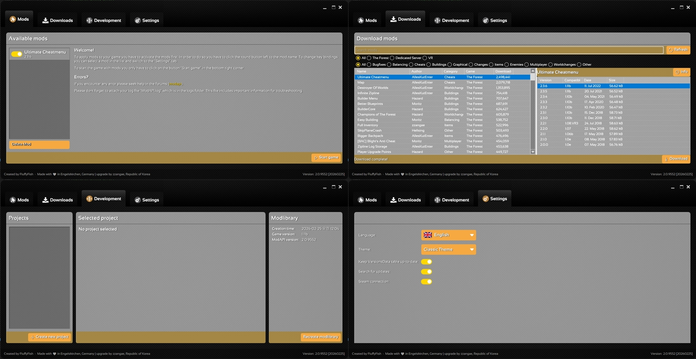
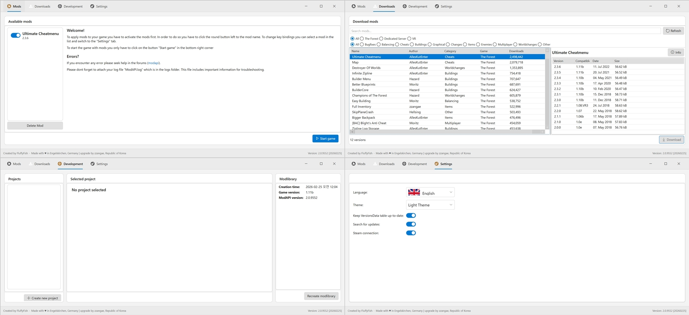
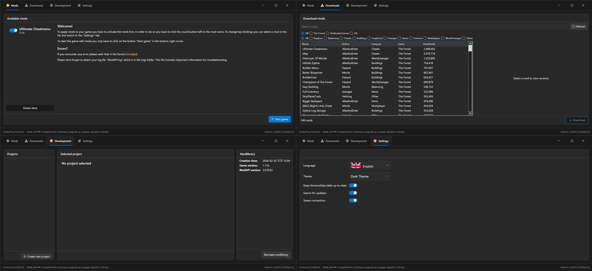

[](README.md)
[](Docs/ko/README.md)
[](Docs/de/README.md)
[](Docs/es/README.md)
[](Docs/fr/README.md)
[](Docs/pl/README.md)
[](Docs/ru/README.md)
[](Docs/it/README.md)
[](Docs/ja/README.md)
[](Docs/pt/README.md)
[](Docs/vi/README.md)
[](Docs/zh-CN/README.md)
[](Docs/zh-TW/README.md)

# ModAPI(v1) v2.0.9561 - 20260306

**The Forest Mod Management Tool — Upgraded Edition**

> Original: FluffyFish / Philipp Mohrenstecher (Engelskirchen, Germany)
> Upgrade: zzangae (Republic of Korea)

---

## Overview

ModAPI is a desktop application for managing mods for The Forest. This upgraded edition includes .NET Framework 4.8 migration, Windows 11 Fluent Design UI, a 3-theme system, enhanced multilingual support, a full Downloads tab implementation, and C# 7.3 mod development support.

---

## Runtime Architecture — .NET / Mono Design Decision

ModAPI operates across two distinct runtime environments. Understanding this separation is essential for contributors.

### Runtime Split

| Component | Target | Runtime | Reason |
|---|---|---|---|
| `ModAPI.exe` | .NET Framework 4.8 | Windows .NET 4.8 | Desktop application, full modern API access |
| `ModAPI_Shared.dll` | .NET Framework 4.8 | Windows .NET 4.8 | Shared library for ModAPI desktop |
| `BaseModLib.dll` | .NET Framework 3.5 | Game Mono 2.0 | **Permanently fixed — see below** |
| Mod DLLs (user) | .NET Framework 4.8 | Game Mono 2.0 (patched) | Built with 4.8, PE header patched at Apply time |

### Why BaseModLib Must Stay at .NET 3.5

The Forest runs on **Unity 5.6.x**, which embeds **Mono 2.0** (`mono.dll`, CLR Runtime `v2.0.50727`). This runtime is physically embedded in the game executable and cannot be replaced externally.

When a DLL is compiled targeting .NET 4.8, its PE header contains `CLR Runtime v4.0.30319`. Mono 2.0 inspects this header before loading and **refuses to load any DLL with a v4.x PE header**, resulting in a black screen.

`RemapAllReferences()` (Mono.Cecil) can patch assembly reference versions inside a DLL, but it **cannot modify the PE header CLR Runtime field**. Therefore, BaseModLib must be compiled with .NET 3.5 so its PE header reads `v2.0.50727`, which Mono 2.0 accepts.

```
v3.5 build  →  PE header: CLR Runtime v2.0.50727  ←  Mono 2.0 accepts  ✅
v4.8 build  →  PE header: CLR Runtime v4.0.30319  ←  Mono 2.0 rejects  ❌  (black screen)
```

### Why Mono 2.0 Cannot Be Upgraded

Unity 5.6.x embeds `Mono/mono.dll` compiled and ABI-linked against its own engine internals. Replacing this DLL with a newer Mono version causes an immediate crash because the Unity engine binary expects the exact ABI of its bundled Mono. The Forest is a released, no-longer-updated game — a Unity engine upgrade is not possible.

### C# 7.3 for Mod Developers

Although BaseModLib targets .NET 3.5, the C# language version is set independently:

```xml
<TargetFrameworkVersion>v3.5</TargetFrameworkVersion>
<LangVersion>7.3</LangVersion>
```

This allows mod developers to use modern C# syntax while staying within Mono 2.0's runtime constraints.

| C# 7.3 Feature | Available | Notes |
|---|---|---|
| Pattern matching (`is`, `switch`) | ✅ | Compiler-handled |
| String interpolation (`$""`) | ✅ | Compiler-handled |
| `out` variable inline | ✅ | Compiler-handled |
| Expression-bodied members (`=>`) | ✅ | Compiler-handled |
| Local functions | ✅ | Compiler-handled |
| `nameof` | ✅ | Compiler-handled |
| Null-conditional (`?.`, `??`) | ✅ | Compiler-handled |
| `async`/`await` | ✅ | Via AsyncBridge + TaskParallelLibrary polyfills |
| Tuples (`ValueTuple`) | ❌ | Mono 2.0 `mscorlib` does not contain `ValueTuple` — polyfill insufficient |

### Assembly Remapping Pipeline

Mod DLLs built with .NET 4.8 go through the following pipeline at Apply time:

```
[Mod Developer builds with .NET 4.8]
  → Mod DLL: PE header v4.0.30319, references mscorlib 4.0.0.0

[ModAPI Apply — ModProject.cs]
  → AssemblyVersionMap.RemapAllReferences(modModule)
      patches reference table: mscorlib 4.0.0.0 → 2.0.0.0, etc.
  → modModule.RuntimeVersion = "v2.0.50727"
      patches PE header: v4.0.30319 → v2.0.50727

[Game runtime — Mono 2.0]
  → PE header accepted ✅
  → Assembly references resolved ✅
```

### C# 7.3 Polyfill DLLs

Two polyfill DLLs are automatically deployed to `TheForest_Data/Managed/` during Apply:

| DLL | NuGet Package | Purpose |
|---|---|---|
| `AsyncBridge.dll` | AsyncBridge 0.3.1 | `async`/`await` Task implementation for .NET 3.5 |
| `System.Threading.dll` | TaskParallelLibrary 1.0.2856 | AsyncBridge dependency |

These are sourced from `libs/polyfills/` and copied automatically by `Game.cs` during the Apply phase. BaseModLib's PostBuild target copies them from the development tree into the ModAPI libs folder.

---

## Key Changes

### Phase 1 — .NET Framework 4.8 Upgrade

- Migrated all projects (5) from `.NET Framework 4.5` → `4.8`
- Updated `TargetFrameworkVersion`, `App.config`, `packages.config` across all projects
- Unified assembly version

### Phase 2 — Build Environment & Fluent Design Foundation

- Introduced **ModernWpf 0.9.6** NuGet package
- Created **FluentStyles.xaml** — Windows 11 Fluent Design override layer
  - Fluent color palette, typography, buttons, tabs, comboboxes, scrollbar styles
  - Window, SubWindow, SplashScreen templates
- Compiled **UnityEngine stub DLL**
  - Added missing types: `WWW`, `Event`, `TextEditor`, `Physics`, etc.
- Fixed dependency references and confirmed successful build

### Phase 3 — UI Redesign & Theme System

#### Fluent UI Redesign
- Complete **MainWindow.xaml** restructuring
  - Fluent Design-based layout, colors, typography
  - Redesigned tab controls, status bar, caption buttons
- Runtime fixes: SplashScreen freezing, tab switching, icon states, window dragging

#### 3-Theme System

| Theme | Style File | Description |
|-------|-----------|-------------|
| Classic | Dictionary.xaml only | Original ModAPI design (texture background) |
| Light | FluentStylesLight.xaml | Bright tone + blue accent |
| Dark | FluentStyles.xaml | Dark tone + blue accent (default) |





- Added **Theme Selector ComboBox** in Settings tab
- Theme change triggers **confirmation popup** → **auto restart**
- Theme setting saved/loaded via `theme.cfg` file

#### Window Drag / SubWindows / Hyperlinks
- Root Grid `MouseLeftButtonDown` event for direct drag handling
- ThemeConfirm, ThemeRestartNotice, NoProjectWarning, DeleteModConfirm popups
- Theme-specific link colors: Dark/Classic (`#FFD700`), Light (`#0078D4`)

### Phase 4 — Code Cleanup & Legacy Removal

- Removed login system (server no longer operational)
- Modernized update mechanism
- Cleaned up unused code
- Fixed SubWindow UI (game path dialogs, etc.)

### Phase 5 — Multilingual Support Expansion (13 Languages)

| Language | File | Language | File |
|----------|------|----------|------|
| Korean | Language.KR.xaml | Italian | Language.IT.xaml |
| English | Language.EN.xaml | Japanese | Language.JA.xaml |
| German | Language.DE.xaml | Portuguese | Language.PT.xaml |
| Spanish | Language.ES.xaml | Vietnamese | Language.VI.xaml |
| French | Language.FR.xaml | Chinese (Simplified) | Language.ZH.xaml |
| Polish | Language.PL.xaml | Chinese (Traditional) | Language.ZH-TW.xaml |
| Russian | Language.RU.xaml | | |

### Phase 5-1 — Downloads Tab & Theme Completion

#### Downloads Tab
- Loads mod list from 3 sources (`mods.json`, `versions.xml`, HTML parsing)
- Search functionality (filter by mod name/description/author)
- **Game filter** (All / The Forest / Dedicated Server / VR)
- **Category filter** (All / Bugfixes / Balancing / Cheats, etc. — 12 categories)
- Version selection split-panel UI
- Direct `.mod` file download → game folder installation
- Column sorting (click name/category/author) and resizing
- Mod deletion (DLL + staging file cleanup)

#### Icon Modernization (All Themes)
- All button PNG icons → **Segoe MDL2 Assets** font icons
- Applied across MainWindow.xaml + 14 SubWindow files
- Font icons inherit Foreground color, ensuring visibility across all themes

| Original PNG | Font Icon | Usage |
|---|---|---|
| Icon_Add | &#xE710; / &#xE768; | Add / Start Game |
| Icon_Delete | &#xE74D; | Delete |
| Icon_Refresh | &#xE72C; | Refresh |
| Icon_Download | &#xE896; | Download |
| Icon_Continue/Accept | &#xE8FB; | Confirm/Continue |
| Icon_Decline | &#xE711; | Cancel/Close |
| Icon_Information | &#xE946; | Information |
| Icon_Warning | &#xE7BA; | Warning |
| Icon_Error | &#xEA39; | Error |
| Icon_Browse | &#xED25; | Browse |
| Icon_CreateMod | &#xE713; | Create Mod |

#### Unified Controls Across All Themes

| Control | Classic | Dark | Light |
|---------|---------|------|-------|
| CheckBox | Toggle (Gold) | Toggle (AccentBrush) | Toggle (AccentBrush) |
| RadioButton | Circle (Gold) | Circle (AccentBrush) | Circle (AccentBrush) |
| ComboBox | Scale9 original | Fluent custom | Fluent custom |

#### Theme Visibility Fixes
- Light: AccentButton text forced White, tab icon Opacity adjustment
- Dark/Light: ComboBoxItem `TextElement.Foreground` approach for selected text visibility
- Classic: Fluent fallback resources added to Dictionary.xaml

### Phase 5-5 — Assembly Resolution Restoration

- **`AssemblyVersionMap.cs`** — new shared utility mapping 20 system assemblies to correct Mono 2.0 versions and public key tokens
- **`CustomAssemblyResolver.cs`** — rewritten with name-based (not `FullName`) matching and Dictionary caching for cross-version compatibility
- **`ModLib.cs`** — removed Silverlight hardcoding, replaced with `AssemblyVersionMap.RemapAllReferences()`
- **`Game.cs`** — replaced `@HOTFIX` loop with `RemapAllReferences()` + `RemoveDuplicateReferences()`
- **`ModProject.cs`** — updated with v3.5→v4.8 template, `UpgradeProjectFile()` method, system assembly filtering
- **`MonoHelper.cs`** — replaced `Console.WriteLine` debug calls with `Debug.Log`
- Fixed `CS0723` build error: `ModAPI.Version` shadowing `System.Version` resolved by full qualification

### Phase 5-6 — C# 7.3 Mod Development Support

- **`BaseModLib.csproj`**: `.NET 3.5` permanently fixed + `<LangVersion>7.3</LangVersion>` added
- **`ModProject.cs`**: `modModule.RuntimeVersion = "v2.0.50727"` added after `RemapAllReferences()` to patch mod DLL PE headers
- **`Game.cs`**: polyfill DLL auto-deployment to `TheForest_Data/Managed/` during Apply
- **`BaseModLib.csproj` PostBuild**: polyfill DLLs auto-copied from `libs/polyfills/` to ModAPI libs folder on build
- Polyfill DLLs added: `AsyncBridge.dll`, `System.Threading.dll`
- Confirmed working: pattern matching, string interpolation, `out` variable inline, `async`/`await`
- Confirmed unsupported: `ValueTuple` tuples (Mono 2.0 `mscorlib` limitation, no workaround)

---

## Version History

| Version | Date | Summary |
|---|---|---|
| v2.0.9561 | 2026-03-06 | C# 7.3 mod dev support, PE header patching, polyfill pipeline, assembly resolution restoration |
| v2.0.9552 | 2026-02-25 | Downloads tab, icon modernization, theme unification, 13-language support |
| v2.0.9500 | — | Theme system (Classic/Light/Dark), Fluent Design UI, SubWindow system |
| v2.0.9400 | — | Code cleanup, login removal, legacy modernization |
| v2.0.9300 | — | Build environment, UnityEngine stub DLL, ModernWpf integration |
| v2.0.9200 | — | .NET Framework 4.8 migration |
| v1.x | — | Original FluffyFish release |

---

## File Structure

```
ModAPI/
├── App.xaml / App.xaml.cs              # Theme load/save/apply
├── Dictionary.xaml                      # Original styles + toggle/radio/fallback resources
├── FluentStyles.xaml                    # Dark theme + ComboBox/CheckBox/RadioButton
├── FluentStylesLight.xaml               # Light theme + ComboBox/CheckBox/RadioButton
├── Windows/
│   ├── MainWindow.xaml / .cs            # Main UI + Downloads tab + theme selector
│   └── SubWindows/                      # 16 SubWindows (all with font icons)
├── Data/
│   ├── Game.cs                          # Game assembly patching + polyfill deployment
│   ├── ModLib.cs                        # BaseModLib generation + assembly remapping
│   ├── Models/
│   │   └── ModProject.cs                # Mod project create/build/apply + PE header patch
│   └── AssemblyVersionMap.cs            # Mono 2.0 assembly version mapping (20 assemblies)
├── Utils/
│   ├── CustomAssemblyResolver.cs        # Name-based assembly resolver with caching
│   └── MonoHelper.cs                    # Mono.Cecil IL helper utilities
├── resources/
│   ├── langs/                           # 13 language files
│   └── textures/Icons/flags/            # Flag icons (16x11 PNG)
└── libs/
    ├── UnityEngine.dll                  # Stub DLL for BaseModLib compilation
    └── polyfills/                       # C# 7.3 runtime polyfills
        ├── AsyncBridge.dll              # async/await for .NET 3.5
        └── System.Threading.dll         # AsyncBridge dependency

BaseModLib/
├── BaseModLib.csproj                    # .NET 3.5 + LangVersion 7.3 + PostBuild polyfill copy
├── Attributes/                          # ModAPI attributes (ExecuteOnGameStart, Priority, etc.)
├── Mod.cs / Mods.cs                     # Mod base classes
├── Log.cs / Input.cs / Interface.cs     # ModAPI runtime APIs
└── libs/
    └── polyfills/                       # Source polyfill DLLs (copied by PostBuild)
        ├── AsyncBridge.dll
        └── System.Threading.dll
```

---

## Build Requirements

- **Visual Studio 2022**
- **.NET Framework 4.8** SDK
- **.NET Framework 3.5** SDK (for BaseModLib)
- **ModernWpf 0.9.6** (NuGet)
- **AsyncBridge 0.3.1** (NuGet — `libs/polyfills/`)
- **TaskParallelLibrary 1.0.2856** (NuGet — `libs/polyfills/`)

---

## License

GNU General Public License v3.0 — follows the original license.